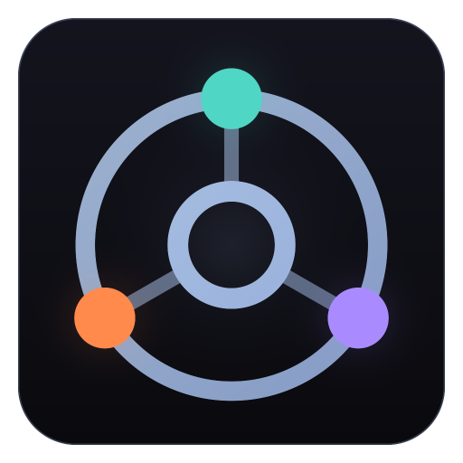

<!--
  THE README DOCTRINE. This file is a DURABLE overview: it names nothing that
  ordinary development changes. No counts, rosters, class lists, file maps,
  command inventories, keybinds or version strings. Every one of those went
  stale here within weeks. Living facts ride the badges below, which read the
  GitHub API and the site's CI-built data/meta.json (rebuilt from src/data on
  every push), so they stay current with ZERO commits to this file.

  The test for a new line: would a session adding content or a system ever
  need to edit it? If yes, it belongs in CLAUDE.md, docs/ or the website.
  Edit this file only when the game's identity, its install path or the run
  commands change.
-->

<p align="center">
  
</p>

<h1 align="center">Hollow Wake</h1>

<p align="center"><b>A top-down action RPG where every system is open, modular data.</b></p>

<p align="center">
  <a href="https://github.com/arianna-arpg/arpg-game-world/releases/latest"></a>
  <a href="https://github.com/arianna-arpg/arpg-game-world/releases"></a>
  <a href="https://github.com/arianna-arpg/arpg-game-world/actions/workflows/ci.yml"></a>
</p>

<p align="center">
  <a href="https://arianna-arpg.github.io/arpg-game-world/database/"></a>
  <a href="https://arianna-arpg.github.io/arpg-game-world/database/"></a>
  <a href="https://arianna-arpg.github.io/arpg-game-world/database/"></a>
  <a href="https://arianna-arpg.github.io/arpg-game-world/database/"></a>
  <a href="https://arianna-arpg.github.io/arpg-game-world/tree/"></a>
  <a href="https://arianna-arpg.github.io/arpg-game-world/database/"></a>
  <a href="https://arianna-arpg.github.io/arpg-game-world/database/"></a>
</p>

Skills, monsters, statuses, passives, items and zones are plain data entries composed by one shared engine. The player, monsters and minions all act through a single skill pipeline, so a fireball behaves the same whether a sorcerer casts it, a monster breathes it, or your summon throws it. Classes are starting points, not cages.

Built in TypeScript and Vite on an HTML5 Canvas 2D renderer, wrapped in an Electron desktop shell. It runs on Windows, Linux and Steam Deck, and in the browser.

> **Status:** a playable prototype in active development. Deep, working systems under deliberately placeholder geometry art. No audio yet. Saves can be reset between versions.

The numbers above are live. They are read from the same data the game ships, so they are never out of date and nobody maintains them by hand.

---

## Play

- **In your browser.** [Play the current build](https://arianna-arpg.github.io/arpg-game-world/play/). CI rebuilds it from `main`. Saves stay in that browser's local storage.
- **Windows.** Take the installer from the [latest release](https://github.com/arianna-arpg/arpg-game-world/releases/latest). Per-user install, no admin needed.
- **Linux and Steam Deck.** Take the `.AppImage` from the same page, `chmod +x` it and run. [STEAM.md](STEAM.md) has the one-line Deck installer and the controller notes.

The desktop launcher checks for a new stable release on start and can update itself in place. Nightly release candidates are published as pre-releases on the [Releases](https://github.com/arianna-arpg/arpg-game-world/releases) page for anyone who wants the newest build; installed stable copies never see them.

Play with keyboard and mouse or any controller (Xbox, DualSense, Steam Deck). Every binding can be changed in Options.

---

## Run from source

Requires Node.js and npm.

```bash
npm install
npm run dev     # browser dev mode at http://localhost:5173
npm run game    # the desktop app: the launcher, then the game in its own window
npm run build   # type-check + production build to dist/
```

On Windows, `Play Game.bat` (browser) and `Launch Game.bat` (desktop app) do the same and run `npm install` for you the first time. The launcher opens as a plain game launcher. Tick **Developer mode** on its page for DevTools, the in-game dev panel and hot reload straight from `src/`.

There is no unit-test runner. Changes are gated by the type-check plus headless harnesses that boot the engine itself: regression probes, smoke boots, a seeded balance sim, generation QA and a frame-time sweep. CI runs the type-check and the probe gate on every push, and the nightly job runs the full lane before it cuts a release candidate. The commands and their contracts are in [CLAUDE.md](CLAUDE.md).

---

## The core idea

**Skills are loot.** Your build is the skills you find and the supports you socket into them, not a menu unlocked by character level. Character levels feed the passive tree instead.

**One pipeline for everyone.** The player, monsters and minions all resolve their actions through `World.useSkill()`. A summoner's skeletons run on the same skills monsters do.

**One modifier engine.** Every number flows through one layered, tag-scoped formula (`flat → increased → more → override`), implemented once and shared by every system. Content composes behavior out of tags and modifiers instead of new engine code.

**Data in, no engine changes.** Adding a skill, support, monster, passive, item, biome or class means adding an entry under `src/data/`. The engine already knows how to run it.

---

## Where the truth lives

This page stays short on purpose. The project moves fast, and each kind of detail has one maintained home:

| If you want | Go to |
|---|---|
| What is in the game right now: every skill, support, monster, class, unique and biome | The [Database](https://arianna-arpg.github.io/arpg-game-world/database/), regenerated from `src/data/` on every push |
| The passive tree | The [tree viewer](https://arianna-arpg.github.io/arpg-game-world/tree/) |
| How the systems feel from the player's side | The [website](https://arianna-arpg.github.io/arpg-game-world/) and its [Systems](https://arianna-arpg.github.io/arpg-game-world/systems/) page |
| The repository map, every command, the verification gates and the working conventions | [CLAUDE.md](CLAUDE.md), maintained continuously. [AGENTS.md](AGENTS.md) points there too |
| One system in depth | [docs/](docs/), one contract per system, grouped by area |
| Packaging, releases, Steam Deck and controller layout | [STEAM.md](STEAM.md) |
| What changed between versions | [Releases](https://github.com/arianna-arpg/arpg-game-world/releases) and [docs/releases/](docs/releases/) |

The short map: the engine lives in `src/engine/`, all content in `src/data/`, the renderer in `src/render/`, the desktop shell in `launcher/`, the website in `site/` and the headless harnesses in `balance/`.

---

## Project status

Hollow Wake is a prototype. The systems are broad and working, and the presentation is deliberately minimal for now:

- **Art** is placeholder geometry shaded by the renderer's visual fabric, not final assets.
- **Audio** is not implemented yet.
- **Saves are disposable** while the game is a prototype. A version may reset runs or the whole account, and it says so when it does.
- **Balance, classes and content** shift between versions.

---

Made by Arianna.
