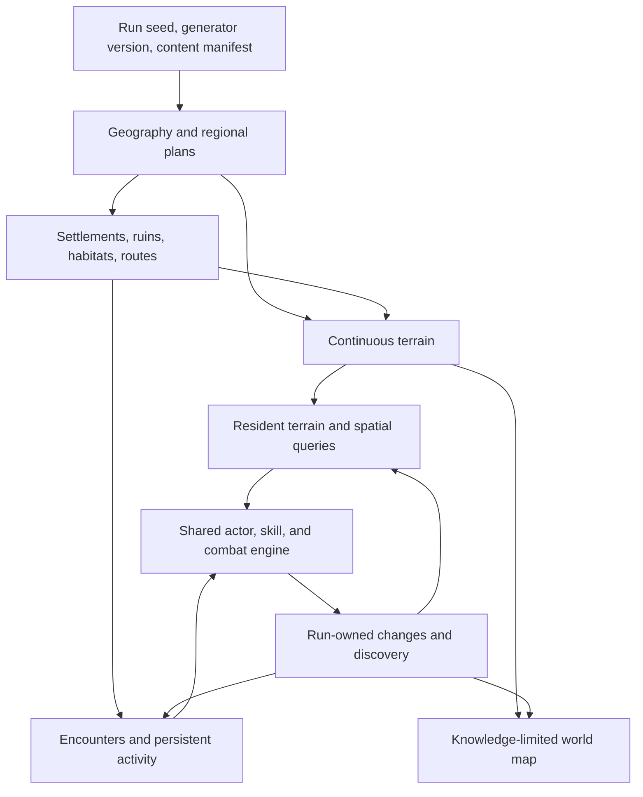

# Seamless world: terrain, places, and a fresh journey each run

Status: implementation in progress, started 2026-09-29. An opt-in playable terrain
and combat prototype now uses the existing engine. It is a first integration
milestone, not the completed seamless-world overhaul. The later stages in this
document are requirements, not shipped features.

Experiment branch: `codex/seamless-world-foundation`, starting at
`a4c8d08c179065655f5e1fa22dfb5f0fd199bef4` on `main`.
Historical reference: `seamless-world` at `75333fd2`, read without merging it.

Browser preview: `/arpg-game-world/dev/seamless-world/`. The deployment builds
this branch with `HOLLOW_WAKE_WORLDMASS=1` and
`HOLLOW_WAKE_STORAGE_SCOPE=preview:seamless-world`. `src/buildProfile.ts`
keeps account, character/roster, settings, workshop, atlas and developer
preferences under separate browser keys. Scoped builds never call the shared
disk-save endpoints. Ordinary builds retain their existing keys and disk lane.
Save import/export uses the same scoped keys. No production saves are copied.
Verify with `balance/browser-preview-ui.cjs` after building `dist-preview` with
those variables; an optional URL argument checks the published preview too.
Publishing configuration lives on main so ordinary site updates retain the
separate preview; gameplay changes remain on this experiment branch.
The existing Git remote is `https://github.com/arianna-arpg/arpg-game-world.git`.

## Implementation ledger

`src/worldmass/` now contains the first independent spatial contracts:

- `address.ts`: signed 64-bit decimal cell addresses, exact negative normalization,
  bounded local-frame subtraction, and a generation lattice separate from pages.
- `random.ts`: canonical finite JSON manifests and named independent seeded streams.
- `generator.ts`: immutable per-run field/surface recipes and bounded place
  footprint competition. Neighboring queries share stable place identities and
  reserved site surfaces before the scenery loads. Place-page query caching is bounded.
- `state.ts`: sparse terrain changes with causes, one-time identity claims, and
  validated atomic restore. Terrain invalidation is separate from discovery and
  reward claims, so finding a place does not throw out the floor cache.
- `stream.ts`: sample-budgeted page preparation, atomic publication, cancellation,
  bounded resident/sample caches, and regeneration from seed plus durable changes.

- `walk.ts`: the native WalkField contract over streaming terrain, bounded local
  path searches, per-actor travel prices, and collision queries before residency.
- `preset.ts`: one replaceable expedition descriptor. Snapshots palette and
  level-appropriate native rosters from existing tilesets with source attribution;
  controls field scales, place density, starting reservation and resource budgets.
- `progression.ts`: configurable distance stops, bounded levels and a seeded
  regional danger field. The refuge is the pinned Lastlight footprint, so a
  larger town does not start inside harder country. Version 4 snapshots native
  presence tables for levels 1–24; fixed-level content remains supported.
  Each encounter resolves from its own place centre and keeps its level while
  chasing, fighting, revisiting or resuming. No hero-level scaling is applied.
- `sites.ts`: a reusable native-structure adapter with deterministic orientation,
  persistent discovery and sparse scenery mutations. The first recipes are
  Wayside Camp and Pillaged Ruin, reusing native scenery, breakables, guards and
  timed caches. Scenery residency respects nearby actors/projectiles and ongoing
  native felling; restored felling rejoins native regrowth with its remaining delay.
- `journey.ts`: a saved finite opening circuit, with four native town-edge
  approaches and four country links. Seeded bends grade ground around the pinned
  town, reserve scenery-free lanes and connect defended destinations. It never
  repaints native town cells or reestablishes roads on Continue. Immutable town
  foundation cells choose the exits, so later edits cannot move the network.
- `landmarks.ts`: four data compositions of native scenery: Cinderwatch Camp,
  The Broken Gate, Memorial Grove and The Fallen Court. Their complete props,
  guards, fixtures and caches are copied into the descriptor. Optional
  `MassContent.magicPack` selects an attributed native coordinated recipe:
  Footfall at the gate and Bloodfont at the court. Atomic placement admits a
  complete cohort; below the recipe's native level gate, ordinary populations
  remain supported. Native promotion owns stats, visual warnings, combat and
  rewards. Continue remaps group IDs while retaining names, wounds, slots and
  casualties; native resume policy re-arms dangerous actions with a full warning.
  Existing descriptors remain ordinary encounters. Random camps and ruins
  continue farther out. These compositions introduce no separate combat rules.
- `ecology.ts`: biome-selected clusters of native trees, rocks, brush, flowers
  and desert vegetation. Saved recipes control chance, members, spread, radii
  and weights. Paths, sites and Lastlight retain clear reservations; trunk
  spacing uses native body sizes. Page ownership and sparse removal/felling
  consequences survive eviction and Continue. Saved changes to one member
  cannot change which neighboring members the seed generates.
- `runtime.ts`: one initial arrival, then continuous movement without loadZone.
  Native actors, skills, projectiles and companions remain in the same World.
  Character saves include the run descriptor, configuration, exploration claims,
  explicit worldmass terrain edits, killed native identities, surviving natives'
  positions/health/scale, and ordinary persistent loot/contents. A survived-mode
  death returns to its native bedside (legacy descriptors retain the clearing);
  creating a new run rolls another seed.
- `settlement.ts`: a native Lastlight scene embedded directly into the same
  continuous World. Its original plan grid remains authoritative inside the
  footprint, with a common cell lattice for geographic collision and sight.
  The native generator supplies buildings, upstairs rooms, doors, residents and
  account-owned counters. A saved settlement descriptor pins geometry and tier;
  native region edits, doors, removed/felled scenery and resident bodies persist.
  A reserved, attributed verge excludes wilderness sites/populations from the
  whole town footprint. Ground textures blend at the old arena rim.
- `paint.ts`: bounded renderer-owned floor textures and a local explored-terrain
  map, with native town footprints/doors, zoom, surveyed paths, a directional
  home marker and named/levelled discovered sites with searched-cache state.
  The map samples the physical terrain rather than displaying the old graph. Native solid scenery also informs
  path searches; mutation revisions invalidate cached routes.

The shared cell-ray and sight-veil interface now accepts finite grids and
worldmass. Moving projectiles (including terrain bounce) use it too. Native
region effects and grounded spell telegraphs operate on the same sampled cells.

### Trying the prototype

Run the development server from this worktree and open `/?worldmass`, then begin
a new character. Without the query parameter, the existing game remains the
default. `M` shows the surveyed terrain and Lastlight marker; the journal remains
available separately. New expeditions wake in native Lastlight. Walk
through its native doors, use unlocked counters, explore the inn's upper floor,
then walk into the country on any side. No gateway, loading call, coordinate
jump, hero replacement or scene reset occurs at the town boundary.

**New generation features require a new run.** Default generator version 5
adds the opening circuit, distinct landmarks and persistent biome scenery.
Version 4 added geographic danger and native level rosters. Version 3 added Lastlight and
aligned geographic cells to the native 30-unit floor lattice (960-unit terrain
pages). Version 2 introduced camps and ruins. Continue preserves the saved
descriptor, including version 1/2 land without Lastlight and version 1–3's
fixed encounter levels;
updating the game never inserts new structures into an existing expedition.
Caches use the ordinary hold-nearby interaction, native reward policy and the
site's configured level. Destroyed supplies and claimed caches do not regenerate
on page reload. A site's whole native population must fit before it can introduce
a cache; saturation delays the encounter rather than furnishing free rewards.

The expedition progression policy currently keeps the first 1,600 units beyond
Lastlight's footprint at country level 1, then follows configurable distance
stops with smooth seeded regional variation and a level-24 ceiling. Ruins
have a configurable +1 encounter offset within that ceiling. This is initial
pacing data, not a completed balance pass. The HUD's country level describes
the local geography; discovered map markers give each site's encounter level.
A pursuing enemy keeps its original level across both places. Inside a site,
the existing HUD location line names that landmark and its encounter level;
the read does not change the shared zone or its reward context.

Shared combat presentation uses `VIS_CFG.combatFocus`: pale corners identify
the local controlled body, while damage values receive stable nearby positions
clear of visible bodies and overhead bars. Values, lifetimes, native warning
geometry and saved state are unchanged. Concealed/burrowed/dead heroes do not
gain a marker. Placement has a bounded search and retains the original value
if a completely saturated screen offers no free seat; it is not a general
label/telegraph layout solver. Ground reward labels yield to nearby visible
hostiles while item glyphs and the separate pickup ledger remain available.

Native kill rewards use the slain body's level, including gear, gem-pool
eligibility, ability-essence tiers, resource orbs and kill-handler context.
Caches retain their saved site reward level. Scoped payout context restores
after nested calls or exceptions and never mutates the shared zone's level.
Region damage and sky strikes sample the affected position; simultaneous
strikes retain independent source actors. Ordinary game reward semantics and
older fixed-level expedition descriptors retain their prior behavior.
This admits the current population/cache/terrain paths; it does not migrate
every event package, summoned child or quest reward to a spatial context.

Site descriptors snapshot native legacy structure scenery and breakable fixtures.
Population tables/counts and cache placement/time remain explicit content data.
This repeated-site adapter still rejects plan floors, doors, scripted effects,
town stations, NPC services and folk. Lastlight uses the separate native scene
adapter, preserving those systems through their existing generator and service
controllers. It is not a promise that arbitrary repeated settlements are ready. The sparse scenery
checkpoint covers position, kind, radius, rotation, adornment, hitbox, removal
and felling state. It is not a general effect/actor serializer.

`npm run build` followed by `node_modules/.bin/electron.cmd balance/worldmass-ui.cjs`
runs a hidden real-client check with disposable, isolated saves. Screenshots and
the log go to ignored `balance/reports/worldmass-*` files.

### Current limits (do not call these completed)

- The geographic kernel supports very large addresses. The live engine still
  uses a local numeric frame; automatic rebasing of **all** combat/scene state
  is not implemented. Do not claim indefinitely traversable live-world support.
- Native bodies remain resident to avoid losing combat state at page edges.
  The default cap is 96: when full, additional habitat populations wait. This
  is a temporary test budget, not distant simulation or a complete ecology.
- Checkpointed natives use the existing game's kind of position/health restore,
  not an exact serialization of buffs, threat, cooldowns or every spawned child.
  Streaming itself does not recreate actors. Admitted site and biome scenery
  have sparse mutation ownership; arbitrary summoned/event actors, actor-owned hazards
  and other world packages still need lifecycle adapters. Terrain edits here mean
  MassState edits specifically. Retained native actors keep required site scenery
  after a reload; dependency residency is still conservative, not full dormancy.
  Ecology pages near retained actors/effects also remain resident, so their
  count can exceed the terrain page budget.
- Terrain sampling is budgeted, but an uncached visible texture can still bake
  synchronously. Terrain edits invalidate all floor pages. There is no proven
  crossing frame-time bound yet; the UI harness logs batch timings, not FPS.
- The local map records entered pages, not detailed line-of-sight exploration.
  Saves remain whole-run JSON; paging long-run consequences is still required.
- Terrain currently provides open ground, soil/climate variation, lakes/shores,
  outcrops and native biome scenery, with one resident native Lastlight and a
  finite opening circuit. Global roads, drainage, bridges, additional settlements,
  caves and biome-specific per-actor simulation contexts remain. The opening
  routes grade ground; they do not implement a river-crossing or earthworks simulation. Camps, ruins and Lastlight are not a migrated campaign.
  Co-op replication and the old campaign are not integrated into this mode.
- Lastlight's geometry/tier and original resident roster are pinned for each run.
  New account additions appear in the next expedition, preventing buildings from
  shifting under live or saved characters. Safe in-world construction is still
  required for growth within one expedition. The one town stays resident; this
  does not implement arbitrary settlement paging or distant civic simulation.
- Native counter rules remain authoritative: Brandt, Mireille, Font, unlocked
  salvage/Oracle/Tracker/board/recruiter facilities retain their existing gates
  and proximity checks. Campaign quests still reference the old graph, whose
  destinations are not yet geographic places. Caravan departure, waypoint travel
  and the old campfire population reset are inactive; the prototype must not
  charge for a trip or claim a reset it cannot perform. Native cellar/campaign
  travel needs a durable interior/return adapter. Actual upstairs inn rooms use
  native tiers in the same scene and are included, including upstairs Continue.

Verification includes `npm run check`, the worldmass contract and real-engine
probes, existing persistence/sight-veil/cistern probes, generation QA, and the
hidden real client. `probe_worldmass_sites.ts` covers cross-page identity, opposing
approaches, native loot, scenery removal/regrowth, discovery, dependency residency,
real character reload and version-1 compatibility. After a scoped preview build,
`balance/worldmass-sites-ui.cjs` exercises both default site types, their map and
cache interaction, and browser Continue with isolated saves (optional published
URL argument). The engine probe proves a hero's native attack across a page
seam, moving-projectile wall occlusion, water status effects, negative-coordinate
spell telegraphs, save/reload consequences and same-run mode wakes. These are
bounded integration tests, not a full campaign playthrough.

Latest verification (2026-09-30 UTC): game/launcher/sim types and production
build passed; worldmass probes reported 12 PASS lines (including their summary),
existing persistence 84, cistern 60 and sight-veil passed; genqa reported 869
cases × 3 seeds, zero failures and the four baseline spacing warnings. The
hidden client confirmed viewport coverage, unchanged hero/skills at crossings,
the surveyed map, and actual Continue after reload preserving the seed, a wall
edit and a defeated native. Launcher smoke passed. Normal game smoke initially
reported a missing menu when run alongside the other Electron checks; its
isolated retry passed. This intermittent menu result is recorded, not hidden.

Site milestone verification (2026-10-01 UTC): all three worldmass probes,
visibility-stability/sightveil, persistence (84 checks) and rampage (64 checks)
passed. Generation QA again reported 869 cases × 3 seeds, zero failures and the
same four spacing warnings. The isolated client rendered both default locations
(seed 42), displayed their discovered map markers, opened a native cache and
preserved it through real browser Continue. Preview isolation retained ordinary
save sentinels unchanged. Forced-teleport/render batches took roughly 460–600 ms
in the software-rendered test client; these batches are not frame-rate evidence
or a seamless-crossing performance guarantee.

Lastlight milestone verification (2026-10-01 UTC): all four worldmass probes
passed, including native hamlet/township layouts, both-way crossings of all four
town edges, spatial services, doors, damaged scenery and pinned-town Continue.
Game/launcher/sim types, normal and scoped preview builds, native town growth
(136 checks), persistence (84), visibility stability and sightveil passed.
Generation QA reported 869 cases × 3 seeds, zero failures and 20 warnings:
four baseline spacing warnings and sixteen slow-generation warnings under
local load. The real client walked out of Lastlight and back using PlayerInput
with zero loadZone calls and unchanged hero/skill objects; it opened the native
Font and resumed upstairs with the saved door open. Separate browser checks
passed camps/ruins, cache consequences, full viewport terrain coverage and save
isolation; ordinary game smoke passed. The site harness initially expected
generator version 2; its default-version assertion now correctly expects 3.

The software-rendered Lastlight walk measured approximately 31–32 ms median,
302–310 ms p95 and 329–341 ms maximum per forced client step. Those hitches
remain a performance limitation, not a smooth-frame acceptance result. The
checkpoint measured approximately 529 KB for the hamlet and 1.26 MB for the
township in the fixture; town foundation deltas and resident bodies remain
whole-run data. Boundary-correlated profiling and consequence paging are still
required before claiming long-run seamless performance.

Progression milestone verification (2026-10-01): all five worldmass probes,
game/launcher/sim type checks, native container loot, memories, ability economy,
persistence, sightveil and cistern checks passed. Generation QA reported 869
cases × 3 seeds with zero failures and four baseline spacing warnings.
The scoped browser client visited a level-7 Wayside Camp with native level-7/8
populations nearby, rendered country/site levels, retained the site's reward
after a hero-level change and travel, and preserved native identities/levels
and an opened cache through real Continue. Separate camps/ruins and preview
save-isolation checks passed. Normal/scoped builds and ordinary game smoke
passed too. This is a bounded integration journey, not a
full level-1-to-24 playthrough or performance acceptance.

Opening-circuit milestone verification (2026-10-01): all seven worldmass probes
passed (45 named checks across kernel, progression, engine, sites, haven,
journey and cohorts). The journey probe covers five seeds, connected physical trails,
native cache approaches, scenery eviction/felling, edited-road Continue,
immutable route topology, modified cluster peers and version-4 compatibility.
The cohort probe covers complete placement, a failed-seat retry, native attack
warnings, wounded survivors/casualties, distinct groups and legacy encounters;
37 native magic-pack checks also passed.
Game/launcher/sim types, normal/scoped builds, ordinary game smoke, persistence,
sightveil, visibility stability and cistern checks passed. Generation QA
reported 869 cases × 3 seeds, zero failures and four baseline warnings.
The hidden client walked a full trail with actual input and no scene load,
opened the native cache, used map zoom/home/search state and resumed through
browser Continue. It also saved during a native Footfall warning and resumed
with the same cohort, without an unannounced firing attack. The combat-focus
probe passed three checks; its real renderer check placed twelve simultaneous
damage values outside a controlled crowd and retained the local-player marker.
Other client checks covered native Lastlight services and
upstairs rooms, camps/ruins, geographic encounter levels and save isolation.

The seed-42 sparse terrain snapshot fell from approximately 180 ms to 12 ms
after sorting stored address keys instead of reconstructing them per comparison;
whole expedition snapshot time fell from approximately 190 ms to 20 ms in the
same fixture. Bounded generation/navigation memoization avoids repeated
geographic work without changing the saved truth. Software-rendered forced
steps still show long frames (latest trail median 10.1 ms, p95 132 ms, maximum
518 ms). A separate 30-second live requestAnimationFrame sample with GPU
compositing enabled measured 16.7 ms median/p95 and two frames over 100 ms,
both within the first second; this is one machine/scene, not a general FPS
guarantee. Startup and wider-scene performance remain unfinished work.

## The commission and the decided run policy

Build a continuous, procedurally expanding exploration-adventure ARPG. The
player can leave a road, travel through countryside, discover places, approach
danger from different directions, and return to recognizable land. Skyrim and
Minecraft describe the freedom of exploration; they do not mandate 3D, voxels,
construction, survival meters, or a replacement combat model.

The governing values are extensibility, flexibility, customization,
modifiability, attribution, and configuration. Preserve Hollow Wake's shared
actor/skill/modifier pipeline, deep builds, faction relationships, companions,
world events, and account progression. Rebuild the spatial foundation around
continuous land instead of treating the old zone arrangement as a constraint.

**User decision: generate a fresh world each run.** A continuing run retains its
seed, discovered geography, and durable consequences across save/reload. A new
run gets a new world identity and seed. Death follows the selected character
mode; when that mode ends the run, its world ends with it. A mode's intermediate
death stage must not accidentally start another world. Account unlocks remain
account-owned. Lastlight can retain an authored, familiar core while its
surrounding country changes with the run.

This decision belongs in run policy, not terrain generation. A future persistent
world mode should not require rewriting the generator, but is not this branch's
default or an additional feature to implement now.

## What the source actually supports

The audit follows executable code where older documentation describes an earlier
state. In particular, current zone contents persist and zone-memory TTL defaults
to `Infinity`; an old comment about discarding drops on travel is not the full
current behavior.

| Area | Inspected source | What can carry forward; what must change |
| --- | --- | --- |
| Shared gameplay | `src/engine/world.ts`, `src/engine/actor.ts`, `src/engine/ai.ts` | Keep the actor and skill systems. Many consumers currently read the hero's single `World.zone`; remote actors need their own place context. |
| Geography | `src/world/continents.ts`, `climate.ts`, `biomes.ts`, `relief.ts`, `courses.ts` | Reuse geography, climate, and course vocabulary. Adapt sampling to one explicit run context and physical projection; audit numeric ranges and bounded query costs. |
| Meaningful destinations | `src/world/atlas.ts`, `locales.ts`, `landmarkComplexes.ts`, `escarpments.ts` | Reuse geographic features, locale programs, footprints, and access constraints. They become places within terrain, potentially spanning many streaming chunks. |
| Graph generation | `src/engine/worldgen.ts`: `placeZoneAt`, `generateZone`, `settleWeb` | Current frontier generation depends on existing neighbors and sometimes fresh randomness; settling moves some map coordinates. This graph cannot author immutable physical ground. |
| Local generation | `src/engine/levelgen.ts`: `generateLayout`, `GenCtx`; `src/data/zones.ts`: `ZoneDef` | Retain builders and authored content where their assumptions fit. Whole-zone layouts receive arena, entry, and exits; they cannot all be called unchanged for arbitrary land slices. |
| Terrain rules | `src/world/walk.ts`, `gridWalk.ts`, `regions.ts`; `src/engine/los.ts`, `spatial.ts` | Preserve movement costs and separate movement, shot, and sight channels. Add queries spanning resident terrain pages. Current spatial keys have a documented finite coordinate range. |
| Consequences | `src/engine/world.ts`: `zoneMemorySnapshot`, `captureZoneMemory`, `restoreZoneEnemies`; `src/engine/zonecontents.ts` | Existing memory covers survivors, doors, fixtures, contents, and drops. Reuse serializers where appropriate, but a partial enemy memo is insufficient for freezing an ongoing fight. |
| Save ownership | `src/meta/worldstate.ts`, `character.ts`, `saveCompatibility.ts` | World state already belongs to the character's run. Replace graph/local-position assumptions deliberately, and use the central compatibility policy for an incompatible experimental format. |
| World activity | `src/world/overlay.ts`, `sim.ts`; `src/packages/types.ts`, `registry.ts` | Preserve registered overlays, packages, and explicit durable/transient pledges. Current views are node-based; migrate to spatial places and bounded regional queries. |
| Progression | `src/world/levelField.ts`, `openingProgression.ts`; `docs/design/world-progression.md` | Keep geographic danger and protected opening intent. Validate reachable terrain and opportunity density instead of a count of graph nodes. |
| Rendering and map | `src/render/vis/ground.ts`, `canopy.ts`; `src/ui/atlasPaint.ts` | Reuse art and cache machinery. Ground currently clears caches when `world.zone` changes. Use spatial keys/revisions; map geometry must project actual terrain. |
| Multiplayer | `src/net/snapshot.ts`: `StateSnapshot`, `ZoneMsg`, `serializeZone`, `applyZone` | Current transport describes one current zone. Future peers need region subscriptions, stable identities, revisions, and authoritative entity transfer. |

The decisive lifecycle issue is `World.loadZone`: it clears projectiles and many
effect controllers, captures the departed zone, assigns a new arena, resets
local objectives, and rebuilds local content. Hiding a portal while still doing
this at a boundary cannot deliver continuous combat or continuous consequences.

Geography has a good foundation, but seeded sampling alone does not make the
whole game discovery-order independent. `placeZoneAt` uses
`spec.seed ?? rollSeed()` and neighborhood-dependent placement; explicitly
seeded identity rolls already have a separate stream. Preserve that lesson and
extend the guarantee through placement, names, ownership, and realization.

## Lessons from the earlier experiment

The old branch provides useful examples of resident terrain, cross-border sight,
world-relative rendering, shared crossing geometry, and regression probes. Its
charter also records crossing stalls and repeated work during threshold rebases.
Those timings are historical reports, not measurements of this checkout.

Its later design deliberately enclosed zone cells and made the intervening land
solid except for connecting passages. `src/world/cells.ts` fitted cells to the
current node roster; `src/world/tissue.ts` filled/blended the remainder.
That was a different traversal goal. This commission calls for navigable
countryside and physical obstacles independent of bookkeeping boundaries.

Use the old tests as failure scenarios, particularly sight, collision, movement,
and continuity. Do not inherit the old charter's priorities, its 32 px/map-unit
scale, its fitted-cell geometry, or its zone-centered rebase as new requirements.
The old `src/meta/character.ts` explicitly refuses seamless persistence and
`src/main.ts` gates remote co-op. They are unfinished migration areas, not solved
features to copy forward. No old branch code has been imported by this commit.

## Spatial model

**The land exists first. Places inhabit it. Chunks are implementation details.**

There are four distinct concepts:

1. **World geography:** continuous terrain fields and regional features. A river,
   coast, forest, or cliff is independent of how many pages are loaded.
2. **Place:** a semantic identity with a footprint, sites, occupants, activities,
   access rules, and consequences. A fortress can span several pages; wilderness
   can exist without belonging to an encounter objective.
3. **Streaming chunk:** a fixed spatial page for loading, rendering, and storage.
   Crossing its edge does not emit a gameplay departure or clear anything.
4. **Simulation neighborhood:** the area needing detailed simulation, including
   player reach, sight, moving threats, and active relationships. It need not
   match chunk borders or place footprints.

Keep meaningful road, settlement, and quest graphs as relationships among
places. Derive them from committed regional plans. They do not partition all
land, and road membership does not determine whether the player may walk there.

### Coordinates and scale

Introduce an explicit address containing dimension, integer spatial cell, and
normalized local offset. Use a versioned, serializable large-integer address
representation for durable identity; keep collision/render coordinates small
within a local simulation frame. Exact encoding and supported bounds must be
settled in the first implementation commit, with negative-coordinate tests.

A local origin shift is a coordinate conversion, never a place departure. Every
position-bearing subsystem must either use the shared transform or be registered
for rebasing, including camera, interpolation history, effects, telegraphs,
projectiles, tethers, pending casts, and sound anchors. Test a round trip before
using this with combat. Spatial indices are rebuilt or translated consistently.

Do not use existing 16-bit packed spatial buckets with ever-growing absolute
coordinates. Existing 32-bit field hashes also require an explicit large-world
policy. Numerically finite computers support an effectively unbounded world,
not a promise of mathematical infinity without precision or storage limits.

One projection converts physical land to atlas coordinates. Choose its scale by
walking the prototype and measuring travel time, visibility, encounter spacing,
and landmark size. Save geometry-affecting settings with the generation version.
Runtime cache budgets may vary by machine without changing the world's content.

### Deterministic generation and shared edges

Build generation as bounded stages with explicit inputs and outputs:

1. Sample existing geographic vocabulary through a run-owned context.
2. Plan regional feature geometry, drainage, routes, and candidate places.
3. Resolve place footprints and approach constraints before fine decoration.
4. Realize terrain, structures, and ecology from those plans.
5. Validate geometry and content promises; record any named repair or fallback.
6. Apply persistent run deltas and current, reversible event overlays.

Each stage gets an independent random stream derived from run seed, dimension,
stable feature/address, generator version, and rule ID. Rendering and background
prefetch never consume gameplay random draws. Query/arrival order does not choose
place IDs, footprints, chest identities, or spawn opportunities. Runtime combat
outcomes may depend on player actions; generated base geography may not.

Regional planners need finite dependency envelopes. Candidate conflicts use a
canonical priority and tie-break over all relevant candidates, not whichever
neighbor happened to load first. Features crossing regional boundaries have one
owner/identity and shared geometry; realization clips them into chunks without
duplicating them. Do not require an unbounded flood-fill to find a coastline,
road network, or drainage answer. Existing sea filling is capped and relief
tracing is step-bounded; their truncation behavior needs explicit evaluation
before either becomes a physical continuity guarantee.

Neighbors read the same boundary samples, river centerlines, bridge footprints,
cliff faces, and road splines. Generate with a halo sufficient for each rule's
dependency radius and publish only the owned interior. Noise continuity alone
does not guarantee matching bridges, trees, structures, navigation, or rivers.

Spawn and decoration candidates use a stable generation lattice or feature-local
identity independent of runtime streaming partitions. A cache/chunk-size tuning
change must not multiply encounter density or duplicate a site.

Required content cannot silently vanish after a failed placement. A planned
destination is published only after its required access/sites validate. Repairs
must be bounded, deterministic, and attributed; optional content can be omitted
with a recorded reason. Never move previously discovered land to fit a new site.

## Preserve depth through reusable contracts

These are proposed responsibilities, not types already implemented in `src/`:

| Contract | Responsibility and authoring controls |
| --- | --- |
| Run descriptor | Seed, identity, generation revision, content manifest, geometry settings, run lifecycle policy. |
| Terrain provider | Position/bounds queries for materials, elevation, water, movement, shots, and sight; shared revision/invalidation. |
| Place recipe and instance | Eligibility, footprint, approaches, sites, builder ID/version, encounter tables, local activities, provenance. |
| Activity instance | Location/region, actor/event ownership, objectives, finite state, rewards, persistence policy, simulation cadence. |
| Entity lifecycle | Stable ID, source place/spawner, current location, player/skill credit, serialization, expiry and dependency rules. |
| Stream scheduler | View/reach requests, dependency pins, preparation/publish stages, eviction hysteresis, CPU/memory budgets. |
| Content contribution | Namespaced definition IDs, reference/schema validation, dependency order, explicit overrides, manifest digest. |
| Generation trace | Parent feature, source package/rule/version, chosen option, stream key, constraints, repairs, resulting IDs. |

Use the existing registries where they fit. New content should normally add data
and select existing builders/behaviors. A genuinely new behavior can add one
registered implementation with a validated contract; it should not require
name checks scattered across terrain, combat, save, rendering, and networking.

Configuration does not mean making correctness optional. Unique ownership,
single reward credit, matching boundaries, and valid references are invariants.
Density, spacing, biome influence, danger, persistence, and activity policies are
authoring controls. Geometry changes are versioned; live event changes are
attributable overlays. Arbitrary mid-run mod hot-swapping is out of initial scope.

Attribution has three separate jobs: explain generated content, retain gameplay
credit through actors/effects, and identify which package supplied a definition.
Store compact durable provenance; keep verbose decision traces on demand for
development. Never make the player read a generator explanation to understand
combat. Preserve the project's visible cues and sound-based readability rule.

### Translate the zone vocabulary

| Existing idea | Continuous-world form |
| --- | --- |
| Zone biome, tileset, palette | Geographic habitat and local art recipe, blended across actual ecological transitions. |
| Zone layout | Optional place/locale builder constrained by its physical footprint and approaches. |
| Exit to the next surface zone | Ordinary traversable ground; roads are routes through it. |
| Objective seals all exits | A local activity or a visible, physically bounded sealed arena; no seal around an administrative region. |
| Clear objective | Defeat a specified camp/cohort or resolve a local threat, with explicit membership and one reward. |
| Wave arena | An optional bounded encounter with its own commitment and retreat rules. |
| Cave or dimension entrance | A persistent connection between spaces, with stable arrival/return anchors and explicit transfer policy. |
| Waypoint | A discovered fast-travel site, independent of chunk residency. |
| Zone memory | Place/entity/terrain deltas keyed by stable identity, owned by the run. |
| Zone-level spawn/loot policy | The responsible place/activity context, resolved at the event's location and retained on its source. |
| Forechart and map discovery | Background planning distinct from knowledge; generating terrain never reveals it automatically. |

Do not automatically stretch every arena across a chunk or force every location
through the same layout generator. Lastlight, fortresses, caves, and open wilds
retain different spatial intentions. Interiors can initially be separate spaces;
continuous overland travel is the first promise. This does not commit to removing
every dungeon door or implementing a new vertical traversal model.

## Runtime continuity and bounded cost

Prepare resident terrain before it can be seen or reached. Separate sampling,
realization, collision preparation, entity hydration, and render baking into
budgeted jobs. A quota of one whole synchronous layout per frame is insufficient
if that layout itself exceeds the frame budget. Pure planning can move to a
worker after inputs stop depending on mutable global state.

Publish a ready terrain revision atomically so drawing and collision agree.
Prioritize readiness over cosmetic detail. Never let actors walk through missing
collision; a readiness stall is an observable development failure, not an
invisible wall accepted as normal geography. Teleports prepare their destination
before transfer. Prefetch must cover maximum supported movement speed times
measured preparation latency, plus camera and interaction reach.

Use three execution tiers initially: detailed local simulation, coarse regional
activity, and stored consequences. Pin ongoing interactions in detailed
simulation until a defined safe handoff: enemy pursuit, projectiles in flight,
owned companions, tethers, timed objectives, and pending rewards cannot disappear
because the hero crossed a page edge. Bound these dependencies through authored
lifetimes/ranges and explicit gameplay disengagement rules, not a hidden chunk
despawn. Far travel does not imply simulating every monster every frame.

Dormancy is a system contract. Define for each state whether time advances,
freezes, expires, or updates coarsely. Keep actors with unresolved combat active;
do not reuse zone travel's loss of aggro/statuses as the streaming default.
Cold snapshots need stable IDs, ownership, positions, health, relevant state,
absolute expiry times, and spawn/death tombstones. Cohorts, leaders, followers,
and movement tethers require referential integrity across pages.

Separate place-owned state from the hero's currently highlighted place. Objectives,
weather/roof exposure, spawns, loot, rescue logic, and event activity must resolve
at the relevant actor/action position. A presentation-focused `World.zone`
compatibility view cannot remain the authority for a fight in a neighboring place.

Likewise, pathfinding needs a coarse connection graph plus local terrain queries,
not a BFS over all explored land. Movement, sight rays, projectile sweeps, and
ground effects must query every crossed resident page through shared interfaces.
Biome transitions blend terrain and vegetation as well as color; cliffs and
water retain their physical shape through that blending.

Rendering keys include run, dimension, spatial page, content/terrain revision,
and presentation settings. Walking between named places does not flush unrelated
ground/canopy caches. The atlas reads the same committed geography, subject to
knowledge; presentation-only graph settling or seam warping cannot move physical
land. Rumors can indicate a bearing without exposing unexplored terrain.

## Saves, storage, and multiplayer

Persist the run descriptor plus sparse changes over regenerable base terrain:
discovery, looted/defeated IDs, placed or broken objects, durable actor state,
activity state, and player addresses. Crossing a streaming boundary is neither
a save reset nor a respawn trigger. Explicit camp/reset mechanics keep their own
policy and must state which nearby populations they reset.

Make region/entity ownership transfers and reward claims idempotent. A coherent
save snapshot records one authoritative revision; restore cannot leave an entity
in both its previous and current region. Use recoverable writes through the
save service and test interruption/retry. Seed replay alone is insufficient
across generator or content changes: retain compatible versions or explicitly
reset experimental runs through `SAVE_COMPATIBILITY` with a truthful reason.
Do not silently rewrite incompatible geography underneath saved coordinates.

Existing whole-run JSON is useful for the first bounded prototype, but is not a
long-term storage strategy for indefinite exploration. Introduce paged region
records, dirty-page writes, compacted deltas, and bounded in-memory metadata.
Storage grows with meaningful explored changes; it cannot be both lossless and
strictly constant forever. Background event processing and map queries must also
be spatially bounded rather than scanning every recorded place.

Design stable IDs and address/manifest encoding before the first save. Deliver
solo first, but do not declare the project complete until co-op has been handled.
Host authority should publish region revisions and entities to each player's
interest area, carry cross-region effects, and reconcile join/reconnect against
the same content manifest. Separate players can occupy separate active areas.
The current `ZoneMsg` cannot express this simply by changing `zoneId` to `chunkId`.

### Future persistent shared worlds

Long-term direction (2026-09-30): this foundation should also support a separate
online, MMORPG-style mode in which multiple characters log into the same durable
world. This is a future architectural requirement, not implemented networking
or a change to the prototype's fresh-world-per-run default. New terrain/location
work should preserve the boundaries below; multiplayer scale and production
operations need their own later design and acceptance gates.

- **World lifetime is independent of character lifetime.** A persistent world
  owns its identity, seed, generator/content manifest, clock and regional
  consequences. Characters own their progression, inventory, discovery policy
  and current world address. Death, deletion, logout and replacement characters
  must not implicitly reroll that world's land or clear its consequences.
  A mode's lifecycle policy chooses fresh expedition or persistent world;
  respawn, population renewal and world reset each have explicit policies.
- **Keep identity and attribution durable.** Place/entity IDs are scoped to the
  world, with stable account/character/actor ownership and causal records for
  changes. The prototype currently encodes `MassRun.runId` into generated IDs
  and embeds the descriptor in character saves. A persistent-world mode must
  migrate that ownership into an independent world record; simply reusing a
  seed or renaming `runId` is not a persistence implementation.
- **Make shared state authoritative.** A server or authoritative host validates
  movement, combat, world edits, ownership transfers and reward claims. Clients
  subscribe to relevant regions and receive snapshots plus ordered revisions.
  Different players may keep distant areas active. Reconnect and retried
  commands must not duplicate actors, items, rewards or irreversible actions.
  Authentication, authorization and abuse controls belong at this boundary.
- **Separate residency from existence.** Logging out or unloading a region does
  not delete its state. Region records need transactional changes, recoverable
  writes, versioned manifests and explicit off-screen clock policies. Durable
  consequences must survive process restarts and content upgrades. Generator
  changes require compatibility handling for already inhabited geography.
- **Extend through contracts and policies.** World lifetime, character death,
  discovery sharing, interaction permissions, simulation interest and population
  renewal remain configurable services with attributable effects. The existing
  combat, skill and item systems remain shared; a persistent mode should not
  acquire bespoke copies of those rules.

The current milestone remains a coherent solo adventure on continuous terrain.
Prove independent world/character save ownership and two-player separation,
reconnection and simultaneous interactions before expanding toward persistent
realms or making any MMO capacity claim.

## Adventure, pacing, and emergence

Free travel still needs purposeful opportunities. Separate biome scale, landmark
spacing, ambient encounter density, encounter difficulty, and reward budget.
Do not reproduce today's whole-zone monster population in every streaming page.
Allow quiet stretches, optional danger, alternate approaches, refuges, and
recognizable silhouettes. Players may bypass an encounter without losing all
forward progression. The opening must contain multiple reachable viable choices
on actual terrain, not merely several low-level markers across impassable water.

Start with the existing geographic danger field and fixed encounter identities.
Do not silently level every foe to the hero when terrain is loaded. Validate
travel time and XP/reward opportunity against the current progression baseline;
later danger can be shaped by attributed regional activity. Infinite generation
does not require infinitely increasing enemy levels. The late-world difficulty
ceiling/variety policy remains an explicit balance decision.

An example composition to aim for: a road follows a river past a farm and a
ruined watchtower. The player can follow the road, cross at a ford, or approach
the tower through forest. Existing predator/faction behavior can threaten farm
occupants; an encounter group can occupy the tower; weather can alter traversal
through registered terrain effects. Rescue, fighting, or avoidance changes local
state and supplies existing quest/reward systems. Each interaction must arise
from reusable rules with traceable sources. This is an illustrative target, not
a claim that all these cross-system interactions currently work on continuous land.

## Implementation order and acceptance gates

Keep the stable game available while the experimental runtime develops in
separate modules. Route through an explicit world-mode boundary; avoid scattering
a new boolean through every system. Fresh implementation applies to the spatial
foundation, not a second damage, skills, inventory, or account engine. Do not
merge the old seamless branch as the starting implementation.

| Step | Concrete deliverable | Required evidence before expanding |
| --- | --- | --- |
| 0. Audit and charter | This branch/document; identified source boundaries and run policy. | Baseline type checks, geography and persistence probes; no gameplay change claimed. |
| 1. Spatial kernel | Address/projection rules, run context, independent seed streams, terrain-query contract, shared-edge regional planning, trace schema. Proposed home: `src/worldmass/`, delegating geography to existing `src/world/` vocabulary. | Same features when generated in different orders; negative/large addresses; coordinate round trips; adjacent samples/ownership; bounded dependency envelope and cancellation. |
| 2. Terrain walk | A development entry route from Lastlight into continuously generated field/forest/river terrain; working collision, sight, camera, map, prefetch, and cache eviction. | Off-road and diagonal travel over at least 20 page boundaries; revisit geometry unchanged; cross-edge rivers/roads; no routine loadZone call at page edges; recorded frame/memory costs. |
| 3. First playable slice | Existing hero, skills, companions, ambient encounter groups, one camp activity, drops/rewards, and run save/reload on that land. | Chase, cast, hit, die, summon, loot, disengage, evict, reload, and return across boundaries with continuous state and single credit. A fresh run changes the surrounding world. |
| 4. Places and adventure | Reusable settlement/ruin/cave recipes, contextual objectives and quests, opening progression, geographic discovery. | Several valid approaches; physically reachable promised destinations; saveable interior return; new place content added through data/registered builders. |
| 5. Living world | Migrate package/event families through spatial activity contexts and durable/coarse lifecycle contracts. | Explicit compatibility inventory; each included family has lifecycle, attribution, save, and off-screen tests. Unsupported families are visible development scope, never silently dropped gameplay. |
| 6. Long runs and company | Paged storage, long-distance precision, bounded regional simulation, remote/couch co-op, reconnection, full performance and content coverage. | Long out-and-back soak, save interruption recovery, two players separating/rejoining, all relevant existing harnesses and real playtesting. |

Steps 1 and 2 are technical prototypes. **Step 3 is the first playable verdict**:
walk out of Lastlight, leave the road, follow a river, approach a camp from two
directions, fight while crossing hidden page boundaries, save away from town,
resume, and return to the same consequences. Expand the biome/event roster only
after that journey works. A smooth empty landscape alone is not sufficient.

### Failure cases to pin from the beginning

- Generate A then B, B then A, and both after unrelated C; compare shared
  geometry, place ownership, and initial content identities.
- Inspect four-page corners, coastlines, bridges, wide structures, diagonals,
  narrow passes, large bodies, fastest travel, and long-range projectiles.
- Chase across a boundary and back; cross with an active shield, tether, summon,
  possession, ground effect, charged cast, delayed payload, and return projectile.
  Exercise these families as they are admitted to the playable slice.
- Kill/loot once, evict, reload, and return; reward and entity duplication are
  failures. Open a door, wound a survivor, abandon an activity, and verify policy.
- Cancel generation, teleport during preparation, change run, and switch
  dimensions. Stale jobs must not publish into the next run or space.
- Explore the same seed in different directions, return after a long walk, and
  resume with a compatible manifest. A mismatched manifest follows explicit
  compatibility policy and never masquerades as a valid replay.
- Track resident actors, terrain/canopy pages, jobs, metadata, and memory during
  out-and-back travel. Counts should plateau for a fixed active workload; durable
  save growth is measured separately. Streaming must not create reward exploits.

Performance acceptance must use the real client on the target machine, with
frame-time percentiles and boundary-correlated hitch counts against a comparable
non-streaming control. Establish a crossing-specific budget; the current
`balance/perf.config.json` allows a 250 ms zone-entry burst, which is inappropriate
as a normal seamless crossing target. Record generation job time, sim/render
cost, queue backlog, and memory. No frame-rate or memory claim is established by
this documentation pass.

Automated probes establish invariants. Repeated player walks judge whether the
world feels coherent, readable, and worth exploring. Neither alone guarantees
that the transformation will be mistake-free.

## Verification of this starting point

At the pinned base in the isolated checkout:

- `npm run check`: passed game, launcher, and simulation type checks.
- `npm run probe -- geography --retries 0`: passed, 5 checks, no failures.
- `npm run probe -- persistence --retries 0`: passed, 84 checks, no failures.

These establish the existing baseline, not implementation of the proposed
runtime. No generation algorithm, gameplay behavior, save format, or boot path
changes in this commit. Future source changes require the touched harnesses from
`AGENTS.md`/`CLAUDE.md`: generation QA for generation, balance smoke for data,
appropriate focused probes, real-client checks for boot/render, and the new
continuous-world acceptance cases above. Keep the source map in `CLAUDE.md` and
this contract current as each step becomes implemented.

## Opening playtest follow-up

New run population rows at levels 1–2 resolve native standoff skills into a
saved composition quota (at most one ranged body per group). The manifest owns
concrete species IDs and provenance; later levels and native AI/stats remain
unchanged. Every seeded slot counts, including dead or resident members, so a
revisit cannot reroll the survivors. Old manifests without limits preserve
their exact random stream. This limits one group, not simultaneous pressure
from distinct neighbouring encounters.

Continuous Lastlight now supplies spatial dialogue context. Its physical
departure points use the native visibility, portrait reader, dismissal and
once-per-run admission rules for Mireille's optional invitation. The Oracle's
home dialogue uses the same local context. No loading gate is introduced.

The first carried Memory borrows the existing menu-to-inventory-to-item glow.
A successful native recall stamps MEMORY_CFG.lessonReceipt; invalid attempts
do not. The account remembers graduation across lives, while ongoing unspent
Memories remain available without repeated instruction. This adds no caption
or forced action and changes neither reward odds nor skill grants.

Checks: worldmass_population, worldmass_welcome, memorylesson, memories,
menubar, townwelcome, mireille_lesson, speech, itemreadability, full worldmass
probes, check, generation QA, sim smoke, and the scoped real-client journey
harness (portrait, dismissal, recall UI, Continue).

## First discovery payoff

A fresh descriptor snapshots `MassRewardSpec`: an attributed support pool,
gem level and per-run reward budget. The first eligible opened native cache
earns a journal choice alongside its ordinary loot. Eligibility uses actual
equipped skills, available sockets, native crew-aware compatibility and current
attribute/account gates. The initial policy draws from the existing starter
support pool; it creates no new unlock or combat rule. A kit with no compatible
option leaves the budget available for a later discovery.

Choice payloads, compatible skill identities at discovery, cache source and
claim receipt are saved. Changing a build, reopening the journal or Continue
does not reroll them. The journal shows current compatible open sockets and
retains the original host names if the build changed. A full pack refuses
before consuming the choice; repeats and foreign seats cannot receive a second
item. Socketing still follows native field discipline and requires the player's
inventory gesture. The optional policy is absent from older descriptors, which
retain their old rewards.

The journal uses its existing attention glow for pending exploration rewards.
It does not open during combat. Graph-campaign leader summaries and directions
are omitted in this mode until that campaign is admitted. Native quest ledgers
are not repurposed as discovery receipts.

Cache Memories now mint with registered Chest provenance. Previously saved
cache-address Memories keep their original source/recall key and roll behavior,
but their inventory, live recall and spent row present a readable label.
Unknown provenance presents the ordinary Found label instead of internal IDs.

Verified: worldmass_rewards (all three starter kits, account/fit gates, native
Cleave socket effect, capacity retry, duplicates, actual cache timer, ordinary
spoils, attention, character-save round trips and legacy labels), all ten
worldmass probes, native Memories/menu/container/Oracle reward regressions,
check, generation QA (869 × 3, zero failures; four baseline warnings), sim smoke,
and the real-client reward harness (pending and claimed Continue, actual journal
click, native bag drag/socket). Independent playtest findings remain evidence
about the tested routes and builds, not a blind AAA comparison or universal
performance guarantee.

Socket surgery uses the shared spatial sanctuary read, so continuous Lastlight
waives the same field restrictions as native town scenes. The Skills panel and
empty-socket tooltip show the existing refusal while combat prevents a change;
the floating world note is no longer its only visible explanation. Verify
fielddiscipline, worldmass_rewards and the reward client harness (hot field
refusal followed by immediate native town socketing).

The next review pass exposes native reachable passive choices as readable cards
above the full tree. Card eligibility, choice popups and point spending are the
same as graph nodes; no progression gate, point grant or account unlock changes.
The optional panel presentation is owned by PASSIVE_FRONTIER_VIEW. Search filters
the cards and graph together, and the cards can be collapsed.

Fresh landmark descriptors now distinguish Memorial Grove through a processional
monument and paired graves, Cinderwatch through abandoned timber work, and the
Broken Gate through a wrecked approach. Native scenery remains solid/fellable by
its existing rules; layouts retain open approaches and are frozen into each run.
New opening populations limit tiny bodies where larger native species are already
eligible; this changes composition, never actor size or hit geometry. Saved and
higher-level populations keep their existing rules.

The next encounter pass admits optional native altar fields at finite journey
landmarks. `MassAltarSpec` copies the native recipe, position and provenance into
the run descriptor. Memorial Grove's Altar of Mending heals every living body
inside its native boundary, including enemies. It gives the cemetery a spatial
combat choice; no encounter-specific damage or AI code is added.

The adapter admits a field only after the site's population is seated. Its
geographic source is stable; its level belongs to the place, not the hero or the
shared enclosing zone. Admitted fields remain resident on the native simulation
clock, with their remaining pulse delay checkpointed separately from ordinary
zone furniture. Continue restores each once even from far away. Old descriptors
without fields retain their former encounters. Modifiers, mending and localized
storms are admitted; kill-reward fields still need a lifecycle adapter. Repeated
procedural fields are rejected until their paging exists.
The finite opening circuit and per-site limits bound this first adapter.

Verification: real native shared healing and modifier entry/exit, level-seven
field inside the level-one encompassing world, exact remaining pulse across an
actual character save, duplicate prevention, full-population admission, legacy
recipes and malformed-field refusal. The real client checks visible field/pulse
and browser Continue. Passive choices now keep their allocated names and native
granted/selected text visible in a collapsible owned list after points are spent.
This is purchase feedback; broader graph-route planning is still unfinished.
### Contact and restoration readability

The ninth gameplay pass keeps an actor's native life, defense, cast and component
meters together in `render/vis/combatMeters.ts`. A bounded placement search avoids
visible body footprints and other meter groups, and a displaced group has an
unobstructed line back to its owner. The offset settles back to its native anchor
after the space clears. Fully hidden actors neither reserve space nor move visible
meters; the existing tier, concealment and sight veil still control painting.
Damage text reserves the displaced meter space as well. No actor position, pool,
cast clock or attack footprint changes. Saturated crowds retain native readouts
rather than hiding them; this is not a promise of unlimited clutter-free density.
`VIS_CFG.combatFocus.meters` contains the dials and opt-out.

A measured altar heal now uses the shared restoration/consumption transfer painter
with an optional `restore` kind: motes travel from the intact source to the bodies
that actually recovered, with identical treatment of friend and foe. Full pools
invent no transfer. `AltarDef.mend.cue` can customize or disable the cue; the
restoration profile supplies its material/timing. The altar's sigil follows its
available native pulse clock. Legacy transfer packets keep their consumption
meaning, and source/recipient copies survive the native snapshot path. This adds
visual attribution, not a new healing rule or an explanation banner.

Validation: combatfocus, feedingcues, worldmass_fields, castingcues, anatomycues and
visibility_stability probes; native combat smoke; real crowd-render and field
Continue harnesses. Field screenshots capture the actual canvas because an
offscreen compositor can return a stale page image. Independent ordinary-input
critics retest the resulting clarity; their report verdicts remain separate from
automated correctness checks.

### Qualitative comparison for the gameplay gauntlet

The author clarified that no commercial reference client is available for a
literal blind play comparison. Grim Dawn, Diablo 2/4 and Path of Exile 1/2 are
quality references. Reviews provide criteria; only playing this build provides
evidence about this build. Published opinions are dated observations, not claims
about today's balance or endgame.

- Expressive builds and a world worth exploring, with attention to loot friction:
  [PC Gamer's Grim Dawn review, 12 March 2016](https://www.pcgamer.com/grim-dawn-review/).
- Upgrades that create skill/gear synergies, and experimentation that remains
  accessible: [PC Gamer's Diablo 4 review, 10 June 2023](https://www.pcgamer.com/diablo-4-review/).
- Readable preparations, useful positioning and skill combinations with visible
  consequences: [PCGamesN's PoE 2 early-access review, 8 December 2024](https://www.pcgamesn.com/path-of-exile-2/early-access-impressions).

For each played encounter, record the threat the critic actually recognized,
the decision it prompted, the earned build change used in the next fight, and
the reason to enter or return to a place. Then ask whether the critic wanted to
continue voluntarily. Distinguish correctness from enjoyment; neither a passed
probe nor an implementation explanation earns an impressed verdict. Preserve
negative findings and state the seed/class/route and input/capture limitations.
Frame-stepped play can inspect consecutive animations but cannot establish
normal reaction-time difficulty, continuous frame pacing or audio quality.

### Raised landmark surfaces

The next visual pass separates a standing object's raised art from the shadow it
casts onto the ground. `DoodadVisualDef.raisedSurface` opts a sparse solid painter
into a bounded second paint; `SightVeil.raisedSurfaceReveal` excludes only that
same object's cached surfaces. Other objects, grid walls and roof hulls remain
occluders. Tier/storey admission, canopies, roofs and the room veil still apply.
Ordinary actors, labels, floor pixels and gameplay sight retain their original
queries and shadows. Layered mutations keep their complete original composition.

The shared statue painter now describes a carved figure, stepped plinth, stone
relief, incisions and weathering within the existing collision square. Its stone,
moss, relief and weathering remain registry parameters. This changes presentation
for existing statues too; no world recipe, saved terrain, hit shape or reward
changes. It is a focused response to the independent dark-monument finding, not
a claim of overall art quality or commercial parity.

Verify sightveil and visibility_stability, the native visibility client and
`balance/raised-surfaces-ui.cjs` against a scoped preview build. The last harness
captures actual canvas pixels for exposed and externally covered monuments,
checks far-side shadow and unchanged combat state, and verifies mutation layering.

### Nearby threat identity and hover-name clearance

Extended ordinary play found a small armed pursuer that read as harmless wildlife
until attacked, and a long native hover name across a close group. Nearby armed
enemies now retain native life meters at full health, with configurable minimum
width and reach under `VIS_CFG.combatFocus.threats`. The renderer shares
`World.isPressingFoe` with the unchanged native field-discipline predicate:
unarmed prey, passive/untargetable bodies, other stories and out-of-range bodies
do not acquire this healthy threat meter. Existing wounded/anatomy meters remain.
No AI, damage, life, chase, calm interval or socket restriction changes.

A native hovered name and its optional subtitle move together through the same
bounded placement utility as damage values, using independent name settings.
They clear visible bodies and displaced meters, and damage values reserve the
resulting name footprint. The source's native reveal/selection rules still gate
the whole plate. Position remains stable during one hover; leaving that target
releases the remembered offset. Saturated space retains the name at its original
anchor rather than dropping information. These remain names, not mechanic prose.

Checks: combatfocus and fielddiscipline probes, game/launcher/sim type checks,
the existing crowd-render harness (native health fractions and reward clearance)
and `balance/combat-identity-ui.cjs` (actual hovered crowd name, healthy armed rat,
unarmed wildlife, passive/untargetable/range/story exclusions and unchanged state).

### Native body motion and name contrast

The next ordinary-play pass still found quiet bodies beneath accurate native
attack sectors and meters, and a dark blue pack name at night. The render now
derives sweep, thrust, cast and pulse poses from resolved skill delivery. A
preparation draws back on the actual cast clock; a successful real-use completion
stamps a bounded follow-through and visual settle. Cancellation, fizzle and
scheduled descendants do not invent a fresh release. These are painted poses,
not additional recovery locks: costs, damage timing, reach, collision and AI stay
native. Held modes retain their existing readiness/guard cues; traversal,
emergence, dash, leap, downed and burrowed states keep their own motion.

Profiles and global limits live in `data/bodyAction.ts`; `SkillDef.bodyMotion`
can select another profile or opt out. The co-op snapshot carries the host's
resolved pose and explicitly clears idle mirrors, without relying on incomplete
client skill definitions. The renderer moves the body and adorn together while
leaving shadows, ground warnings and meters at the native anchor. Native hover
names use the existing color contrast utility and a configurable contrast floor
against their outline, preserving rarity hue and reveal opacity.

Verify castingcues (real casts, interruption, opt-outs, native-state preservation
and co-op clearing), the combat smoke suite, and `balance/body-action-ui.cjs`.
The hidden client captures actual preparation/release/settled canvas frames and
checks painted transforms against unchanged ground and gameplay anchors.

### Articulated native parts

The normal-scale contact retest found that whole-body poses remained modest.
`PartSpec.action` now optionally declares a joint pivot, preparation angle,
follow-through angle and reach. The Warrior and skeleton swords, Magician
staff and Rogue paired daggers opt in through their existing look data. Other
looks retain their static composition. The joint carries the loaded pose into a short completed-use sweep,
then settles, using host-resolved preparation/strike weights. It never drives
damage or collision.

Runtime sprites omit only the articulated parts, then draw each from a cached
native part sprite at its joint. Rotation does not create new cache entries.
Ordinary portraits, corpses and forge previews still bake the complete neutral
look. Typed and outline-only hit flashes follow the moving part. The body-action
client harness checks one body/one weapon, opposite preparation and release
angles, neutral restoration, stationary ground anchors and unchanged gameplay
state. `HOLLOW_WAKE_QA_LABEL` can retain evidence for multiple candidates.

### Continuous sanctuary combat boundary

An independent return to Brandt exposed a real gap: wilderness pursuers could
enter the shop and hurt the player while the HUD said Sanctuary. Native safe
zones formerly separated these populations through travel; continuous terrain
needs an explicit spatial combat policy.

`worldmass/sanctuary.ts` shares that policy across hostility, impact resolution
and native AI. Wilderness combat involving a sheltered body or its owned attack
proxy is refused in both directions. Already-banked hits recheck at resolution;
a projectile authored inside town cannot become damaging simply because its
caster subsequently steps outside. Native settlement residents, practice targets,
self costs and non-worldmass combat retain their existing rules. Existing damage
over time and environmental rules are not a blanket invulnerability grant.

An intruder drops its attack and follows native paths to its outside anchor.
Older saves with an intruder already inside choose a nearby physical exit.
The body is neither removed nor teleported, and receives no retreat heal; normal
recovery still runs. Pursuers returning outside cannot be farmed as unresponsive
targets. Once their return finishes, ordinary wilderness combat resumes.
Native driven, airborne and self-destruct phases keep their own controllers.

Safe native objectives supply the default. `MassSettlementSpec.sanctuary=false`
opts a settlement into open combat; `MASS_SANCTUARY_CFG` exposes retreat spacing.
Continue inherits the corrected safe-place meaning without restaging the world.

Verification: worldmass_sanctuary, all worldmass probes, fielddiscipline,
castingcues and tacticalai, plus native combat smoke and the real
`balance/worldmass-sanctuary-ui.cjs`. The controlled client uses actual admitted
pursuers, a live vendor and native Save/Continue. On the previous candidate its
negative control lost life from 154 to about 90; the corrected client stayed at
154 with invulnerability false, and both pursuers physically left the town.
The separate ordinary-play critic retains its original defect and retest.

### Body-relative rear-target movement

A controlled check of the Rogue's positioning concern found that rear-target
blinks used the approach line rather than the victim's heading. Forty of 64
heading/approach combinations landed outside the actual backstab sector.
The shared `BlinkDelivery.behindTarget` path now chooses the victim's rear.
Native collision and standing-ground clamps still take priority, and the
victim can subsequently turn or move; this does not guarantee a later hit.
Costs, attack timing, concealment and positional damage are unchanged.

The stealth probe retains the 64-orientation regression and obstructed arrival
case. Verify native starter trees, layers, sanctuary and combat smoke as well.

### Native landmark completion

The opening landmarks now snapshot an optional completion reward. Their
original admitted garrison uses the native objective eligibility predicate:
scenery, ambient fauna and exempt bodies cannot become mandatory kills.
Eligibility is recorded when each original body enters the world. A missing
population slot is never a kill, and partially admitted cohorts cannot pay.

Once a discovered place's original eligible garrison has fallen, a living
player receives the shared native objective experience curve (40 + 30 per
fixed place level) exactly once. This feeds ordinary character levels,
passive points and level-up recovery; it grants no skill levels, account
unlocks or currency. Opening its chest is a separate accomplishment.
Roaming neighbours do not become an unbounded extermination requirement,
and Cleared does not make the country a sanctuary.

`MassSiteSpec.completion` is optional and snapshotted; old expeditions retain
their former progression. The map derives Cleared from the durable place
receipt. `data/objectiveRewards.ts` owns the same curve used by ordinary
zone clears and escapes, whose existing payout values are unchanged.

Verify worldmass_clearance, the worldmass and objective suites, native combat
smoke and generation QA. `balance/worldmass-clearance-ui.cjs` exercises actual
admitted bodies, native kill rewards, level/point changes, the map, saving and
Continue. Its `HOLLOW_WAKE_QA_UNREWARDED=1` negative control uses the preceding
build: the same two Cinderwatch kills yield 22 experience alone; the new
landmark adds 70, reaching level 2 with 47 experience and one passive point.

Reward-bearing landmark rosters reserve at least one native objective-eligible
slot through the same saved composition quotas. `MASS_GARRISON_COMPOSITION`
owns that minimum; wildlife can still accompany a garrison and keeps its native
behavior. All-exempt authored rosters refuse instead of creating a place whose
completion can never pay. Existing expedition descriptors retain their previous
rosters. The population probe uses the native objective predicate across 6,144
sampled landmark populations: the prior rules produced 28 all-exempt garrisons,
while the reservation preserved at least one eligible target in every sample.

Pending completion pays on the first live update after scene reconstruction.
Saving immediately after the last kill can precede the normal completion tick;
Continue must restore saved vitals before granting the earned level-up refill.
The clearance probe and `HOLLOW_WAKE_QA_PENDING=1` browser variant exercise this
boundary. The previous build restored about 32 of 158 life after its reward;
the corrected build retains the native full life/mana refill and pays once.

### Native expedition opening

Fresh Begin now enters the existing Mu vessel deal when the worldmass build or
query opt-in is active. The expedition intentionally omits the authored prologue;
the old Begin handler nevertheless used its forced Warrior branch. The shared
worldmass predicate now selects both the opening and eventual expedition.
Native account unlocks, awake vessel eligibility, physical dwell and Wake remain
authoritative. Ordinary fresh play still enters its authored prologue. Continue
retains its saved character and descriptor through the existing path.

The hidden `balance/worldmass-opening-ui.cjs` uses a disposable fresh profile and
actual Begin, walking, vessel card and Wake controls. The preceding preview is a
negative control: it immediately started Warrior instead of Mu. The corrected
client selected an awake Rogue and entered Lastlight with no invulnerability or
extra unlocks. A separate ordinary build retained the prologue. Type checks,
native Mu/dwell/offer probes and the desktop boot smoke remain required.

A fourth independent ordinary-play critic cleared Grove and Court, tested an
earned support, returned on foot and verified Save/Continue. Their overall
verdict remained negative: meaningful Mending positioning and a coherent reward
loop did not outweigh effective stationary Cleave trading, quiet connecting
travel and interaction friction. No blocking defect was established. This is
feedback for continuing work, not a claim of enjoyment or AAA parity.

### Physical settlement door approach

New settlement descriptors opt ordinary dwell/both doors into `DoodadDoor.press`:
continuous non-combat walking toward a nearby slab may build its existing latch.
The player can keep walking through the opening. Direction and hand reach are
explicit data; the native time, body quiescence, same-story gate, opening visuals,
collision repaint, teaching ledger and saved open/broken state remain unchanged.
Idle dwell is still accepted. Absent policy preserves earlier expedition doors;
sealed, switched, pull and breakable-only records cannot enter this lane.

Input is captured after native action/timeflow gates and consumed once per world
update. Attacks and meta presses cannot also push a door. The probe covers the
native threshold, continued open state, legacy idle behavior, action lock, wrong
story, mechanism modes and a single contact input that must not persist.
The actual hidden client walked from the bed through the opening and recovered
its exact position/open state on Continue. The preceding client stopped inside
with the door still closed under the same held movement. This addresses observed
interaction friction without adding a text tutorial or changing transit menus.

### Native enemy birth identity

A native monster can roll extra skills, socketed supports, boons and a brain
variant when constructed. Reconstructing from species/level alone rerolled that
identity on Continue: four of sixteen tested guardians changed their ability
set. New descriptors opt into `nativeBirthSource`; each admitted original body
records its factory seed and exact optional scale argument. Reconstruction
replays that native factory span through `withSeededRandom`, then restores its
saved wounds and native cohort state. Combat randomness is never reseeded.

The birth record describes initial construction, not the entire evolving actor
or a frozen copy of all game content. Future factory/content changes still need
migration review. Existing descriptors without the namespace retain their former
construction behavior; previously unsaved rolls cannot be recovered retroactively.
Malformed or missing birth records in an opted-in checkpoint refuse to load.

The birth probe checks native grants, supports, boon modifier sources, wounds,
original scale argument, exception cleanup, unrelated RNG isolation and legacy
admission. All sixteen guardians retained their recorded identity after the fix.
`balance/worldmass-birth-ui.cjs` creates four controlled native guardians through
the actual runtime and verifies their kits, boons and exact life through browser
Save/Continue. This is controlled persistence QA, not an independent play verdict.

### Connected branches and the Stoneward

Optional ordered `MassJourneySpec.extensions` attach a destination to an existing
place identity or earlier branch. Each owns its offset, clearing radius, jitter
and content reference. Its seeded geometry and durable provenance are independent
of the original circuit; new branches do not move its four town departures or
reroute its eight trails. Missing parents/content, duplicate identities, invalid
spacing, overlapping clearings and settlement crossings refuse. Finite altar
admission remains within the checkpoint's sixteen-field budget. This remains a
finite opening network on procedural country, not a global road generator.

New expeditions add a northward branch beyond the Broken Gate to the Stoneward:
paired broken colonnades, a native carved statue, one fixed level-four Stone
Sentinel and the native shared Wrath altar. A landmark may supply a fixed native
population instead of a geographic roster. The guardian keeps its native shield,
turning, recovery, ability grants and leash; the altar's benefits and costs apply
to both sides. Ordinary cache loot and native landmark clearance remain the
rewards. Existing descriptors without extensions retain their original land.

Enemy checkpoints now retain the native home anchor and return-home latch.
A controlled negative case showed that Continue previously moved a returning
Sentinel's home to its current position and discarded its retreat. Admission now
records the placed home before the first AI tick; Continue restores it and only
the safe return phase, never an unwarned attack. Native movement, hysteresis and
healing still execute in the AI. Legacy records without an anchor use their
saved position because no earlier home was recorded. This is not complete AI
state persistence or distant simulation.

Validation: game/launcher/sim type checks, all fifteen worldmass probes, native
combat smoke (25 episodes), shield-defender counterplay (30 assertions), and
869 generation cases across three seeds (zero failures, four existing warnings).
The extension probe checks chained branches, unchanged old routes/Continue,
fixed danger, real native return behavior, legacy homes and invalid records.
The hidden `balance/worldmass-extensions-ui.cjs` walks the branch with native
movement and active AI after one controlled initial placement, using
invulnerability for route QA. It records no scene swap and verifies the wounded
guardian's kit, original home/return phase, field and player position through
browser Continue. This controlled test is separate from the fresh critic's
ordinary-play assessment; it makes no claim about live frame rate or enjoyment.

The completion notice and map now say **Garrison defeated**, sharing the wording
through `MASS_CLEARANCE_VIEW`. A fresh playtest encountered another hostile after
the earlier “cleared” notice. The reward still records the original eligible
garrison; it does not establish a sanctuary or promise that wandering creatures
are absent. The existing clearance probe and hidden client verify this wording
alongside unchanged experience, one-time rewards and Continue.

### Successful active defense and earned counterattacks

A fresh critic chose Answer the Blow but found defensive payoff unclear. An
independent investigation reproduced a native event omission: active Shield Up
could absorb a hit without stamping the block-recency ledger. The passive's
existing `recentlyBlocked` condition therefore remained false. Passive chance
blocks already stamped it. The shared guard interception now stamps the actual
defender after the capacity and facing gates, covering guards, parries and an
owner guarding an ally. It changes neither the passive's value nor the native
shield, turning, recovery or hit rules.

The negative control held life at 154 and spent shield, but left the melee damage
factor at 1.095. With the fix, the same native condition raises that factor to
1.255: the authored 16% increased modifier, with ordinary additive stacking.
The new guard-recency probe exercises the real incoming hit resolver and native
Cleave damage packet, condition expiry, rear/depleted/lowered refusals, guarding
owner attribution and an intercepted shield-breaking hit. The isolated client
allocates the existing node with one controlled point and verifies the same
successful hit and modifier activation against both builds. This is controlled
mechanics QA, not evidence of an improved independent enjoyment verdict.

### Shared modifier-field presence

The fifth fresh critic completed an ordinary Warrior run through Cinderwatch,
Broken Gate and a Stoneward victory, then verified the earned build and location
through native Save/Continue. The overall verdict remained negative: defensive
and altar experiments did not communicate their payoff clearly, and sustained
Cleave remained effective. That report predates the active-block recency fix;
the fix does not retroactively turn the playtest into a positive review.

Persistent native altar modifier sources now carry the altar's triangular sigil
and inward-moving motes on their actual recipients. Both teams use the same
membership ledger and granted source; leaving the field removes the cue with
the modifiers. The actor renderer retains visibility/alpha, so hidden bodies
gain no marker, and no line crosses scenery to reveal the source. Pulse-only
Mending retains its measured restoration transfers. Altar labels use the shared
contrast guard and an outline. Colors remain authored by the field, presentation
dials live in VIS_CFG.altar, and AltarDef.influenceCue=false opts out.

This is a presence cue, not a promise that every conditional modifier currently
contributes, a new combat rule, or a claim that the enjoyment criterion passed.
The field probe checks both teams, actual native edge contact, source removal,
story/death gates and opt-out. The isolated altar-cues client captures both
bodies inside, only the enemy inside, then both outside, while checking the real
Wrath damage multiplier independently for each. Type checks, native combat smoke,
field/visibility probes and actual screenshots accompany the change.

### Authored native garrison roles

New Stoneward expeditions pair the existing Stone Sentinel with a lighter native
Karst Slinger placed among the colonnades. Both retain level-four native stats,
abilities, targeting and movement. This is an encounter-composition experiment:
a durable defender plus ranged pressure should invite target and approach choices.
It is not a demonstrated improvement in enjoyment or a difficulty multiplier.

MassSiteSpec.fixtures may explicitly declare garrison=true. Those placed native
bodies share admission readiness and completion slots with the seeded population.
Native objective eligibility still decides which bodies must die; marking a
barrel does not turn scenery into a mandatory enemy. A missing declared guard
delays the field and cache. Old descriptors with no role flag keep their previous
completion obligations, and continued Stoneward runs acquire no extra creature.

The existing extension probe now checks both native kits, fixed levels, placed
guard wounds/home/eligibility through Continue, no completion while the escort
survives, missing-placement retry, legacy roles and malformed flags. All fifteen
worldmass probes pass. The isolated extension client walked 468 normal frames
with AI active after one controlled placement and with invulnerability for route
QA. It crossed no scene boundary and preserved both wounded defenders' native
kits and original homes through browser Continue. A separate fresh-context
Magician playtest uses the fixed candidate without grants or invulnerability;
its gameplay verdict remains independent of these controlled checks.

### Scripted playtest input boundary

The sixth critic made a transport error by passing two numbers to the renderer's
point-object coordinate converter. The resulting non-finite aim entered a
scripted cast and later reached canvas drawing. The affected segment is excluded
from its gameplay evidence; native Save/Exit and Continue recovered the isolated
run. This is not evidence of an ordinary pointer-control failure.

The shared QA entry point now validates finite movement/aim and boolean slot
arrays before passing an intent to the simulation. Invalid or throwing callbacks
stand down after reporting the error. Null and sparse unpressed arrays retain
their native meaning; ordinary device/network input is unchanged. This does not
replace the fatal-error trap or validate every simulation boundary.

The hidden scripted-input client refuses seven malformed intents before changes
to position, facing, mana or projectile count, verifies subsequent native frames,
and exercises valid null/sparse input plus a real Magician Firebolt cast. All
three type checks, the scoped build and ordinary desktop boot smoke pass. The
critic continues on its original fixed candidate, without silently changing the
build beneath its report.

### Shield coverage agrees with native interception

A controlled client reproduction found that a quadrupled area stat widened the
native Shield Up interception arc from 120 to 240 degrees while the painted arc
remained 120. A hit at 90 degrees was absorbed outside its visible boundary.
The guard now derives its coverage through one shared function used by the hit
gate, persistent arc and impact/break geometry. Live actor and skill-local
modifiers retain the original square-root scaling and interception behavior.

Co-op carries the resolved angle in its existing degree-valued cast field, so
render-only actors do not need the host's full equipment or skill instance.
Lowering the guard removes the view. The combat-cue probe checks reduced, normal
and enlarged coverage just inside/outside the actual interception boundary,
skill-local modifiers, remote presentation and cancellation. A hidden client
records real canvas arcs and a native blocked hit; it reproduces the old 120/240
mismatch and verifies 240/240 after the change. Screenshots were inspected.
This corrects spatial feedback; it does not change guard strength or assert
that the broader combat-enjoyment criterion has passed.

### Exploration reward handoff

Choosing a cache support now leaves a historical Journal receipt with the actual
chosen definition and rolled effect text, plus a direct request to show the
native Skills/inventory workspace. It does not auto-socket, re-mint the item or
claim that a previously chosen gem remains in the pack. Failed/full-pack claims
leave the offer intact, and receipts derive from the existing saved claim.

The rewards probe covers full-pack absence, once-only payout and receipts after
socketing/Continue. The isolated client follows the real Journal button into
Skills, checks the native combat restriction, then returns to Lastlight and
drags the earned gem into Cleave. The fitted gem and receipt survive Continue;
the receipt screenshot was inspected. All three type checks pass. This addresses
a repeated navigation criticism without changing the independent verdicts.

### Localized storm encounters

New Fallen Court descriptors include the native Gathering Storm altar alongside
its existing native garrison. Both sides can use its damage field and both can
be struck by its announced bolts. The adapter accepts the existing WeatherStrike
payload with finite bounds and registered skills; no new hazard damage or AI
pipeline is introduced. A placed field supplies its fixed encounter level to
the shared strike verb, while weather retains impact geography.

The remaining bolt cadence joins the field checkpoint. Continue discards old
transient strikes like other native in-flight effects; every subsequent beat
starts a full warning, including one due at the saved instant. Continued older
expeditions do not acquire the new field. Repeated-field paging and kill-reward
altar verbs remain unfinished.

Verification includes all fifteen worldmass probes, all three type checks,
25 native combat smoke episodes and 869 generation cases across three seeds
(zero failures, four existing warnings). The field probe checks exact cadence,
fixed level, independent in-flight casters, native friend/foe damage, a safe
outside, complete re-warning and malformed data. The isolated real client moves
out of a native warning before impact, observes the remaining enemy struck,
then verifies a player hit when staying and the field timer through Continue.
Screenshots were inspected. Its first stand-in fixture failed an impact assertion;
that attempt lacked position diagnostics and is not counted as successful QA.
The fixture now requires a clear sampled impact point and verifies that native
landing did not displace the player. The revised run passed. This is controlled
mechanics evidence, not a positive independent gameplay verdict.

### Recovered choices beside Skills

The seventh critic's Warrior run never tried the first cache's compatible
choice, while the sixth critic's Magician eventually found it through Journal
attention and saw Arcing change a later fight. The seventh report remains a
negative enjoyment verdict; the sixth would voluntarily continue another build
experiment. Neither is a commercial-game comparison or evidence of full polish.

Pending cache choices now have an entry beside the bag's recovered loot.
It opens the native Skills workspace, which displays the same source-attributed
offer cards as the Journal. Claiming removes both pending faces and places the
native gem in the adjacent bag; the skill sockets remain in the same workspace.
The Journal retains its historical receipt. No forced popup, automatic choice,
socket-rule waiver, extra payout or new save state is added.

All three type checks and the rewards probe pass. The isolated client follows
the bag shortcut, checks both offer faces and the real inventory/socket
targets, verifies the combat refusal, sockets the gem in Lastlight and continues
with the same claimed choice and fitted support. The workspace screenshot was
inspected. Independent reviewers retain their original fixed builds; this
navigation refinement does not retroactively change their reports.

### Nearby body separation

Several independent playtests reported losing small or dark creatures against
nearby scenery. Nearby native threats now gain a subtle edge derived from the
actual cached body artwork, including part-grammar bodies. It shares the body's
pose and opacity and remains below fog, roofs and canopy passes. Detached weapon
joints retain their existing rendering. Radius, fade, width, color, strength and
opt-out live in VIS_CFG.combatFocus.bodies; no new target or damage rule is added.

The controlled client compares identical frames with this painter enabled and
disabled for a native skeleton, rat and sentinel. All three gain visible edge
pixels without changes to actor position, vitals, casting or status state.
Passive, untargetable, unarmed, distant and other-tier actors gain none. A native
wall and the completed native body fade also leave zero added edge pixels.
The first concealment fixture repeated renders at a frozen world time, which
does not advance that fade; the corrected fixture advances the native clock
and checks both occlusion and body opacity. This was a fixture correction.

All three type checks, the scoped build, sightveil and visibility-stability
probes pass; paired visible/disabled/occluded screenshots were inspected.
Existing health-meter visibility is unchanged. This is controlled readability
evidence, not a fresh critic's endorsement or proof of real-time performance.

### Concealed overhead meters

The body-contrast check exposed a pre-existing health-meter leak: a wall could
fully hide the body and name while the native translucent fog still left its
health and cast readouts visible. CombatMeterLayout now takes the actor's
existing label/cover admission before queuing or directly painting any meters.
The same rule applies when displacement is disabled. Opening the sightline
restores the original readouts; world warnings and combat rules are unchanged.

A controlled native skeleton keeps its wounded life and active Cleave cast while
the client compares rendering with its meters present or suppressed. The prior
fixed build leaves 228 changed meter pixels behind a fully concealing wall;
the corrected build leaves zero. Both builds show 828 meter pixels in the open
and after removing the wall. Life and cast state stay unchanged. This is a
rendering fixture with manually advanced visibility time, not a live AI fight.
The paired screenshots were inspected.

All three type checks, combatfocus and visibility-stability probes, the scoped
build and the real crowded-renderer check pass. The crowd retains all twelve
damage values, exact native life fractions and unobstructed body placement.
The headless check also covers layout opt-out and reveal on a later frame.

### A newer held skill can answer an older repeat

The repeated cast-control criticism led to a reproducible input problem:
holding Cleave while newly holding Shield Up allowed lower-slot Cleave to keep
restarting. A native engine reproduction made three swings and never guarded;
a separate real-client test with actual mouse buttons confirmed it. This was
not a movement-cancellation or real-time latency finding.

The host now tries the newest still-held skill before older repeats through
engine/skillInputOrder.ts. Current casts finish, native costs and recovery stay
in force, and releasing the newer button restores the other held choice.
There is no released-input queue, cancellation rule, damage adjustment or
second skill executor. Cooldown/refusal falls through to the next held action.
The per-seat transient order handles meta edges and changed bars; simultaneous
edges tie by slot order. SKILL_INPUT_CFG retains the previous policy as a dial.

All three type checks, the scoped build, the new native input-order probe and
harvest, trace, meta-slot and typing-guard probes pass. Engine checks verify
the guard begins at exactly the former next-repeat opportunity, release and
cooldown fallback, no deferred short tap, independent seat histories and ties.
The isolated native-button client reproduces the prior failure, then verifies
Cleave commitment, held shield, primary resumption and idle after release;
screenshots were inspected. This does not establish continuous control feel or
resolve the critics' broader concerns about early encounter pressure and travel.

### Distinct reward announcements

The latest fresh reviewer captured two native drop names painted over one
another after opening the camp chest (latest-slice-r10, capture 0034). The
existing stable text layout now admits the configured drop/pickup kinds as well
as damage. It moves only their painted positions; text values, native source
positions, lifetimes, pickup-feed records and per-kind preferences remain intact.
Reward labels still yield when a nearby visible threat would be obscured.

The isolated client mints five native reward floats at one source. The prior
fixed build has ten intersecting text pairs; the corrected renderer has zero.
Every name remains present, paused redraw is stable, disabling pickup floats
leaves only the two drop announcements, and nearby combat suppresses them all.
The text objects remain unchanged. All three type checks, combatfocus, the
scoped build and this actual renderer test pass; screenshots were inspected.
As with damage text, placement is bounded and an overcrowded viewport can still
fall back to native positions. This does not claim to solve every HUD overlap.

### Route-relative detours

The tenth independent reviewer liked earned build choices and a readable dodge,
but still found the overall slice sparse and visually schematic. Its negative
overall verdict remains intact; its native Save/Continue check passed. The
subsequent fixes and additions are not evidence of a changed enjoyment verdict.

Optional journey stops now name an existing route, an arc-length fraction and
a signed side offset. They add their own attributable place and physical spur
after the original network is resolved. Validation refuses missing references,
duplicate identities, invalid geometry, settlement crossings and overlapping
destinations/routes. Stop content uses the existing native place lifecycle:
population admission, discovery, caches, clearance, fields, scenery and saves.

New runs gain two level-two detours on the outer circuit. The Silent Caravan
combines scattered wagons, supplies and native melee/archer roles; the Windworn
Shrine combines two native wolves and the shared Haste altar. Either can be
passed by on the original road. These are configurable compositions and finite
opening content, not global roadside settlement generation or population paging.
Old descriptors gain no stops, and adding stops leaves original routes unchanged.

All three type checks, the sixteen worldmass probes and the generation harness
pass (869 cases across three seeds, zero failures, four existing warnings).
Geometry checks include 64 route seeds against one native settlement footprint;
the journey probe also exercises five separately seeded native settlements.
The first discovery comparison wrongly required insertion order across a sorted
save; the corrected check compares the complete identities and data by identity.
No production persistence change was needed for that fixture correction.

The isolated client walks both spurs with native collision and AI, keeps the
same hero without loading a scene, and verifies exact browser Continue for the
routes, discoveries, enemies, fields and player position. A controlled native
Haste sample raises hero speed from 200 to 260 and wolf speed from 188 to 244.4;
leaving removes each recipient independently. Turnoff/arrival screenshots were
inspected. This establishes the mechanics, not enjoyment or continuous feel.

### Seeded conifer crowns

The shared pine-crown painter now accepts a needle-bough specification for
layers, branches, needle pairs and irregularity. The conifer visual opts in;
omitting the specification preserves the previous star rings. Boughs derive
their palette from the existing theme and their variation from the native
crown seed. They remain inside the crown radius and use the existing bounded
sprite cache, canopy slices, rotation, fade and solid trunk rules.

All three type checks, native canopy-presence/sightveil/visibility-stability
and doodad-family probes, 25 combat smoke episodes and the scoped build pass.
The native painter/cache client verifies eight distinct seeded variants,
stable cache hits, alpha-zero silence, bounded extent, state restoration,
no combat-randomness consumption, and palette/shape controls. The actual game
client verifies warm canopy draws require no new bough gradients, preserves
scenery/vitals, retains solid trunks and restores the same proximity fade
after departure. Gallery and in-world screenshots were inspected. This is a
shared visual refinement, not evidence of AAA parity or continuous performance.
The independent route reviewer keeps its earlier fixed build.
