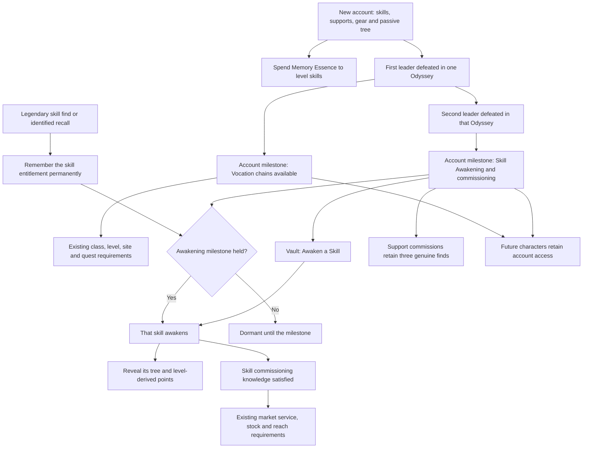

# Account power progression

Power-system access follows earned Odyssey depth. Town services and convenience
continue through their existing resource, quest and purchase progression.

Discovery and Awakening remain separate. Reaching Odyssey 2 does not awaken
every discovered skill; it enables the Vault draw and activates earned legendary
entitlements. Before a skill awakens, its tree, point bar, button and alerts stay
hidden. Basic skill leveling and sockets remain usable. Points derive from the
skill's current level when its tree becomes accessible.

Class discovery grants the actual base starting bar plus its authored support
selection. Mastery alternates remain separate purchases. Wider schools are
available through Memory discovery. Previously granted gems and allocated nodes
are retained, with further tree spending requiring current access.

`src/data/powerProgression.ts` owns the milestone thresholds. The Odyssey runtime
stamps each reached stage immediately and reconciles validated saved campaigns.
Receipts persist on the account and are not accumulated from separate runs'
first victories. Modes that cannot earn account progression cannot stamp them.
Host decisions control co-op tree access.

Existing per-skill legendary receipts work retroactively, even if the original
gem was sold or lost. Accounts older than per-skill tracking cannot reconstruct
that history from a global legendary flag. Likewise, old lifetime faction totals
do not establish campaign depth; surviving saved campaign receipts do.

The debug Grand Codex retains its Awakening bypass. Skill Grafting remains tied
to that debug purchase. Odyssey 3/4 system rewards, relic changes and event
configuration are reserved for later passes.

Verification: `memoryunlocks`, `odyssey`, `unlocks`, `classmastery`, `vendorlocker`
and `menubar` probes; account and co-op round trips; the hidden Memory UI harness;
type checks and the simulation smoke suite.
