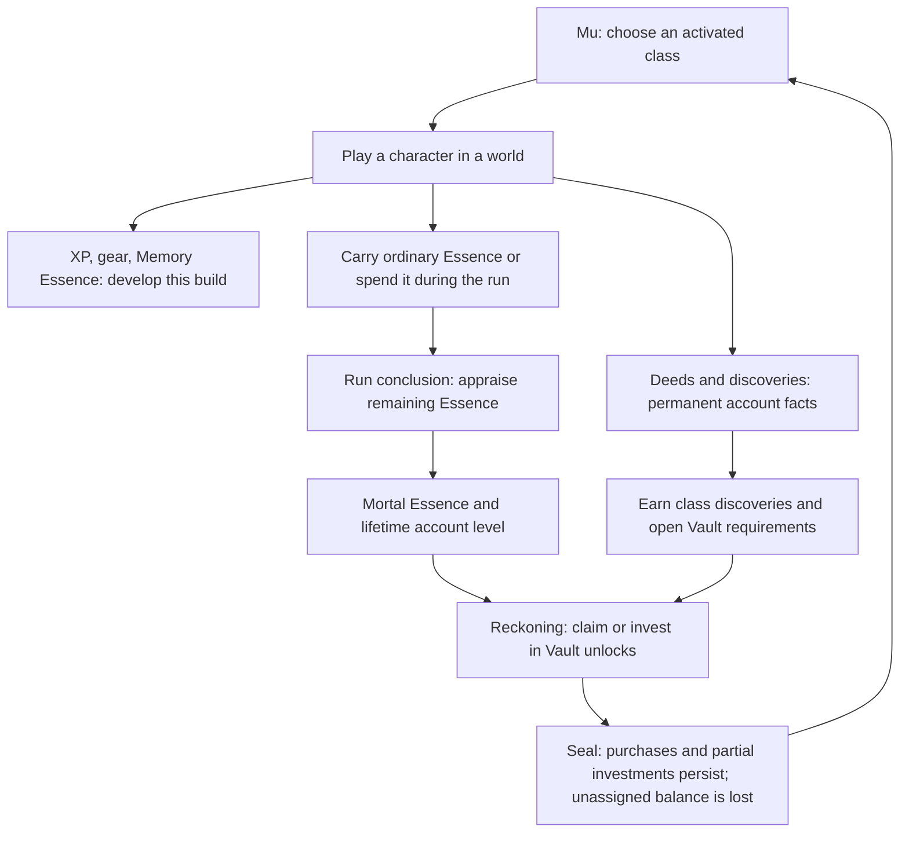
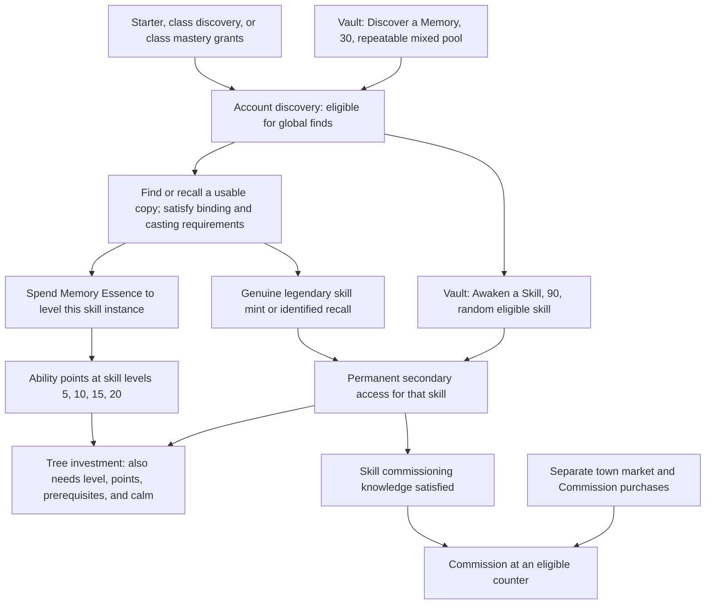

# Hollow Wake — current progression map

Source audit of the working tree on 2026-09-21. This describes current behavior,
including the experimental Memory economy, rather than a proposed progression order.
The accompanying interactive diagram is a navigable summary; the catalog below
preserves the exact prerequisite groups for every active Vault entry.

## Read the gates

- **Play**: a deed, encounter, character level, lesson, or quest completion.
- **Vault**: a separate deliberate claim or Mortal Essence investment. A satisfied
  requirement usually makes a purchase available; it does not buy the feature.
- **Account**: survives mortal characters. **Character/world**: belongs to the
  current build or expedition. A class-level achievement is recorded on the account;
  it is not the same thing as account level.
- Requirements in the catalog's **All required** column are conjunctive. Its
  **Any one road** column is an OR group which is itself required alongside those
  prerequisites. Package tiers additionally require the base and all earlier tiers.
- The Vault itself opens after the first counted account death. Free claims still
  require access to the Vault. Static catalog eligibility alone does not express this UI gate.
- Proximity, stock, attributes, level, available points, and combat discipline may
  still constrain use after a permanent unlock.

## The repeating account loop

Ordinary Essence denominations are worth 1/2/3/5 Mortal Essence respectively.
Lifetime credited essence sets account level at thresholds `50 × level²`; spending
does not reduce that level. Memory Essence I–IV is a separate skill-leveling wallet,
not the ordinary Essence appraisal. The normal mortal run pays 100%; Immortal policy
differs below. Sources: [reckoning](reckoning.md), [account](../../src/meta/account.ts),
[essences](../../src/data/essences.ts), [modes](../../src/meta/modes.ts).

## Class discovery, selection, and mastery

There are three starter classes: Warrior, Magician, Rogue. A non-starter's parent
requirements plus any one authored deed earn its discovery. Discovery immediately
grants its existing skill/support rewards and reveals its background vessel in Mu.
The free Vault **Unlock** activates selection; only activated classes count toward
the class-card slot ladder. Parent-class discovery chains currently read earned
bundle ownership, so a pending activation can still satisfy a child's parent gate.

Class mastery is a separate paid ladder: the relevant class reaches 10/30/60/100,
then the player invests 90/180/320/600 in sequence. Only authored kit tiers exist;
currently eight classes have four tiers each. These open alternate starting kits
or an extra opening skill and also grant those skills' drop eligibility. Discovering
the same skill randomly does not purchase its class's alternate opening.

Sources: [class deeds](../../src/data/classdeeds.ts), [catalog](../../src/meta/unlocks.ts),
[class kits](../../src/meta/classkit.ts), [Mu dealing](../../src/engine/muDeal.ts).

## Memories: access, possession, investment

Both random pools exclude existing results. Discovery includes skills and supports;
awakening currently includes skills only. Supports keep the three-genuine-find
commission requirement. Drop level, source, and stock restrictions still apply.
Regional/fixed finds can precede global discovery; a legendary such find grants both
discovery and awakening. Unidentified Memory previews do not awaken anything.

Skill leveling remains usable before awakening. Trees accumulate their level-derived
point budget while sealed. Previously spent tree nodes survive; additional spending
needs awakening. Item/internal skills that are not in the obtainable catalog have
an explicit engine exemption. Higher rarity and awakening are different states:
**Font merging and vendor purchases do not count as genuine legendary finds**.

Grand Codex remains a 500-essence, account-level-2 **debug** purchase that bypasses
both discovery and awakening by default. Skill Grafting still requires that Codex,
then costs 120 per armed charge; a chosen next-run skill consumes it. This dependency
needs a replacement when the Codex leaves the normal economy. Prestige has a shared
secondary-gate hook but no implemented prestige progression. The older Mystic-town
proposal is not a current prerequisite.

Sources: [Memory policy](../../src/data/memoryUnlocks.ts),
[Memory resolver](../../src/meta/memoryUnlocks.ts),
[engine](../../src/engine/world.ts) (`noteGemDrop`, `levelUpSkill`, `pickTreeNode`,
`fontMergeSkill`, `setVendorCommission`), [skill bands](../../src/engine/skills.ts).

## Town, markets, and equipment

- Touch ordinary Essence → **Salvage Station, 1** → ordinary vendor trade,
  selling, breaking gear, and craft study. Counters can be browsed before trade.
  A failed Odyssey defense can temporarily close Lastlight trade again.
- Salvage → **Broader Wares I, 60** → **Memory Counter, 120** → true skill
  Memories on shelves. **Supports, 80** adds support stock. Wider-stock and faster
  restock ladders are separate purchases.
- Memory Counter + Broader Wares I + a successful purchase → **Reserved Wares I,
  80**. Then an eligible discovered/awakened skill or three-find support opens
  **Commission, 240**. Normal counter availability and roll odds still apply.
  The core service chain alone costs **501**; random skill awakening adds **90**
  if no legendary find supplied it, and random discovery adds **30** if needed.
- Break suitable natural affixes → account craft lore ranks → craft their families
  using ordinary Essence. Rank study requirements are 3/5/8/12/16, and deeper ranks
  require sufficiently strong examples. Five unlocked craft families → **Oracle,
  90**. Salvage + any character reaching 15 → **Twin Anvils, 400**.
- Sacrificial Fonts are available at authored locations without a Vault purchase:
  merge same-skill gems (3 common → magic, 4 magic → rare, 5 rare → legendary),
  convert Memory Essence tiers, or pay to reset a skill's whole tree.
- Mireille's first flask refill lesson → life care 40 → mana care 60 → XP blessing
  120 or Tracker 90. Bestiary kills accumulate independently of buying its viewing
  station. Mastery defaults: 500 ordinary kills / 20 boss kills, with authored
  exceptions; eligible mastered non-boss forms can be attuned at the Tracker's book.
- Bounty Board is a free Vault claim; one completed bounty opens three independent
  two-rung ladders for breadth, distance, and reservations. Legendary skill discovery
  opens the Training Dummy purchase; 50 explored zones open Campfire world refresh.
- Quartermaster: reach character level 5 → buy Town Expansion 100. At level 8,
  complete and turn in the lost-relic quest → a chosen charm and a free one-cell
  Reliquary. First seating completes its lesson and enables ambient relic drops.
  Its four paid size expansions are a separate ladder.

Sources: [vendor policy](../../src/data/vendors.ts), [crafting](../../src/engine/crafting.ts),
[menu access](../../src/data/menu.ts), [Reliquary quest](../../src/quests/reliquary.ts),
[bestiary](../../src/data/bestiary.ts), [container data](../../src/data/containers.ts).

## Travel and hired companions

Caravan unlocks at character-level milestones 10/30/40/60, costs 120/200/320/480,
and requires the Unmade's defeat for its last two rungs. It expands convenient
band travel, not the right to explore ordinary roads. Sailing starts with a free
Dinghy; voyages, landfall, earlier hulls, account levels, and character level 40
gate the three hull purchases. Finding a port exposes its harbor/harborhold
services; restoration, charts, and hires spend the current character's carried
Essence. Meeting a mercenary market opens the 120-essence Lastlight recruiter;
outposts provide their own recruitment/retirement routes. These services retain
their location, capacity, and encounter-state requirements.

Sources: [caravan](../../src/data/caravan.ts), [ships](../../src/data/ships.ts),
[mercenaries](../../src/meta/mercs.ts), [engine service predicates](../../src/engine/world.ts).

## Odyssey and Vocations

Four leaders are selected from eight faction campaigns per world. Explore or follow
local work to discover leads; optional operations weaken the corresponding leader.
Leaders may be defeated in any order. Readiness 23/45/60/75 is a pacing target, not
a character-level lock. Each victory supplies 2 Vocation points, 1 passive point,
6 Memories, XP, and a signal fragment. Four victories open the level-80 survey;
the final undertaking, final victory, and post-victory endgame are not built here.
Defeating the tutorial faction's Odyssey leader permanently releases its mandatory
enrollment in future worlds; defeating the earlier personal commander does not.

Vocation chains normally begin at character level 30, with explicit exceptions.
An ordinary home-class chain is available without prior account discovery; a
foreign chain needs its account unlock. Secret Vocations first require their own
site discovery and usually the home class. Completing a chain grants that character
the Vocation and, where mode policy permits, opens it account-wide for future
characters. New characters still perform their own chains. One Vocation per
character; spending also requires its home-class passive start node (or authored
override) and earned Vocation points. Chains default to zero points now: Odyssey
owns the ordinary income, allowing points to be banked before acquiring a Vocation.

Sources: [Odyssey data](../../src/data/odyssey.ts), [Odyssey engine](../../src/engine/odyssey.ts),
[Vocation data](../../src/data/vocations.ts), [chain gates](../../src/quests/vocations.ts),
[passive gate](../../src/data/passives.ts).

## World packages: encounter versus control

Most packages already run at their authored level and habitat. Encountering or
achieving the relevant deed opens the purchase of **configuration**. Buying it
permits expedition choices; further deed-and-purchase tiers widen tuning bounds.
The next expedition freezes those choices into its manifest; existing runs retain
their own manifest. World Tempo is an additional 400-essence purchase after a
character reaches level 100.

There are 39 registered packages: 38 base purchases and 69 sequential
tier purchases; Faction Politics is always-on and has no Vault row. **The Pit** is
the sole currently default-disabled package: discover Lastlight's cellar, then buy
it for 140 to add it to a future expedition. Pressureless does not mean unowned
content is absent: **The Unsealing** and **The War Below** are both default-enabled,
even though each has a purchase. Their own in-world progress remains distinct
(for example, four canopic wards open the Unsealing tomb). Read the registry rather
than inferring existence from the generic purchase label.

Sources: [package registry](../../src/packages/registry.ts),
[manifest policy](../../src/packages/manifest.ts), [package definitions](../../src/packages/defs),
[purchase visibility](../../src/meta/unlocks.ts).

## Life contracts and persistence

Mortal characters feed the account and end on death. After 20 counted deaths,
buy the Immortal Covenant for 100. With a free vessel slot, Mu has a 10% offer
chance and offers at most one activated class under the contract. The offered
contract may be declined. Slots two and three cost 200 and 350 in sequence.

A Sworn character initially feeds account progression. Its first death pays 25%
of ordinary Essence appraisal and advances to Undying. Its build persists, its
carry is stripped, and later deaths grant no account progression or essence.
An Undying death marks the vessel Fallen. Mortal runs can fund its repeatable
resurrection in the Vault at a fee frozen on falling:
`round((30 + 6 × character level) × (1 + 0.05 × account level))` (minimum 1).
Dynamic Fallen-vessel rows are additional to the static catalog below.

Mortal corpses support later reclaiming; the Undying corpse route is self-only.
Cosmetics, knowledge, class/Memory discovery, town purchases, craft lore, and
configuration ownership are account systems, while equipment, skill instances,
ordinary passive allocations, Vocation points, and campaign state follow the
character/world save. Mode policies govern whether play may write account gains.

Sources: [mode definitions](../../src/meta/modes.ts), [account](../../src/meta/account.ts),
[character save](../../src/meta/character.ts), [cosmetics](../../src/meta/cosmetics.ts).

The Wardrobe is a parallel account progression path outside `UNLOCK_CATALOG`.
Most appearances are included initially; achievement cosmetics unlock from quests
or exploration. Three paid entries use the same Mortal Essence balance: Starfall
Steps 35, Wild Bloom 25, and repeatable Prismatic Ink 20. Two Ink charges are
included initially; each charge permanently binds custom recoloring to one learned
or account-unlocked skill. Appearance ownership does not unlock a class or skill.
The separate Wardrobe register below lists all eight non-starter acquisition rows.

## Questions made visible by this map

These are review points, not changes applied by this audit:

1. Is the 501-essence service chain before commissioning, plus optional discovery
   and awakening costs, the intended amount of delay and explanation?
2. Should Skill Grafting depend on the normal discovery system before removing
   the debug Codex prerequisite?
3. Should a Font-forged legendary awaken secondary access too? It currently does not.
4. Should mastery remain a separate starting-kit permission when random discovery
   has already granted that skill's drop eligibility?
5. Should a discovered-but-unactivated class count as a parent in discovery chains?
   It currently does; selection and slot purchases remain activation-gated.
6. Do the two default-enabled pressureless package purchases provide the intended
   value and communicate it clearly?

## Coverage and limits

The catalog appendix is extracted from live registered data, including generated
class mastery, container ladders, bounty upgrades, vendor ladders, and package
tiers. Retired skill/support bundles are excluded under the current policy and
listed separately as an inactive comparison path. The audit also follows runtime
gates for trade, skill trees, fonts, Vocations, relic lessons, modes, and Odyssey.
It does not enumerate every item's roll, combat ability's casting requirements,
map door, included cosmetic appearance, or possible player-created workshop content.
This is a source snapshot, not a balance or save-specific unlock forecast.

<!-- GENERATED CATALOG -->

Live extraction: 2026-09-22T00:33:57.389Z. **232 active catalog entries**, excluding dynamic Fallen vessels. Costs below are Mortal Essence.

### Town services, travel, contracts and debug

| Entry | Cost | All required | Any one road | Result |
|---|---:|---|---|---|
| Bounty Board: Town (`feat_bounty_board`) | 0 | No row-specific prerequisite | — | A posting board raised in Lastlight, free for the claiming. Its slate refreshes on its own clock with work drawn from the living world. Dwell to read the postings, take ONE in hand, and return to the board when the deed is done: the pay is printed on the card, and the next slate waits where you collect. |
| Broader Wares I (`feat_vendor_wares_1`) | 60 | Salvage Station: Town | — | Every counter stocks wider: +2 Memory slots on the one shelf (they fill once the Memory Counter opens) and +1 rolled piece in the glass beside them. One purchase, every market your line will ever trade in. |
| Broader Wares II (`feat_vendor_wares_2`) | 140 | Broader Wares I | — | Every counter stocks wider: +1 Memory slot on the one shelf (they fill once the Memory Counter opens) and +2 rolled pieces in the glass beside them. One purchase, every market your line will ever trade in. |
| Broader Wares III (`feat_vendor_wares_3`) | 260 | Broader Wares II | reach level 15 OR complete a vocation OR complete a quest | Every counter stocks wider: +1 Memory slot on the one shelf (they fill once the Memory Counter opens) and +2 rolled pieces in the glass beside them. One purchase, every market your line will ever trade in. |
| The Memory Counter (`feat_vendor_gems`) | 120 | Broader Wares I | — | Every counter's shelf grows its true finds: direct Skill Memories stock in the glass beside the pouches, account-wide. Support Memories and the deeper counter services grow from here. |
| Memory Counter: Supports (`feat_brandt_supports`) | 80 | The Memory Counter | — | The counters' Memory slots also deal Support Memories. |
| Rush Order I (`feat_vendor_restock_1`) | 100 | Salvage Station: Town | — | Every counter restocks in 4 minutes instead of 5. One purchase, every market. |
| Rush Order II (`feat_vendor_restock_2`) | 220 | Rush Order I | — | Every counter restocks in 3 minutes instead of 4. One purchase, every market. |
| Mireille: Field Care (`feat_mireille_life`) | 40 | Complete Mireille’s flask refill lesson | — | Mireille restores your LIFE when you linger near her. |
| Mireille: Restorative Brew (`feat_mireille_mana`) | 60 | Mireille: Field Care | — | She also replenishes your MANA. |
| Mireille: Traveller's Rest (`feat_mireille_xp`) | 120 | Mireille: Restorative Brew | — | Linger for a 5-minute +5% experience blessing: a worthwhile pitstop. |
| Weslan the Tracker (`feat_tracker`) | 90 | Mireille: Restorative Brew | — | A huntsman camps at the town's west edge. Dwell by his fire to open the BESTIARY: every kind your line has slain, studied into knowledge that outlives every death. |
| Reserved Wares I (`feat_vendor_lock_1`) | 80 | The Memory Counter; Broader Wares I; Buy something from a vendor | — | Every counter learns THE PATRON'S HOLD: tick a ware to RESERVE its shelf slot, and it rides every restock, every reload, untouched, until bought or released. One slot, shared law at every counter. |
| Reserved Wares II (`feat_vendor_lock_2`) | 160 | Reserved Wares I | — | The counters hold 2 reserved slots for you. |
| Reserved Wares III (`feat_vendor_lock_3`) | 280 | Reserved Wares II | — | The counters hold 3 reserved slots for you. |
| The Standing Order: Commission (`feat_vendor_commission`) | 240 | Reserved Wares I; At least one eligible discovered skill (awakened) or support (3 genuine finds) | — | Commission an awakened skill or a support found 3+ times. The counter watches at its normal restock odds and reserves a find for you. One standing order per counter; fulfilled on purchase. |
| Quest Package: Town Expansion (`feat_quest_giver`) | 100 | Any character reaches level 5 | — | A quartermaster settles in Lastlight, posting hunts into the wilds (quest chains). |
| Broader Postings I (`feat_bounty_broader_1`) | 90 | Bounty Board: Town; Complete a bounty | — | The board deals 1 more posting every beat: more work to choose among, one hand at a time all the same. |
| Broader Postings II (`feat_bounty_broader_2`) | 180 | Broader Postings I | — | The board deals 1 more posting every beat: more work to choose among, one hand at a time all the same. |
| Farther Postings I (`feat_bounty_farther_1`) | 80 | Bounty Board: Town; Complete a bounty | — | The board's writs reach 35% farther afield: deeper country, richer asks, longer walks home. |
| Farther Postings II (`feat_bounty_farther_2`) | 160 | Farther Postings I | — | The board's writs reach 35% farther afield: deeper country, richer asks, longer walks home. |
| Reserved Postings I (`feat_bounty_lock_1`) | 100 | Bounty Board: Town; Complete a bounty | — | One reserve pin at the bounty board: a pinned posting holds its seat through every fresh deal until you take it or let it go. A dead ask still leaves: the pin holds the seat, never the truth. |
| Reserved Postings II (`feat_bounty_lock_2`) | 200 | Reserved Postings I | — | One reserve pin at the bounty board: a pinned posting holds its seat through every fresh deal until you take it or let it go. A dead ask still leaves: the pin holds the seat, never the truth. |
| Training Dummy: Town (`feat_target_dummy`) | 50 | Find a genuine legendary skill | — | That legendary Memory deserves better than guesswork. A practice dummy stands in Lastlight: an immortal target to pummel and test your skills, effects, ailments, and modifiers against. |
| Campfire: Town (`feat_campfire`) | 70 | Explore distinct zones ≥ 50 | — | Fifty zones charted, and the wilds know your steps. A campfire is laid in Lastlight. Zones already remember their layout and surviving foes as you cross between them; dwell by the fire to REFRESH the wilds on command, and every zone repopulates fresh (your cleared objectives stay claimed). |
| Salvage Station: Town (`feat_salvage_station`) | 1 | Touch ordinary Essence | — | That strange residue has a name: ESSENCE. A breaker's bench is raised in Lastlight; dwell there to BREAK gear and carried Memories into their rarity's essence (coarse, glimmering, brilliant, pristine), studying every affix broken. The same wisdom teaches Brandt to BUY SCRAP at his counter, paying Coarse Essence by an item's overall quality: sell for volume, break for the deep tints and the lore. Spend essence levelling skills, at counters, and crafting studied affixes onto your gear. |
| Salvage Station: Twin Anvils (`feat_craft_second`) | 400 | Salvage Station: Town; Any character reaches level 15 | — | The bench learns to hold TWO crafted affixes on one item (the one-craft rule, bought apart). |
| Oracle Stone: Town (`feat_oracle_stone`) | 90 | Unlock craft families ≥ 5 | — | Five crafts studied deep enough to work, and the runes will speak to you now. Standing stones rise in Lastlight. Commune over an item (trace the runes; precision and haste decide the outcome) to REROLL one of its affixes; the stone answers each line only once, sealing it forever. |
| Mercenary Recruiter: Town (`feat_merc_recruiter`) | 120 | Meet a mercenary market | — | A recruiting officer takes a table in Lastlight's east quarter. Hire a blade the moment a run begins, under port rules: baseline sellswords fitted to your level, and NO retiring at his table. His sheet is dealt ONCE for each world and never refreshed: what he offers is all he will ever offer, until the world itself is made anew. |
| The Immortal Covenant (`feat_immortal`) | 100 | Counted account deaths ≥ 20 | — | Death has seen you 20 times, and blinked. Opens the IMMORTAL covenant: while a vessel slot stands free, the nothing between lives may offer one waking vessel under it — you will know it by the ember it wears. Take it, or wake mortal. A sworn character plays the wake as any other, until its first death, which pays a reduced essence tithe and seals it OUTSIDE the mortal ledger. It wakes in town, build intact, carry lost; it persists across sessions in an account vessel; its corpses are visible only to itself, and its deeds feed the account nothing. The character itself is never lost, but each later death FELLS the vessel, and only Mortal Essence from your mortal runs, poured at the Vault, calls it back. |
| Immortal: Second Vessel (`feat_immortal_slot_2`) | 200 | The Immortal Covenant | — | The covenant holds a second sworn character (two Immortal save slots). |
| Immortal: Third Vessel (`feat_immortal_slot_3`) | 350 | Immortal: Second Vessel | — | The covenant holds a third sworn character (three Immortal save slots). |
| Caravan: Outpost (`feat_caravan`) | 120 | Any character reaches level 10 | — | A travelling Caravanner makes camp in Lastlight and escorts you to the near wilds (lvl ≤20), minting a fixed route into each level band and ferrying you home. |
| Caravan: Deep Frontier (`feat_caravan_deep`) | 200 | Caravan: Outpost; Any character reaches level 30 | — | The Caravanner braves routes into the lvl 21–30 band. |
| Caravan: Beyond the Veil (`feat_caravan_far`) | 320 | Caravan: Deep Frontier; Any character reaches level 40; Slay the Unmade | — | With the Unmade slain, the Caravanner runs the lvl 31–50 bands. (Requires: reach level 40 AND defeat the Unmade.) |
| Caravan: The Far Reaches (`feat_caravan_world`) | 480 | Caravan: Beyond the Veil; Any character reaches level 60; Slay the Unmade | — | The widest routes: the lvl 51–100 bands. (Requires: reach level 60 AND defeat the Unmade.) |
| Shipwright: Coastal Sloop (`ship_sloop`) | 90 | Sail a voyage | — | A proper hull replaces the dinghy: +15% sail speed, a longer spyglass (the sea streams and reveals further), and a practiced landing crew. |
| Shipwright: Brigantine (`ship_brigantine`) | 220 | Account level 1; Shipwright: Coastal Sloop; Land on an island | — | Twin masts for the open crossings: +32% sail speed, a far spyglass, and swift beachings. (Requires: land on a Voyage island.) |
| Shipwright: Storm Galleon (`ship_galleon`) | 450 | Account level 2; Shipwright: Brigantine; Any character reaches level 40 | — | The flagship: +50% sail speed, a horizon-spanning spyglass, and landings measured in heartbeats. |
| World Tempo: Global Event Frequency (`feat_global_frequency`) | 400 | Any character reaches level 100 | — | End-game mastery: Expedition-screen sliders for the world event dials, across the whole run. Tempo scales how OFTEN events occur and how many run at once; Severity scales how HARD each one runs (invasion strength, meteor rate, spread speed, breach duration). Crank the world into a roaring festival, or dial it to a slow burn. |
| Grand Codex: Debug Unlock All Memories (`feat_unlock_all_gems`) | 500 | Account level 2 | — | DEBUG shortcut retained for testing: every skill and support becomes obtainable, including future additions. Secondary access is bypassed while the debug bypass is enabled. Planned for removal from the player economy after unlock experiments. |
| Reliquary: The First Ring (`feat_reliquary_ring`) | 60 | Reliquary quest reward | — | Seven more seats open around the sealed heart, eight in all. Talismans fit along the walls and idols stand beside them. |
| Reliquary: Wider Shelves (`feat_reliquary_shelves`) | 140 | Reliquary: The First Ring | reach level 12 | The case grows outward: twelve more seats along its outer walls, twenty in all. Talismans lie flat along the shelves, idols stand in the corners of the ring. |
| Reliquary: The Heart (`feat_reliquary_heart`) | 260 | Reliquary: Wider Shelves | reach level 25 | The centre of the case opens. An effigy — the 2×2 relic that carries a rare's full six lines — can finally seat, and every charm around it must make room. |
| Reliquary: The Full Case (`feat_reliquary_case`) | 420 | Reliquary: The Heart | reach level 40 | The four corners close the case: twenty-five seats, a solid five-by-five. Every footprint fits somewhere now; the puzzle is only what you choose to carry. |

### Class card slots

| Entry | Cost | All required | Any one road | Result |
|---|---:|---|---|---|
| Class Slot 4 (`slot_tier_4`) | 40 | 4 activated selectable classes | — | Surface a 4th selectable class at character select, dealt at random from your unlocked classes (Class unlocks below deepen that pool; a slot only surfaces once your pool can fill it). |
| Class Slot 5 (`slot_tier_5`) | 80 | Class Slot 4; 5 activated selectable classes | — | Surface a 5th selectable class at character select, dealt at random from your unlocked classes (Class unlocks below deepen that pool; a slot only surfaces once your pool can fill it). |
| Class Slot 6 (`slot_tier_6`) | 130 | Class Slot 5; 6 activated selectable classes | — | Surface a 6th selectable class at character select, dealt at random from your unlocked classes (Class unlocks below deepen that pool; a slot only surfaces once your pool can fill it). |
| Class Slot 7 (`slot_tier_7`) | 200 | Class Slot 6; 7 activated selectable classes | — | Surface a 7th selectable class at character select, dealt at random from your unlocked classes (Class unlocks below deepen that pool; a slot only surfaces once your pool can fill it). |
| Class Slot 8 (`slot_tier_8`) | 300 | Class Slot 7; 8 activated selectable classes | — | Surface a 8th selectable class at character select, dealt at random from your unlocked classes (Class unlocks below deepen that pool; a slot only surfaces once your pool can fill it). |
| Class Slot 9 (`slot_tier_9`) | 420 | Class Slot 8; 9 activated selectable classes | — | Surface a 9th selectable class at character select, dealt at random from your unlocked classes (Class unlocks below deepen that pool; a slot only surfaces once your pool can fill it). |
| Class Slot 10 (`slot_tier_10`) | 560 | Class Slot 9; 10 activated selectable classes | — | Surface a 10th selectable class at character select, dealt at random from your unlocked classes (Class unlocks below deepen that pool; a slot only surfaces once your pool can fill it). |
| Class Slot 11 (`slot_tier_11`) | 720 | Class Slot 10; 11 activated selectable classes | — | Surface a 11th selectable class at character select, dealt at random from your unlocked classes (Class unlocks below deepen that pool; a slot only surfaces once your pool can fill it). |
| Class Slot 12 (`slot_tier_12`) | 900 | Class Slot 11; 12 activated selectable classes | — | Surface a 12th selectable class at character select, dealt at random from your unlocked classes (Class unlocks below deepen that pool; a slot only surfaces once your pool can fill it). |

### Earned class discoveries

| Entry | Cost | All required | Any one road | Result |
|---|---:|---|---|---|
| Class: Spellblade (`class_spellblade`) | 0 | Bounty Board: Town; Quest Package: Town Expansion | finish 300 enemies with melee hits | Earned discovery + gems; free Vault activation still required |
| Class: Cryomancer (`class_cryomancer`) | 0 | Bounty Board: Town; Quest Package: Town Expansion | land 90 cold hits | Earned discovery + gems; free Vault activation still required |
| Class: Apothecary (`class_apothecary`) | 0 | Bounty Board: Town; Quest Package: Town Expansion | mend 1,200 life lost to hostile hits | Earned discovery + gems; free Vault activation still required |
| Class: Berserker (`class_berserker`) | 0 | No row-specific prerequisite | finish 1,875 enemies with melee hits OR survive and recover from 18 low-life crises | Earned discovery + gems; free Vault activation still required |
| Class: Sorcerer (`class_sorcerer`) | 0 | No row-specific prerequisite | practice 3 elements: land 113 hits with each of fire, cold and lightning | Earned discovery + gems; free Vault activation still required |
| Class: Ranger (`class_ranger`) | 0 | No row-specific prerequisite | land 135 projectile hits from at least 160 units away | Earned discovery + gems; free Vault activation still required |
| Class: Guardian (`class_guardian`) | 0 | No row-specific prerequisite | block 75 hostile hits | Earned discovery + gems; free Vault activation still required |
| Class: Summoner (`class_summoner`) | 0 | Class: Necromancer | have your companions slay 300 enemies | Earned discovery + gems; free Vault activation still required |
| Class: Swashbuckler (`class_swashbuckler`) | 0 | No row-specific prerequisite | evade 300 hostile attacks | Earned discovery + gems; free Vault activation still required |
| Class: Juggernaut (`class_juggernaut`) | 0 | Class: Guardian | survive 18,000 life damage from hostile hits | Earned discovery + gems; free Vault activation still required |
| Class: Pyromancer (`class_pyromancer`) | 0 | No row-specific prerequisite | land 1,125 fire hits | Earned discovery + gems; free Vault activation still required |
| Class: Assassin (`class_assassin`) | 0 | No row-specific prerequisite | finish 113 enemies while concealed | Earned discovery + gems; free Vault activation still required |
| Class: Necromancer (`class_necromancer`) | 0 | No row-specific prerequisite | reclaim 15 of your own corpses OR slay 4 bosses of the undead | Earned discovery + gems; free Vault activation still required |
| Class: Tamer (`class_tamer`) | 0 | No row-specific prerequisite | put down a Crowned beast | Earned discovery + gems; free Vault activation still required |
| Class: Cleric (`class_cleric`) | 0 | No row-specific prerequisite | mend 6,750 life lost to hostile hits | Earned discovery + gems; free Vault activation still required |
| Class: Breaker (`class_breaker`) | 0 | No row-specific prerequisite | break the same living enemy’s poise 2 times in one encounter | Earned discovery + gems; free Vault activation still required |
| Class: Vanguard (`class_vanguard`) | 0 | No row-specific prerequisite | stop 3,000 damage with blocks | Earned discovery + gems; free Vault activation still required |
| Class: Blademaster (`class_blademaster`) | 0 | Class: Berserker | land 113 melee critical hits | Earned discovery + gems; free Vault activation still required |
| Class: Brawler (`class_brawler`) | 0 | No row-specific prerequisite | be seized by a grip, and live | Earned discovery + gems; free Vault activation still required |
| Class: Sentinel (`class_sentinel`) | 0 | Class: Guardian | answer 90 blocks with a melee hit within 3 seconds | Earned discovery + gems; free Vault activation still required |
| Class: Lancer (`class_lancer`) | 0 | Class: Ranger | land 450 projectile hits | Earned discovery + gems; free Vault activation still required |
| Class: Trapper (`class_trapper`) | 0 | No row-specific prerequisite | spring a trap with your own feet, and live | Earned discovery + gems; free Vault activation still required |
| Class: Warlord (`class_warlord`) | 0 | No row-specific prerequisite | kill a warband's warlord | Earned discovery + gems; free Vault activation still required |
| Class: Skald (`class_skald`) | 0 | Class: Warlord | follow 90 warcries with a melee kill within 6 seconds | Earned discovery + gems; free Vault activation still required |
| Class: Beguiler (`class_beguiler`) | 0 | No row-specific prerequisite | accumulate 45,000 indirect damage | Earned discovery + gems; free Vault activation still required |
| Class: Chronomancer (`class_chronomancer`) | 0 | No row-specific prerequisite | slay the Chronophage | Earned discovery + gems; free Vault activation still required |
| Class: Ascetic (`class_ascetic`) | 0 | Class: Cleric | mend 13,500 life lost to hostile hits | Earned discovery + gems; free Vault activation still required |
| Class: Hivecaller (`class_hivecaller`) | 0 | No row-specific prerequisite | kill a mother of broods | Earned discovery + gems; free Vault activation still required |
| Class: Wallwright (`class_wallwright`) | 0 | Class: Breaker | break enemy poise 113 times | Earned discovery + gems; free Vault activation still required |
| Class: Matador (`class_matador`) | 0 | Class: Brawler | evade 750 hostile attacks | Earned discovery + gems; free Vault activation still required |
| Class: Flagellant (`class_flagellant`) | 0 | No row-specific prerequisite | die 6 times | Earned discovery + gems; free Vault activation still required |
| Class: Falconer (`class_falconer`) | 0 | Class: Tamer | have your companions slay 600 enemies | Earned discovery + gems; free Vault activation still required |
| Class: Sharper (`class_sharper`) | 0 | Class: Swashbuckler | land 45 projectile critical hits | Earned discovery + gems; free Vault activation still required |
| Class: Firebrand (`class_firebrand`) | 0 | Class: Beguiler | hit panicked enemies 113 times | Earned discovery + gems; free Vault activation still required |
| Class: Runeweaver (`class_runeweaver`) | 0 | No row-specific prerequisite | rehearse 6 different spells: use each 23 times near enemies | Earned discovery + gems; free Vault activation still required |
| Class: Resonator (`class_resonator`) | 0 | No row-specific prerequisite | break a fallen star | Earned discovery + gems; free Vault activation still required |

### Class mastery

| Entry | Cost | All required | Any one road | Result |
|---|---:|---|---|---|
| Novice Warrior (`tier_warrior_novice`) | 90 | No row-specific prerequisite | reach level 10 as the Warrior | Mastery of the Warrior, rung Novice (a Warrior of level 10 has walked this far). An ALTERNATE OPENING for every Warrior you wake after, chosen on the class card: Carve may stand in for Cleave. The gem joins the drop pool. |
| Adept Warrior (`tier_warrior_adept`) | 180 | Novice Warrior | reach level 30 as the Warrior | Mastery of the Warrior, rung Adept (a Warrior of level 30 has walked this far). An ALTERNATE OPENING for every Warrior you wake after, chosen on the class card: Berserk may stand in for Shield Up. The gem joins the drop pool. |
| Expert Warrior (`tier_warrior_expert`) | 320 | Adept Warrior | reach level 60 as the Warrior | Mastery of the Warrior, rung Expert (a Warrior of level 60 has walked this far). An ALTERNATE OPENING for every Warrior you wake after, chosen on the class card: Grenado may stand in for War Cry. The gem joins the drop pool. |
| Master Warrior (`tier_warrior_master`) | 600 | Expert Warrior | reach level 100 as the Warrior | Mastery of the Warrior, rung Master (a Warrior of level 100 has walked this far). An ALTERNATE OPENING for every Warrior you wake after, chosen on the class card: Red Hour stands on the bar from the first breath. The gem joins the drop pool. |
| Novice Magician (`tier_magician_novice`) | 90 | No row-specific prerequisite | reach level 10 as the Magician | Mastery of the Magician, rung Novice (a Magician of level 10 has walked this far). An ALTERNATE OPENING for every Magician you wake after, chosen on the class card: Frostbolt may stand in for Firebolt. The gem joins the drop pool. |
| Adept Magician (`tier_magician_adept`) | 180 | Novice Magician | reach level 30 as the Magician | Mastery of the Magician, rung Adept (a Magician of level 30 has walked this far). An ALTERNATE OPENING for every Magician you wake after, chosen on the class card: Shock Nova may stand in for Frost Nova. The gem joins the drop pool. |
| Expert Magician (`tier_magician_expert`) | 320 | Adept Magician | reach level 60 as the Magician | Mastery of the Magician, rung Expert (a Magician of level 60 has walked this far). An ALTERNATE OPENING for every Magician you wake after, chosen on the class card: Fireball may stand in for Chain Lightning. The gem joins the drop pool. |
| Master Magician (`tier_magician_master`) | 600 | Expert Magician | reach level 100 as the Magician | Mastery of the Magician, rung Master (a Magician of level 100 has walked this far). An ALTERNATE OPENING for every Magician you wake after, chosen on the class card: The Long Cold stands on the bar from the first breath. The gem joins the drop pool. |
| Novice Rogue (`tier_rogue_novice`) | 90 | No row-specific prerequisite | reach level 10 as the Rogue | Mastery of the Rogue, rung Novice (a Rogue of level 10 has walked this far). An ALTERNATE OPENING for every Rogue you wake after, chosen on the class card: Blowdart may stand in for Backstab. The gem joins the drop pool. |
| Adept Rogue (`tier_rogue_adept`) | 180 | Novice Rogue | reach level 30 as the Rogue | Mastery of the Rogue, rung Adept (a Rogue of level 30 has walked this far). An ALTERNATE OPENING for every Rogue you wake after, chosen on the class card: Stealth may stand in for Cloak. The gem joins the drop pool. |
| Expert Rogue (`tier_rogue_expert`) | 320 | Adept Rogue | reach level 60 as the Rogue | Mastery of the Rogue, rung Expert (a Rogue of level 60 has walked this far). An ALTERNATE OPENING for every Rogue you wake after, chosen on the class card: Closing Fang may stand in for Shadow Step. The gem joins the drop pool. |
| Master Rogue (`tier_rogue_master`) | 600 | Expert Rogue | reach level 100 as the Rogue | Mastery of the Rogue, rung Master (a Rogue of level 100 has walked this far). An ALTERNATE OPENING for every Rogue you wake after, chosen on the class card: Rain of Knives stands on the bar from the first breath. The gem joins the drop pool. |
| Novice Summoner (`tier_summoner_novice`) | 90 | Class: Summoner | reach level 10 as the Summoner | Mastery of the Summoner, rung Novice (a Summoner of level 10 has walked this far). An ALTERNATE OPENING for every Summoner you wake after, chosen on the class card: Unmaking Bolt may stand in for Ruin. The gem joins the drop pool. |
| Adept Summoner (`tier_summoner_adept`) | 180 | Class: Summoner; Novice Summoner | reach level 30 as the Summoner | Mastery of the Summoner, rung Adept (a Summoner of level 30 has walked this far). An ALTERNATE OPENING for every Summoner you wake after, chosen on the class card: Conjure Wisp may stand in for Bind Familiar. The gem joins the drop pool. |
| Expert Summoner (`tier_summoner_expert`) | 320 | Class: Summoner; Adept Summoner | reach level 60 as the Summoner | Mastery of the Summoner, rung Expert (a Summoner of level 60 has walked this far). An ALTERNATE OPENING for every Summoner you wake after, chosen on the class card: Convocation may stand in for Essence Drain. The gem joins the drop pool. |
| Master Summoner (`tier_summoner_master`) | 600 | Class: Summoner; Expert Summoner | reach level 100 as the Summoner | Mastery of the Summoner, rung Master (a Summoner of level 100 has walked this far). An ALTERNATE OPENING for every Summoner you wake after, chosen on the class card: Hollow Star stands on the bar from the first breath. The gem joins the drop pool. |
| Novice Necromancer (`tier_necromancer_novice`) | 90 | Class: Necromancer | reach level 10 as the Necromancer | Mastery of the Necromancer, rung Novice (a Necromancer of level 10 has walked this far). An ALTERNATE OPENING for every Necromancer you wake after, chosen on the class card: Shambling Horde may stand in for Poison Nova. The gem joins the drop pool. |
| Adept Necromancer (`tier_necromancer_adept`) | 180 | Class: Necromancer; Novice Necromancer | reach level 30 as the Necromancer | Mastery of the Necromancer, rung Adept (a Necromancer of level 30 has walked this far). An ALTERNATE OPENING for every Necromancer you wake after, chosen on the class card: Corpse Explosion may stand in for Raise Dead. The gem joins the drop pool. |
| Expert Necromancer (`tier_necromancer_expert`) | 320 | Class: Necromancer; Adept Necromancer | reach level 60 as the Necromancer | Mastery of the Necromancer, rung Expert (a Necromancer of level 60 has walked this far). An ALTERNATE OPENING for every Necromancer you wake after, chosen on the class card: Summon Bone Golem may stand in for Despair. The gem joins the drop pool. |
| Master Necromancer (`tier_necromancer_master`) | 600 | Class: Necromancer; Expert Necromancer | reach level 100 as the Necromancer | Mastery of the Necromancer, rung Master (a Necromancer of level 100 has walked this far). An ALTERNATE OPENING for every Necromancer you wake after, chosen on the class card: Grave Tide stands on the bar from the first breath. The gem joins the drop pool. |
| Novice Spellblade (`tier_spellblade_novice`) | 90 | Class: Spellblade | reach level 10 as the Spellblade | Mastery of the Spellblade, rung Novice (a Spellblade of level 10 has walked this far). An ALTERNATE OPENING for every Spellblade you wake after, chosen on the class card: Tide Lash may stand in for Static Strike. The gem joins the drop pool. |
| Adept Spellblade (`tier_spellblade_adept`) | 180 | Class: Spellblade; Novice Spellblade | reach level 30 as the Spellblade | Mastery of the Spellblade, rung Adept (a Spellblade of level 30 has walked this far). An ALTERNATE OPENING for every Spellblade you wake after, chosen on the class card: Ice Blade may stand in for Hellfire Lash. The gem joins the drop pool. |
| Expert Spellblade (`tier_spellblade_expert`) | 320 | Class: Spellblade; Adept Spellblade | reach level 60 as the Spellblade | Mastery of the Spellblade, rung Expert (a Spellblade of level 60 has walked this far). An ALTERNATE OPENING for every Spellblade you wake after, chosen on the class card: Moult may stand in for Mirage Step. The gem joins the drop pool. |
| Master Spellblade (`tier_spellblade_master`) | 600 | Class: Spellblade; Expert Spellblade | reach level 100 as the Spellblade | Mastery of the Spellblade, rung Master (a Spellblade of level 100 has walked this far). An ALTERNATE OPENING for every Spellblade you wake after, chosen on the class card: Stormcrown stands on the bar from the first breath. The gem joins the drop pool. |
| Novice Cryomancer (`tier_cryomancer_novice`) | 90 | Class: Cryomancer | reach level 10 as the Cryomancer | Mastery of the Cryomancer, rung Novice (a Cryomancer of level 10 has walked this far). An ALTERNATE OPENING for every Cryomancer you wake after, chosen on the class card: Ice Spear may stand in for Frost Pulse. The gem joins the drop pool. |
| Adept Cryomancer (`tier_cryomancer_adept`) | 180 | Class: Cryomancer; Novice Cryomancer | reach level 30 as the Cryomancer | Mastery of the Cryomancer, rung Adept (a Cryomancer of level 30 has walked this far). An ALTERNATE OPENING for every Cryomancer you wake after, chosen on the class card: Cold Snap may stand in for Flash Freeze. The gem joins the drop pool. |
| Expert Cryomancer (`tier_cryomancer_expert`) | 320 | Class: Cryomancer; Adept Cryomancer | reach level 60 as the Cryomancer | Mastery of the Cryomancer, rung Expert (a Cryomancer of level 60 has walked this far). An ALTERNATE OPENING for every Cryomancer you wake after, chosen on the class card: Frostguard may stand in for Shatterstep. The gem joins the drop pool. |
| Master Cryomancer (`tier_cryomancer_master`) | 600 | Class: Cryomancer; Expert Cryomancer | reach level 100 as the Cryomancer | Mastery of the Cryomancer, rung Master (a Cryomancer of level 100 has walked this far). An ALTERNATE OPENING for every Cryomancer you wake after, chosen on the class card: Hailcrown stands on the bar from the first breath. The gem joins the drop pool. |
| Novice Apothecary (`tier_apothecary_novice`) | 90 | Class: Apothecary | reach level 10 as the Apothecary | Mastery of the Apothecary, rung Novice (a Apothecary of level 10 has walked this far). An ALTERNATE OPENING for every Apothecary you wake after, chosen on the class card: Contagion may stand in for Venom Bolt. The gem joins the drop pool. |
| Adept Apothecary (`tier_apothecary_adept`) | 180 | Class: Apothecary; Novice Apothecary | reach level 30 as the Apothecary | Mastery of the Apothecary, rung Adept (a Apothecary of level 30 has walked this far). An ALTERNATE OPENING for every Apothecary you wake after, chosen on the class card: Expunge may stand in for Spore Bloom. The gem joins the drop pool. |
| Expert Apothecary (`tier_apothecary_expert`) | 320 | Class: Apothecary; Adept Apothecary | reach level 60 as the Apothecary | Mastery of the Apothecary, rung Expert (a Apothecary of level 60 has walked this far). An ALTERNATE OPENING for every Apothecary you wake after, chosen on the class card: Benediction may stand in for Cleansing Light. The gem joins the drop pool. |
| Master Apothecary (`tier_apothecary_master`) | 600 | Class: Apothecary; Expert Apothecary | reach level 100 as the Apothecary | Mastery of the Apothecary, rung Master (a Apothecary of level 100 has walked this far). An ALTERNATE OPENING for every Apothecary you wake after, chosen on the class card: Reaper's Toll stands on the bar from the first breath. The gem joins the drop pool. |

### Repeatable Memory purchases

| Entry | Cost | All required | Any one road | Result |
|---|---:|---|---|---|
| Discover a Memory (`memory_discovery`) | 30 | At least one eligible undiscovered skill/support | — | Unlock one random skill or support you have not unlocked yet. It joins your find and selection pools permanently. Every eligible Memory has the same chance; no duplicates. |
| Awaken a Skill (`memory_secondary`) | 90 | At least one discoverable, unawakened skill | — | Awaken one random skill already in your find pool. Awakening opens its skill tree and commissioning access. A legendary find awakens the same access through play. Already awakened skills cannot repeat. |

### Repeatable Skill Grafting

| Entry | Cost | All required | Any one road | Result |
|---|---:|---|---|---|
| Skill Grafting (`skill_graft`) | 120 | Grand Codex: Debug Unlock All Memories; No unused Skill Graft charge already armed | — | Buy a SKILL GRAFT charge: at your next run's start, choose any skill your account has unlocked, and its Memory, at its plainest cut (level 1, common), rides in beside your class's own kit, learned where your young hands can hold it, packed where they cannot. The charge arms and spends only when a run begins with a chosen skill; decline the pick and it simply carries on to a later run. Return here for another once it's spent. The shelf never empties: this is where a full Vault keeps growing. |

### World package purchases and tiers

| Entry | Cost | All required | Any one road | Result |
|---|---:|---|---|---|
| Warbands: Configurable (`pkg_warbands`) | 90 | Slay a Crowned enemy | — | Configure an already-active event in future expeditions |
| Storm Fronts: Configurable (`pkg_storm_fronts`) | 60 | Reach account level 1 | — | Configure an already-active event in future expeditions |
| Demon Invasions: Configurable (`pkg_demon_invasion`) | 140 | Slay any faction warlord | — | Configure an already-active event in future expeditions |
| Demon Invasions: Demon Siege (`pkg_demon_invasion_demon_siege`) | 180 | Demon Invasions: base configuration purchased; Repel 3 Demon Invasions | — | Widen tuning bounds: {"weight":{"min":0,"max":80}} |
| Demon Invasions: Warlord's Bane (`pkg_demon_invasion_demon_warlord`) | 320 | Demon Invasions: base configuration purchased; Demon Siege purchased; Slay the Balor | — | Widen tuning bounds: {"weight":{"min":0,"max":100}} |
| Demon Invasions: Infernal Dominion (`pkg_demon_invasion_demon_dominion`) | 260 | Demon Invasions: base configuration purchased; Demon Siege purchased; Warlord's Bane purchased; Open a demon portal | — | Widen tuning bounds: {"startLevel":{"min":0,"max":101}} |
| Breach: Configurable (`pkg_breach`) | 80 | Open a Breach (they appear from level 10) | — | Configure an already-active event in future expeditions |
| Breach: Breach Investigation (`pkg_breach_breach_invest`) | 120 | Breach: base configuration purchased; Seal 5 Breaches | — | Widen tuning bounds: {"weight":{"min":0,"max":80}} |
| Breach: Breach Exploration (`pkg_breach_breach_explore`) | 220 | Breach: base configuration purchased; Breach Investigation purchased; Seal 15 Breaches, or fell a Vessel of the court | — | Widen tuning bounds: {"weight":{"min":0,"max":100},"startLevel":{"min":0,"max":101}} |
| Crusades: Configurable (`pkg_crusade`) | 130 | Encounter a Crusade (they appear from level 12) | — | Configure an already-active event in future expeditions |
| Crusades: Crusade Muster (`pkg_crusade_crusade_muster`) | 170 | Crusades: base configuration purchased; Liberate 3 crusade zones | — | Widen tuning bounds: {"weight":{"min":0,"max":80}} |
| Crusades: Leader's Bane (`pkg_crusade_crusade_warlord`) | 300 | Crusades: base configuration purchased; Crusade Muster purchased; Slay a Crusade Leader | — | Widen tuning bounds: {"weight":{"min":0,"max":100}} |
| Crusades: Holy War (`pkg_crusade_crusade_dominion`) | 280 | Crusades: base configuration purchased; Crusade Muster purchased; Leader's Bane purchased; Slay 3 Crusade Leaders or liberate 12 zones | — | Widen tuning bounds: {"startLevel":{"min":0,"max":101}} |
| The Hunt: Configurable (`pkg_hunt`) | 110 | Track a beast to its lair (hunts appear from level 8) | — | Configure an already-active event in future expeditions |
| The Hunt: Master Tracker (`pkg_hunt_hunt_tracker`) | 150 | The Hunt: base configuration purchased; Slay 2 hunted beasts | — | Widen tuning bounds: {"weight":{"min":0,"max":80}} |
| The Hunt: Beast-Warden (`pkg_hunt_hunt_warden`) | 260 | The Hunt: base configuration purchased; Master Tracker purchased; Slay 5 hunted beasts | — | Widen tuning bounds: {"weight":{"min":0,"max":100},"startLevel":{"min":0,"max":101}} |
| Fractures: Configurable (`pkg_fractures`) | 120 | Trip a fracture (they appear from level 10) | — | Configure an already-active event in future expeditions |
| Fractures: Fracture Delver (`pkg_fractures_fracture_delver`) | 160 | Fractures: base configuration purchased; Seal 5 fracture chasms | — | Widen tuning bounds: {"weight":{"min":0,"max":80}} |
| Fractures: Abyss-Breaker (`pkg_fractures_fracture_breaker`) | 280 | Fractures: base configuration purchased; Fracture Delver purchased; Run 3 fractures to their end | — | Widen tuning bounds: {"weight":{"min":0,"max":100},"startLevel":{"min":0,"max":101}} |
| Fractures: Rift Warden (`pkg_fractures_fracture_warden`) | 320 | Fractures: base configuration purchased; Fracture Delver purchased; Abyss-Breaker purchased; Slay a rift champion | — | Widen tuning bounds: {"weight":{"min":0,"max":100}} |
| Conclave: Configurable (`pkg_conclave`) | 120 | Discover an Occult ritual (they appear from level 10) | — | Configure an already-active event in future expeditions |
| Conclave: Conclave Initiate (`pkg_conclave_conclave_initiate`) | 160 | Conclave: base configuration purchased; Subdue 3 rituals | — | Widen tuning bounds: {"weight":{"min":0,"max":80}} |
| Conclave: Conclave Adept (`pkg_conclave_conclave_adept`) | 240 | Conclave: base configuration purchased; Conclave Initiate purchased; Slay 15 cultists | — | Widen tuning bounds: {"weight":{"min":0,"max":100},"startLevel":{"min":0,"max":101}} |
| Conclave: Eldritch Warden (`pkg_conclave_conclave_warden`) | 320 | Conclave: base configuration purchased; Conclave Initiate purchased; Conclave Adept purchased; Repel an Eldritch awakening | — | Widen tuning bounds: {"weight":{"min":0,"max":100}} |
| Amalgamation: Configurable (`pkg_amalgamation`) | 140 | Discover the Bonewright (it appears from level 12) | — | Configure an already-active event in future expeditions |
| Amalgamation: Amalgam Apprentice (`pkg_amalgamation_amalgam_apprentice`) | 200 | Amalgamation: base configuration purchased; Build & slay 1 Amalgamation | — | Widen tuning bounds: {"weight":{"min":0,"max":90}} |
| Amalgamation: Amalgam Artisan (`pkg_amalgamation_amalgam_artisan`) | 300 | Amalgamation: base configuration purchased; Amalgam Apprentice purchased; Build & slay 5 Amalgamations | — | Widen tuning bounds: {"weight":{"min":0,"max":100},"startLevel":{"min":0,"max":101}} |
| Descent: Configurable (`pkg_descent`) | 130 | Find a Delver in the caves (from level 8) | — | Configure an already-active event in future expeditions |
| Descent: Spelunker (`pkg_descent_descent_spelunker`) | 200 | Descent: base configuration purchased; Complete 3 descents | — | Widen tuning bounds: {"weight":{"min":0,"max":90}} |
| Descent: Abyssal Delver (`pkg_descent_descent_abyssal`) | 300 | Descent: base configuration purchased; Spelunker purchased; Slay 100 Depthkin | — | Widen tuning bounds: {"weight":{"min":0,"max":100},"startLevel":{"min":0,"max":101}} |
| Ascent: Configurable (`pkg_ascent`) | 140 | Find a sky geyser (from level 10) | — | Configure an already-active event in future expeditions |
| Ascent: Pilgrim of the Steps (`pkg_ascent_ascent_pilgrim`) | 200 | Ascent: base configuration purchased; Ride 3 geysers | — | Widen tuning bounds: {"weight":{"min":0,"max":90}} |
| Ascent: Hostbane (`pkg_ascent_ascent_hostbane`) | 300 | Ascent: base configuration purchased; Pilgrim of the Steps purchased; Slay 100 of the Vigilant Host | — | Widen tuning bounds: {"weight":{"min":0,"max":100},"startLevel":{"min":0,"max":101}} |
| Deadwake: Configurable (`pkg_deadwake`) | 130 | Be caught in a Deadwake (they break loose from level 14) | — | Configure an already-active event in future expeditions |
| Deadwake: Gravecaller (`pkg_deadwake_deadwake_gravecaller`) | 180 | Deadwake: base configuration purchased; Rout a Deadwake | — | Widen tuning bounds: {"weight":{"min":0,"max":80}} |
| Deadwake: Tidebreaker (`pkg_deadwake_deadwake_tidebreaker`) | 280 | Deadwake: base configuration purchased; Gravecaller purchased; Rout 3 Deadwakes | — | Widen tuning bounds: {"weight":{"min":0,"max":100},"startLevel":{"min":0,"max":101}} |
| Deadwake: Necropolis (`pkg_deadwake_deadwake_necropolis`) | 320 | Deadwake: base configuration purchased; Gravecaller purchased; Tidebreaker purchased; Rout 6 Deadwakes | — | Widen tuning bounds: {"weight":{"min":0,"max":100}} |
| Extraction: Configurable (`pkg_extraction`) | 70 | Tap an essence seam (they well up from level 5) | — | Configure an already-active event in future expeditions |
| Extraction: Deeper Veins (`pkg_extraction_extraction_invest`) | 110 | Extraction: base configuration purchased; Drain 4 seams dry | — | Widen tuning bounds: {"weight":{"min":0,"max":80}} |
| Extraction: The Long Draw (`pkg_extraction_extraction_master`) | 200 | Extraction: base configuration purchased; Deeper Veins purchased; Drain 12 seams dry | — | Widen tuning bounds: {"weight":{"min":0,"max":100},"startLevel":{"min":0,"max":101}} |
| Borough: Configurable (`pkg_borough`) | 90 | Come to a borough's aid (they muster from level 4) | — | Configure an already-active event in future expeditions |
| Borough: Raised Palisades (`pkg_borough_borough_invest`) | 120 | Borough: base configuration purchased; Hold 2 boroughs | — | Widen tuning bounds: {"weight":{"min":0,"max":80}} |
| Borough: The Long Refuge (`pkg_borough_borough_master`) | 220 | Borough: base configuration purchased; Raised Palisades purchased; Hold 6 boroughs | — | Widen tuning bounds: {"weight":{"min":0,"max":100},"startLevel":{"min":0,"max":101}} |
| Migration: Configurable (`pkg_migration`) | 120 | Be caught in a migrating herd (they cross the plains from level 1) | — | Configure an already-active event in future expeditions |
| Migration: Drover (`pkg_migration_migration_drover`) | 160 | Migration: base configuration purchased; Witness 3 migrations | — | Widen tuning bounds: {"weight":{"min":0,"max":80}} |
| Migration: Stampede (`pkg_migration_migration_stampede`) | 240 | Migration: base configuration purchased; Drover purchased; Witness 8 migrations | — | Widen tuning bounds: {"weight":{"min":0,"max":100}} |
| The Swarming: Configurable (`pkg_swarming`) | 140 | Meet the Swarming (walk a brood ground, or stand under the wing) | — | Configure an already-active event in future expeditions |
| The Swarming: Broodwatcher (`pkg_swarming_swarming_broodwatcher`) | 180 | The Swarming: base configuration purchased; Witness 3 Swarmings | — | Widen tuning bounds: {"weight":{"min":0,"max":60}} |
| The Swarming: Broodbreaker (`pkg_swarming_swarming_broodbreaker`) | 260 | The Swarming: base configuration purchased; Broodwatcher purchased; Stamp 20 hive throats | — | Widen tuning bounds: {"weight":{"min":0,"max":85}} |
| Contagion: Configurable (`pkg_contagion`) | 130 | Stumble into a corrupted zone (the plague spreads on its own) | — | Configure an already-active event in future expeditions |
| Contagion: Plague Tracker (`pkg_contagion_contagion_tracker`) | 170 | Contagion: base configuration purchased; Cleanse 1 contagion | — | Widen tuning bounds: {"weight":{"min":0,"max":80},"startLevel":{"min":1}} |
| Contagion: Plague Purger (`pkg_contagion_contagion_purger`) | 240 | Contagion: base configuration purchased; Plague Tracker purchased; Cleanse 4 contagions | — | Widen tuning bounds: {"weight":{"min":0,"max":100}} |
| Deepwinter: Configurable (`pkg_deepwinter`) | 140 | Walk ground the frost has taken (the winter marches on its own) | — | Configure an already-active event in future expeditions |
| Deepwinter: Winterwarden (`pkg_deepwinter_deepwinter_warden`) | 180 | Deepwinter: base configuration purchased; Break 1 winter | — | Widen tuning bounds: {"weight":{"min":0,"max":70},"startLevel":{"min":8}} |
| Deepwinter: Thawbringer (`pkg_deepwinter_deepwinter_thawbringer`) | 260 | Deepwinter: base configuration purchased; Winterwarden purchased; Break 3 winters | — | Widen tuning bounds: {"weight":{"min":0,"max":95}} |
| Holdfast: Configurable (`pkg_holdfast`) | 110 | Find a fortified bonus path (the wilds raise them from low levels) | — | Configure an already-active event in future expeditions |
| Holdfast: Wayfinder (`pkg_holdfast_holdfast_wayfinder`) | 150 | Holdfast: base configuration purchased; Open 3 holdfasts | — | Widen tuning bounds: {"weight":{"min":0,"max":80}} |
| Holdfast: Pathbreaker (`pkg_holdfast_holdfast_pathbreaker`) | 220 | Holdfast: base configuration purchased; Wayfinder purchased; Open 8 holdfasts | — | Widen tuning bounds: {"weight":{"min":0,"max":100}} |
| Brigands: Configurable (`pkg_brigands`) | 110 | Be set upon by a roving band (they march the wilds from low levels) | — | Configure an already-active event in future expeditions |
| Brigands: Marked (`pkg_brigands_brigands_marked`) | 150 | Brigands: base configuration purchased; Survive 3 brigand bands | — | Widen tuning bounds: {"weight":{"min":0,"max":80}} |
| Brigands: Hunted (`pkg_brigands_brigands_hunted`) | 220 | Brigands: base configuration purchased; Marked purchased; Survive 8 brigand bands | — | Widen tuning bounds: {"weight":{"min":0,"max":100}} |
| Mycelia: Configurable (`pkg_mycelia`) | 140 | Stumble into a spore-laced zone (the web grows on its own) | — | Configure an already-active event in future expeditions |
| Mycelia: Spore Warden (`pkg_mycelia_mycelia_warden`) | 180 | Mycelia: base configuration purchased; Push back the bloom 3 times | — | Widen tuning bounds: {"weight":{"min":0,"max":80}} |
| Mycelia: Bloom Purger (`pkg_mycelia_mycelia_purger`) | 260 | Mycelia: base configuration purchased; Spore Warden purchased; Fell 2 Heartblooms | — | Widen tuning bounds: {"weight":{"min":0,"max":100}} |
| The Haunting: Configurable (`pkg_haunting`) | 120 | Stand haunted ground (griefs settle on charted zones by night) | — | Configure an already-active event in future expeditions |
| The Haunting: Mourner (`pkg_haunting_haunting_mourner`) | 160 | The Haunting: base configuration purchased; Lift 2 hauntings | — | Widen tuning bounds: {"weight":{"min":0,"max":80}} |
| The Haunting: Grief-Warden (`pkg_haunting_haunting_griefwarden`) | 240 | The Haunting: base configuration purchased; Mourner purchased; Lift 6 hauntings | — | Widen tuning bounds: {"weight":{"min":0,"max":100}} |
| The Long Night: Configurable (`pkg_long_night`) | 140 | Stand a feeding ground (the Court claims charted zones by night) | — | Configure an already-active event in future expeditions |
| The Long Night: Dawn Reeve (`pkg_long_night_long_night_reeve`) | 160 | The Long Night: base configuration purchased; Reclaim 3 feeding grounds | — | Widen tuning bounds: {"weight":{"min":0,"max":80}} |
| The Long Night: Dawnkeeper (`pkg_long_night_long_night_dawnkeeper`) | 260 | The Long Night: base configuration purchased; Dawn Reeve purchased; Break the Countess's court | — | Widen tuning bounds: {"weight":{"min":0,"max":100}} |
| The Verminfall: Configurable (`pkg_verminfall`) | 110 | Walk a claimed warren-ground (infestations claim the farmland) | — | Configure an already-active event in future expeditions |
| The Verminfall: Ratcatcher (`pkg_verminfall_verminfall_ratcatcher`) | 150 | The Verminfall: base configuration purchased; Clear 2 infestations | — | Widen tuning bounds: {"weight":{"min":0,"max":80}} |
| The Verminfall: Warden of the Hem (`pkg_verminfall_verminfall_wardenofthehem`) | 230 | The Verminfall: base configuration purchased; Ratcatcher purchased; Clear 6 infestations | — | Widen tuning bounds: {"weight":{"min":0,"max":100}} |
| The Straying: Configurable (`pkg_straying`) | 110 | Witness a straying (the bell calls in the worked country) | — | Configure an already-active event in future expeditions |
| The Straying: Drover (`pkg_straying_straying_drover`) | 140 | The Straying: base configuration purchased; Walk 12 strays home | — | Widen tuning bounds: {"weight":{"min":0,"max":80}} |
| The Straying: Bell-Breaker (`pkg_straying_straying_bellbreaker`) | 220 | The Straying: base configuration purchased; Drover purchased; Relieve 4 strayings | — | Widen tuning bounds: {"weight":{"min":0,"max":100}} |
| The Drove: Configurable (`pkg_drove`) | 110 | Witness a drove (a pen gives way in the worked country) | — | Configure an already-active event in future expeditions |
| The Drove: Grazier (`pkg_drove_drove_grazier`) | 140 | The Drove: base configuration purchased; Pen 12 heads alive | — | Widen tuning bounds: {"weight":{"min":0,"max":80}} |
| The Drove: Reeve’s Right Hand (`pkg_drove_drove_reeves_hand`) | 220 | The Drove: base configuration purchased; Grazier purchased; Gather 4 droves | — | Widen tuning bounds: {"weight":{"min":0,"max":100}} |
| The Wisplight: Configurable (`pkg_wisplight`) | 110 | Witness a wisplight (lights gather in the fen) | — | Configure an already-active event in future expeditions |
| The Wisplight: Lightfollower (`pkg_wisplight_wisplight_follower`) | 140 | The Wisplight: base configuration purchased; Kindle 8 wisplights | — | Widen tuning bounds: {"weight":{"min":0,"max":80}} |
| The Wisplight: Lampbreaker (`pkg_wisplight_wisplight_lampbreaker`) | 220 | The Wisplight: base configuration purchased; Lightfollower purchased; Break 5 ridden hosts | — | Widen tuning bounds: {"weight":{"min":0,"max":100}} |
| The Quickening: Configurable (`pkg_quickening`) | 130 | Stand on quickened ground (old zones surge on their own) | — | Configure an already-active event in future expeditions |
| The Quickening: Surgechaser (`pkg_quickening_quickening_chaser`) | 150 | The Quickening: base configuration purchased; Stand in 4 quickenings | — | Widen tuning bounds: {"weight":{"min":0,"max":80}} |
| The Quickening: Echobreaker (`pkg_quickening_quickening_echobreaker`) | 240 | The Quickening: base configuration purchased; Surgechaser purchased; Break 3 Surge Echoes | — | Widen tuning bounds: {"weight":{"min":0,"max":100},"startLevel":{"min":0,"max":101}} |
| The Mirrorkin: Configurable (`pkg_mirrorkin`) | 120 | Open a Mirror Rift (pale diamonds stand in charted zones) | — | Configure an already-active event in future expeditions |
| The Mirrorkin: Facing Yourself (`pkg_mirrorkin_mirrorkin_facing`) | 160 | The Mirrorkin: base configuration purchased; Seal 3 Mirror Rifts | — | Widen tuning bounds: {"weight":{"min":0,"max":80}} |
| The Mirrorkin: The Unmirrored (`pkg_mirrorkin_mirrorkin_unmirrored`) | 240 | The Mirrorkin: base configuration purchased; Facing Yourself purchased; Seal 8 Mirror Rifts | — | Widen tuning bounds: {"weight":{"min":0,"max":100}} |
| The Long Candle: Configurable (`pkg_longcandle`) | 130 | Walk a court-claimed ground by night (the courts claim charted zones after dark) | — | Configure an already-active event in future expeditions |
| The Long Candle: Snuffer (`pkg_longcandle_longcandle_snuffer`) | 160 | The Long Candle: base configuration purchased; Snuff 5 candle-shrines | — | Widen tuning bounds: {"weight":{"min":0,"max":80}} |
| The Long Candle: Lamplighter (`pkg_longcandle_longcandle_lamplighter`) | 240 | The Long Candle: base configuration purchased; Snuffer purchased; Snuff 15 candle-shrines | — | Widen tuning bounds: {"weight":{"min":0,"max":100}} |
| The Gloaming: Configurable (`pkg_gloaming`) | 120 | Stand in the deep of a gloaming (the dark rises from the gloamwood) | — | Configure an already-active event in future expeditions |
| The Gloaming: Lampwarden (`pkg_gloaming_gloaming_lampwarden`) | 180 | The Gloaming: base configuration purchased; Outlast 2 gloamings | — | Widen tuning bounds: {"weight":{"min":0,"max":80}} |
| The Gloaming: Walker in the Dark (`pkg_gloaming_gloaming_dark_astray`) | 280 | The Gloaming: base configuration purchased; Lampwarden purchased; Outlast 5 gloamings | — | Widen tuning bounds: {"weight":{"min":0,"max":100},"startLevel":{"min":0,"max":101}} |
| Vendetta: Configurable (`pkg_vendetta`) | 120 | Have a writ posted against you (cull one people hard enough) | — | Configure an already-active event in future expeditions |
| Vendetta: Marked (`pkg_vendetta_vendetta_marked`) | 160 | Vendetta: base configuration purchased; Settle 2 writs | — | Widen tuning bounds: {"weight":{"min":0,"max":80}} |
| Vendetta: Outlaw (`pkg_vendetta_vendetta_outlaw`) | 240 | Vendetta: base configuration purchased; Marked purchased; Settle 6 writs | — | Widen tuning bounds: {"weight":{"min":0,"max":100},"startLevel":{"min":0,"max":101}} |
| World Bosses: Configurable (`pkg_worldboss`) | 150 | Witness a Primeval sovereign (they stir on their own from level ~5) | — | Configure an already-active event in future expeditions |
| World Bosses: Sovereign-Slayer (`pkg_worldboss_worldboss_slayer`) | 180 | World Bosses: base configuration purchased; Slay a world boss | — | Widen tuning bounds: {"weight":{"min":0,"max":80}} |
| World Bosses: Scourge of the Primeval (`pkg_worldboss_worldboss_scourge`) | 260 | World Bosses: base configuration purchased; Sovereign-Slayer purchased; Slay 3 world bosses | — | Widen tuning bounds: {"weight":{"min":0,"max":100},"startLevel":{"min":0,"max":101}} |
| Titans: Configurable (`pkg_titans`) | 180 | Discover a Titan or its wake | — | Configure an already-active event in future expeditions |
| The Pit (`pkg_pit`) | 140 | Discover the cellar beneath Lastlight | — | Add this optional package to future expeditions |
| The Unsealing (`pkg_unsealing`) | 100 | Descend into the Sepulcher Sands | — | Recognize/configure existing world content; no frequency sliders |
| The War Below (`pkg_underworld_war`) | 120 | Witness a Demonic Incursion | — | Recognize/configure existing world content; no frequency sliders |
| The Wraithsail: Configurable (`pkg_wraithsail`) | 140 | Sight the Wraithsail (sail near her, or be ashore when she docks) | — | Configure an already-active event in future expeditions |
| The Wraithsail: Boarder (`pkg_wraithsail_wraithsail_boarder`) | 160 | The Wraithsail: base configuration purchased; Board the Wraithsail | — | Widen tuning bounds: {"weight":{"min":0,"max":80}} |
| The Wraithsail: Tidebreaker (`pkg_wraithsail_wraithsail_tidebreaker`) | 260 | The Wraithsail: base configuration purchased; Boarder purchased; Fell the Tidebound Regent in his great cabin | — | Widen tuning bounds: {"weight":{"min":0,"max":100}} |

### World baselines and executable discovery tests

The predicate column is retained because human-facing labels can be narrower than their actual OR conditions. Tiers remain sequential even if a later milestone is already held.

| Package | Active before purchase? | Default start level | Base discovery test |
|---|---|---:|---|
| Warbands | Yes | 3 | ctx=>(ctx.ledger.crowned_killed??0)>=1 |
| Storm Fronts | Yes | 0 | ctx=>ctx.account.level>=1 |
| Demon Invasions | Yes | 15 | ctx=>(ctx.ledger.warlords_killed??0)>=1 |
| Breach | Yes | 10 | ctx=>(ctx.ledger.breach_encountered??0)>=1 |
| Crusades | Yes | 12 | ctx=>(ctx.ledger.crusade_seen??0)>=1 |
| The Hunt | Yes | 8 | ctx=>(ctx.ledger.hunt_seen??0)>=1 |
| Fractures | Yes | 10 | ctx=>(ctx.ledger.fractures_seen??0)>=1 |
| Conclave | Yes | 10 | ctx=>(ctx.ledger.rituals_seen??0)>=1 |
| Amalgamation | Yes | 12 | ctx=>(ctx.ledger.necromancers_seen??0)>=1 |
| Descent | Yes | 8 | ctx=>(ctx.ledger.delvers_seen??0)>=1 |
| Ascent | Yes | 10 | ctx=>(ctx.ledger.geysers_seen??0)>=1 |
| Deadwake | Yes | 14 | ctx=>(ctx.ledger.deadwake_seen??0)>=1 |
| Extraction | Yes | 5 | ctx=>(ctx.ledger.extraction_begun??0)>=1 |
| Borough | Yes | 4 | ctx=>(ctx.ledger.borough_found??0)>=1 |
| Migration | Yes | 1 | ctx=>(ctx.ledger.migration_seen??0)>=1 |
| The Swarming | Yes | 2 | ctx=>(ctx.ledger.swarming_seen??0)>=1 |
| Contagion | Yes | 6 | ctx=>(ctx.ledger.contagion_seen??0)>=1 |
| Deepwinter | Yes | 12 | ctx=>(ctx.ledger.deepwinter_seen??0)>=1 |
| Holdfast | Yes | 2 | ctx=>(ctx.ledger.holdfast_seen??0)>=1 |
| Brigands | Yes | 2 | ctx=>(ctx.ledger.brigands_seen??0)>=1 |
| Mycelia | Yes | 4 | ctx=>(ctx.ledger.mycelia_seen??0)>=1 |
| The Haunting | Yes | 3 | ctx=>(ctx.ledger.haunt_seen??0)>=1 |
| The Long Night | Yes | 5 | ctx=>(ctx.ledger.long_night_seen??0)>=1 |
| The Verminfall | Yes | 2 | ctx=>(ctx.ledger.infestation_seen??0)>=1 |
| The Straying | Yes | 2 | ctx=>(ctx.ledger.straying_seen??0)>=1 |
| The Drove | Yes | 2 | ctx=>(ctx.ledger.drove_seen??0)>=1 |
| The Wisplight | Yes | 2 | ctx=>(ctx.ledger.wisplights_seen??0)>=1 |
| The Quickening | Yes | 8 | ctx=>(ctx.ledger.quickenings_seen??0)>=1 |
| The Mirrorkin | Yes | 4 | ctx=>(ctx.ledger.mirror_rift_encountered??0)>=1 |
| The Long Candle | Yes | 5 | ctx=>(ctx.ledger.vigil_seen??0)>=1 |
| The Gloaming | Yes | 4 | ctx=>(ctx.ledger.gloaming_seen??0)>=1 |
| Vendetta | Yes | 6 | ctx=>(ctx.ledger.writs_seen??0)>=1 |
| World Bosses | Yes | 5 | ctx=>(ctx.ledger.worldboss_seen??0)>=1 |
| Titans | Yes | 10 | ctx=>(ctx.ledger.titans_seen??0)>0 |
| The Pit | No | 0 | ctx=>(ctx.ledger.cellar_entered??0)>=1 |
| The Unsealing | Yes | 0 | ctx=>(ctx.ledger.sepulcher_entered??0)>=1 |
| The War Below | Yes | 0 | ctx=>(ctx.ledger.demon_invasion_seen??0)>=1 |
| The Wraithsail | Yes | 6 | ctx=>(ctx.ledger.wraithsail_seen??0)>=1 |
| Faction Politics | Always; no purchase | 0 | ()=>false |

### Vocation chains

All chains use the shared per-character cap and sequential-step rules described above. Secret-site discovery is an additional prerequisite; it does not replace the offer level.

| Vocation | Home class | Offer level | Steps | Discovery route |
|---|---|---:|---:|---|
| Warbringer | Warrior | 30 | 3 | Ordinary home-class chain; account discovery opens other classes |
| Gravebinder | Summoner | 30 | 3 | Ordinary home-class chain; account discovery opens other classes |
| Wildstalker | Ranger | 30 | 3 | Ordinary home-class chain; account discovery opens other classes |
| Archmage | Magician | 30 | 3 | Ordinary home-class chain; account discovery opens other classes |
| Spellblade | Magician | 30 | 3 | Ordinary home-class chain; account discovery opens other classes |
| Hierophant | Cleric | 30 | 3 | Ordinary home-class chain; account discovery opens other classes |
| Greenwarden | Ranger | 28 | 3 | Secret site; heartwood_warden |
| Plaguelord | Necromancer | 30 | 3 | Ordinary home-class chain; account discovery opens other classes |
| Shadowdancer | Rogue | 30 | 3 | Ordinary home-class chain; account discovery opens other classes |
| Bloodreaver | Berserker | 30 | 3 | Ordinary home-class chain; account discovery opens other classes |
| Stormweaver | Sorcerer | 30 | 3 | Ordinary home-class chain; account discovery opens other classes |
| Bastion | Guardian | 30 | 3 | Ordinary home-class chain; account discovery opens other classes |
| Corsair | Swashbuckler | 30 | 3 | Ordinary home-class chain; account discovery opens other classes |
| Ashborn | Pyromancer | 30 | 3 | Ordinary home-class chain; account discovery opens other classes |
| Exsanguinator | Assassin | 30 | 3 | Ordinary home-class chain; account discovery opens other classes |
| Stonewrought | Juggernaut | 28 | 3 | Secret site; stonefather_menhir |
| Packwarden | Tamer | 30 | 3 | Secret site; pack_stone |
| Groundbreaker | Breaker | 30 | 3 | Ordinary home-class chain; account discovery opens other classes |
| Spearhead | Vanguard | 30 | 3 | Ordinary home-class chain; account discovery opens other classes |
| Swordsaint | Blademaster | 30 | 2 | Secret site; barrow_stone |
| Pitfighter | Brawler | 30 | 3 | Ordinary home-class chain; account discovery opens other classes |
| Thornwall | Sentinel | 30 | 3 | Ordinary home-class chain; account discovery opens other classes |
| Impaler | Lancer | 30 | 3 | Ordinary home-class chain; account discovery opens other classes |
| Enginewright | Trapper | 30 | 3 | Secret site; gearwright_wreck |
| Bannerlord | Warlord | 30 | 3 | Ordinary home-class chain; account discovery opens other classes |
| Warchanter | Skald | 30 | 3 | Ordinary home-class chain; account discovery opens other classes |
| Veilweaver | Beguiler | 30 | 3 | Ordinary home-class chain; account discovery opens other classes |
| Chronarch | Chronomancer | 40 | 3 | Ordinary home-class chain; account discovery opens other classes |
| Stillmind | Ascetic | 30 | 3 | Secret site; stillwater_basin |
| Swarmlord | Hivecaller | 30 | 3 | Secret site; brood_heart |
| Harborwarden | Warlord | 12 | 3 | Secret site; mooring_stone |

### Registered quest catalog

Quest offer level is distinct from the generated destination’s level. Ordinary town offers also require the giver to exist; Odyssey auto-enrollment and secret sites use their own paths. Vocation and revenge conditional policies are described above and in their linked sources.

| Quest | Offer level | Destination level | Prior ledger | Reward / persistent outcome |
|---|---:|---:|---|---|
| Goblins: Burn the siege stores (optional) (`odyssey_operation_goblin`) | 1 | 12 | Shared route-specific gate | {"xp":1200,"gems":3} |
| Odyssey: Defeat Grask, Keeper of the War Chest (`odyssey_leader_goblin`) | 1 | 23 | Shared route-specific gate | {} |
| Bandits: Seize the dispatch ledger (optional) (`odyssey_operation_bandit`) | 1 | 12 | Shared route-specific gate | {"xp":1200,"gems":3} |
| Odyssey: Defeat Veyra, the Road Sovereign (`odyssey_leader_bandit`) | 1 | 23 | Shared route-specific gate | {} |
| Undead: Silence the mustering crypt (optional) (`odyssey_operation_undead`) | 1 | 12 | Shared route-specific gate | {"xp":1200,"gems":3} |
| Odyssey: Defeat Nhal, Marshal of the Last Procession (`odyssey_leader_undead`) | 1 | 23 | Shared route-specific gate | {} |
| Beastkin: Break the tribute convoy (optional) (`odyssey_operation_beastkin`) | 1 | 12 | Shared route-specific gate | {"xp":1200,"gems":3} |
| Odyssey: Defeat Orun, the Crown of Hooves (`odyssey_leader_beastkin`) | 1 | 23 | Shared route-specific gate | {} |
| Demons: Quench the offering furnace (optional) (`odyssey_operation_demon`) | 1 | 12 | Shared route-specific gate | {"xp":1200,"gems":3} |
| Odyssey: Defeat Azrath, the Furnace Regent (`odyssey_leader_demon`) | 1 | 23 | Shared route-specific gate | {} |
| Carven: Break the root tithe (optional) (`odyssey_operation_carven`) | 1 | 12 | Shared route-specific gate | {"xp":1200,"gems":3} |
| Odyssey: Defeat The Root-Crowned Sovereign (`odyssey_leader_carven`) | 1 | 23 | Shared route-specific gate | {} |
| Chitin: Destroy the brood provisions (optional) (`odyssey_operation_chitin`) | 1 | 12 | Shared route-specific gate | {"xp":1200,"gems":3} |
| Odyssey: Defeat The Amber Matriarch (`odyssey_leader_chitin`) | 1 | 23 | Shared route-specific gate | {} |
| Gnolls: Scatter the war feast (optional) (`odyssey_operation_gnoll`) | 1 | 12 | Shared route-specific gate | {"xp":1200,"gems":3} |
| Odyssey: Defeat Rakh, Voice of the Long Hunger (`odyssey_leader_gnoll`) | 1 | 23 | Shared route-specific gate | {} |
| Trace the shared signal — secure the survey ground (`odyssey_signal_survey`) | 1 | 80 | Shared route-specific gate | {"xp":10000,"gems":6} |
| Slay the rising undead to the south (`undead_south_l5`) | 5 | character | Shared route-specific gate | {"xp":400,"gems":3,"passivePoints":1,"ledger":{"quests_completed":1,"undead_south_cleared":1}} |
| A Place for the Unremembered — recover a forgotten shrine’s keepsakes (`relic_east_l8`) | 8 | 8 | Shared route-specific gate | {"xp":500,"features":["reliquary"],"choicePrompt":"“We keep their names. You carry their courage.” Choose one recovered charm. The Quartermaster also gives you its Reliquary with the first seat open. Every charm fits that seat and can be used immediately.","ledger":{"quests_completed":1,"relic_recovered":1},"choices":[{"id":"hearth","name":"Hearthkeeper’s Charm","baseId":"relic_charm","affixes":["relic_life"],"description":"Maximum life. A little warmth kept for the living."},{"id":"well","name":"Stillwell Charm","baseId":"relic_charm","affixes":["relic_mana"],"description":"Maximum mana. The last clear drop in a sealed well."},{"id":"veil","name":"Vigilkeeper’s Charm","baseId":"relic_charm","affixes":["relic_es"],"description":"Energy shield. The keeper’s watch passes into your hands."}]} |
| Descend into the relic's guarded depths (`relic_depths_l8`) | 8 | character | relic_recovered | {"xp":800,"gems":6,"passivePoints":1,"ledger":{"quests_completed":1,"relic_depths_cleared":1}} |
| Confront the Unmade in the Hollow Vault (`unmade_l20`) | 20 | 20 | Shared route-specific gate | {"xp":2400,"gems":8,"passivePoints":1,"ledger":{"quests_completed":1,"unmade_slain":1}} |
| Break the warband mustering in the mountains (`voc_warbringer_1`) | 30 | character | Shared route-specific gate | {"xp":800,"gems":3,"vocationPoints":0,"ledger":{"voc_warbringer_step_1":1,"quests_completed":1}} |
| Hold the wasteland line against the horde (`voc_warbringer_2`) | 30 | character | Shared route-specific gate | {"xp":1200,"gems":4,"vocationPoints":0,"ledger":{"voc_warbringer_step_2":1,"quests_completed":1}} |
| Slay the Crowned Chieftain of the warbands (`voc_warbringer_3`) | 30 | character | Shared route-specific gate | {"xp":2000,"gems":6,"vocationPoints":0,"grantVocation":"warbringer","ledger":{"voc_warbringer_step_3":1,"quests_completed":1}} |
| Still the risen dead beneath the crypts (`voc_gravebinder_1`) | 30 | character | Shared route-specific gate | {"xp":800,"gems":3,"vocationPoints":0,"ledger":{"voc_gravebinder_step_1":1,"quests_completed":1}} |
| Shatter the bone altars that call the dead (`voc_gravebinder_2`) | 30 | character | Shared route-specific gate | {"xp":1200,"gems":4,"vocationPoints":0,"ledger":{"voc_gravebinder_step_2":1,"quests_completed":1}} |
| Bind the Gravecaller to your will (`voc_gravebinder_3`) | 30 | character | Shared route-specific gate | {"xp":2000,"gems":6,"vocationPoints":0,"grantVocation":"gravebinder","ledger":{"voc_gravebinder_step_3":1,"quests_completed":1}} |
| Cull the predators of the deepwood (`voc_wildstalker_1`) | 30 | character | Shared route-specific gate | {"xp":800,"gems":3,"vocationPoints":0,"ledger":{"voc_wildstalker_step_1":1,"quests_completed":1}} |
| Track the quarry through the jungle (`voc_wildstalker_2`) | 30 | character | Shared route-specific gate | {"xp":1200,"gems":4,"vocationPoints":0,"ledger":{"voc_wildstalker_step_2":1,"quests_completed":1}} |
| Bring down the Gorehorn Behemoth (`voc_wildstalker_3`) | 30 | character | Shared route-specific gate | {"xp":2000,"gems":6,"vocationPoints":0,"grantVocation":"wildstalker","ledger":{"voc_wildstalker_step_3":1,"quests_completed":1}} |
| Disperse the cult at the leyline nexus (`voc_archmage_1`) | 30 | character | Shared route-specific gate | {"xp":800,"gems":3,"vocationPoints":0,"ledger":{"voc_archmage_step_1":1,"quests_completed":1}} |
| Hold the crystal confluence as it surges (`voc_archmage_2`) | 30 | character | Shared route-specific gate | {"xp":1200,"gems":4,"vocationPoints":0,"ledger":{"voc_archmage_step_2":1,"quests_completed":1}} |
| Unseat the Leyline Sovereign (`voc_archmage_3`) | 30 | character | Shared route-specific gate | {"xp":2000,"gems":6,"vocationPoints":0,"grantVocation":"archmage","ledger":{"voc_archmage_step_3":1,"quests_completed":1}} |
| Study the cadenced kin in the old woods (`voc_spellblade_1`) | 30 | character | Shared route-specific gate | {"xp":800,"gems":3,"vocationPoints":0,"ledger":{"voc_spellblade_step_1":1,"quests_completed":1}} |
| Hold your tempo against the school's answer (`voc_spellblade_2`) | 30 | character | Shared route-specific gate | {"xp":1200,"gems":4,"vocationPoints":0,"ledger":{"voc_spellblade_step_2":1,"quests_completed":1}} |
| Answer the Maestro in the high passes (`voc_spellblade_3`) | 30 | character | Shared route-specific gate | {"xp":2000,"gems":6,"vocationPoints":0,"grantVocation":"spellblade","ledger":{"voc_spellblade_step_3":1,"quests_completed":1}} |
| Cleanse the blighted fen (`voc_hierophant_1`) | 30 | character | Shared route-specific gate | {"xp":800,"gems":3,"vocationPoints":0,"ledger":{"voc_hierophant_step_1":1,"quests_completed":1}} |
| Cast down the profane altars in the mire (`voc_hierophant_2`) | 30 | character | Shared route-specific gate | {"xp":1200,"gems":4,"vocationPoints":0,"ledger":{"voc_hierophant_step_2":1,"quests_completed":1}} |
| Purge Patient Zero, the First Host (`voc_hierophant_3`) | 30 | character | Shared route-specific gate | {"xp":2000,"gems":6,"vocationPoints":0,"grantVocation":"hierophant","ledger":{"voc_hierophant_step_3":1,"quests_completed":1}} |
| Drive the gnoll packs from the grove (`voc_greenwarden_1`) | 28 | character | Shared route-specific gate | {"xp":800,"gems":3,"vocationPoints":0,"ledger":{"voc_greenwarden_step_1":1,"quests_completed":1}} |
| Cleanse the sporebound thicket (`voc_greenwarden_2`) | 28 | character | Shared route-specific gate | {"xp":1200,"gems":4,"vocationPoints":0,"ledger":{"voc_greenwarden_step_2":1,"quests_completed":1}} |
| Slay the Broodmother gnawing the roots (`voc_greenwarden_3`) | 28 | character | Shared route-specific gate | {"xp":2000,"gems":6,"vocationPoints":0,"grantVocation":"greenwarden","ledger":{"voc_greenwarden_step_3":1,"quests_completed":1}} |
| Walk among the plague-dead of the wastes (`voc_plaguelord_1`) | 30 | character | Shared route-specific gate | {"xp":800,"gems":3,"vocationPoints":0,"ledger":{"voc_plaguelord_step_1":1,"quests_completed":1}} |
| Shatter the altars feeding the blight (`voc_plaguelord_2`) | 30 | character | Shared route-specific gate | {"xp":1200,"gems":4,"vocationPoints":0,"ledger":{"voc_plaguelord_step_2":1,"quests_completed":1}} |
| Usurp the Lich Marshal (`voc_plaguelord_3`) | 30 | character | Shared route-specific gate | {"xp":2000,"gems":6,"vocationPoints":0,"grantVocation":"plaguelord","ledger":{"voc_plaguelord_step_3":1,"quests_completed":1}} |
| Cut the bandit road in the mountains (`voc_shadowdancer_1`) | 30 | character | Shared route-specific gate | {"xp":800,"gems":3,"vocationPoints":0,"ledger":{"voc_shadowdancer_step_1":1,"quests_completed":1}} |
| Slip the dunes before the hunters close (`voc_shadowdancer_2`) | 30 | character | Shared route-specific gate | {"xp":1200,"gems":4,"vocationPoints":0,"ledger":{"voc_shadowdancer_step_2":1,"quests_completed":1}} |
| End the Keeper of the toll roads (`voc_shadowdancer_3`) | 30 | character | Shared route-specific gate | {"xp":2000,"gems":6,"vocationPoints":0,"grantVocation":"shadowdancer","ledger":{"voc_shadowdancer_step_3":1,"quests_completed":1}} |
| Answer the warhorns in the mountains (`voc_bloodreaver_1`) | 30 | character | Shared route-specific gate | {"xp":800,"gems":3,"vocationPoints":0,"ledger":{"voc_bloodreaver_step_1":1,"quests_completed":1}} |
| Carve through the cinder pits (`voc_bloodreaver_2`) | 30 | character | Shared route-specific gate | {"xp":1200,"gems":4,"vocationPoints":0,"ledger":{"voc_bloodreaver_step_2":1,"quests_completed":1}} |
| Drag the Pit Lord from his throne (`voc_bloodreaver_3`) | 30 | character | Shared route-specific gate | {"xp":2000,"gems":6,"vocationPoints":0,"grantVocation":"bloodreaver","ledger":{"voc_bloodreaver_step_3":1,"quests_completed":1}} |
| Scatter the storm cult on the tundra (`voc_stormweaver_1`) | 30 | character | Shared route-specific gate | {"xp":800,"gems":3,"vocationPoints":0,"ledger":{"voc_stormweaver_step_1":1,"quests_completed":1}} |
| Hold the crystal spires through the surge (`voc_stormweaver_2`) | 30 | character | Shared route-specific gate | {"xp":1200,"gems":4,"vocationPoints":0,"ledger":{"voc_stormweaver_step_2":1,"quests_completed":1}} |
| Break the Abyssal Tyrant beneath the gale (`voc_stormweaver_3`) | 30 | character | Shared route-specific gate | {"xp":2000,"gems":6,"vocationPoints":0,"grantVocation":"stormweaver","ledger":{"voc_stormweaver_step_3":1,"quests_completed":1}} |
| Hold the pass against the goblin siege (`voc_bastion_1`) | 30 | character | Shared route-specific gate | {"xp":800,"gems":3,"vocationPoints":0,"ledger":{"voc_bastion_step_1":1,"quests_completed":1}} |
| Tear down the ember rifts shelling the road (`voc_bastion_2`) | 30 | character | Shared route-specific gate | {"xp":1200,"gems":4,"vocationPoints":0,"ledger":{"voc_bastion_step_2":1,"quests_completed":1}} |
| Stand down the Siege Hulk (`voc_bastion_3`) | 30 | character | Shared route-specific gate | {"xp":2000,"gems":6,"vocationPoints":0,"grantVocation":"bastion","ledger":{"voc_bastion_step_3":1,"quests_completed":1}} |
| Clear the corsair coves on the coast (`voc_corsair_1`) | 30 | character | Shared route-specific gate | {"xp":800,"gems":3,"vocationPoints":0,"ledger":{"voc_corsair_step_1":1,"quests_completed":1}} |
| Run the jungle gauntlet to the far shore (`voc_corsair_2`) | 30 | character | Shared route-specific gate | {"xp":1200,"gems":4,"vocationPoints":0,"ledger":{"voc_corsair_step_2":1,"quests_completed":1}} |
| Duel the Lash Maiden (`voc_corsair_3`) | 30 | character | Shared route-specific gate | {"xp":2000,"gems":6,"vocationPoints":0,"grantVocation":"corsair","ledger":{"voc_corsair_step_3":1,"quests_completed":1}} |
| Burn out the cinder warrens (`voc_ashborn_1`) | 30 | character | Shared route-specific gate | {"xp":800,"gems":3,"vocationPoints":0,"ledger":{"voc_ashborn_step_1":1,"quests_completed":1}} |
| Feed the volcano its own children (`voc_ashborn_2`) | 30 | character | Shared route-specific gate | {"xp":1200,"gems":4,"vocationPoints":0,"ledger":{"voc_ashborn_step_2":1,"quests_completed":1}} |
| Outburn Balor, the Rift-Tyrant (`voc_ashborn_3`) | 30 | character | Shared route-specific gate | {"xp":2000,"gems":6,"vocationPoints":0,"grantVocation":"ashborn","ledger":{"voc_ashborn_step_3":1,"quests_completed":1}} |
| Silence the desert watch, blade by blade (`voc_exsanguinator_1`) | 30 | character | Shared route-specific gate | {"xp":800,"gems":3,"vocationPoints":0,"ledger":{"voc_exsanguinator_step_1":1,"quests_completed":1}} |
| Bleed the mire of its profane altars (`voc_exsanguinator_2`) | 30 | character | Shared route-specific gate | {"xp":1200,"gems":4,"vocationPoints":0,"ledger":{"voc_exsanguinator_step_2":1,"quests_completed":1}} |
| Mark and end the untouchable Templar (`voc_exsanguinator_3`) | 30 | character | Shared route-specific gate | {"xp":2000,"gems":6,"vocationPoints":0,"grantVocation":"exsanguinator","ledger":{"voc_exsanguinator_step_3":1,"quests_completed":1}} |
| Quiet the hills that forgot their shape (`voc_stonewrought_1`) | 28 | character | Shared route-specific gate | {"xp":800,"gems":3,"vocationPoints":0,"ledger":{"voc_stonewrought_step_1":1,"quests_completed":1}} |
| Endure the mountain's tantrum (`voc_stonewrought_2`) | 28 | character | Shared route-specific gate | {"xp":1200,"gems":4,"vocationPoints":0,"ledger":{"voc_stonewrought_step_2":1,"quests_completed":1}} |
| Fell the Bone Colossus (`voc_stonewrought_3`) | 28 | character | Shared route-specific gate | {"xp":2000,"gems":6,"vocationPoints":0,"grantVocation":"stonewrought","ledger":{"voc_stonewrought_step_3":1,"quests_completed":1}} |
| Cull the rabid packs turning on their own runs (`voc_packwarden_1`) | 30 | character | Shared route-specific gate | {"xp":800,"gems":3,"vocationPoints":0,"ledger":{"voc_packwarden_step_1":1,"quests_completed":1}} |
| Drive the moon-touched from the taiga dens (`voc_packwarden_2`) | 30 | character | Shared route-specific gate | {"xp":1200,"gems":4,"vocationPoints":0,"ledger":{"voc_packwarden_step_2":1,"quests_completed":1}} |
| Face the Crowned Matron and take the den's blessing (`voc_packwarden_3`) | 30 | character | Shared route-specific gate | {"xp":2000,"gems":6,"vocationPoints":0,"grantVocation":"packwarden","ledger":{"voc_packwarden_step_3":1,"quests_completed":1}} |
| Shatter the resonant stones singing in the karst (`voc_groundbreaker_1`) | 30 | character | Shared route-specific gate | {"xp":800,"gems":3,"vocationPoints":0,"ledger":{"voc_groundbreaker_step_1":1,"quests_completed":1}} |
| Bring down the stone court of the crown peaks (`voc_groundbreaker_2`) | 30 | character | Shared route-specific gate | {"xp":1200,"gems":4,"vocationPoints":0,"ledger":{"voc_groundbreaker_step_2":1,"quests_completed":1}} |
| Fell the Crowned Colossus in the foothills (`voc_groundbreaker_3`) | 30 | character | Shared route-specific gate | {"xp":2000,"gems":6,"vocationPoints":0,"grantVocation":"groundbreaker","ledger":{"voc_groundbreaker_step_3":1,"quests_completed":1}} |
| Break OUT of the wasteland encirclement (`voc_spearhead_1`) | 30 | character | Shared route-specific gate | {"xp":800,"gems":3,"vocationPoints":0,"ledger":{"voc_spearhead_step_1":1,"quests_completed":1}} |
| Escort the relief column through bandit country (`voc_spearhead_2`) | 30 | character | Shared route-specific gate | {"xp":1200,"gems":4,"vocationPoints":0,"ledger":{"voc_spearhead_step_2":1,"quests_completed":1}} |
| Take the Crowned Keeper's palisade head-on (`voc_spearhead_3`) | 30 | character | Shared route-specific gate | {"xp":2000,"gems":6,"vocationPoints":0,"grantVocation":"spearhead","ledger":{"voc_spearhead_step_3":1,"quests_completed":1}} |
| Silence the blade-wraiths rehearsing in the ossuary (`voc_swordsaint_1`) | 30 | character | Shared route-specific gate | {"xp":1000,"gems":4,"vocationPoints":0,"ledger":{"voc_swordsaint_step_1":1,"quests_completed":1}} |
| Answer the Barrow Swordsaint's draw (`voc_swordsaint_2`) | 30 | character | Shared route-specific gate | {"xp":2400,"gems":6,"vocationPoints":0,"grantVocation":"swordsaint","ledger":{"voc_swordsaint_step_2":1,"quests_completed":1}} |
| Survive four rounds in the grand arena (`voc_pitfighter_1`) | 30 | character | Shared route-specific gate | {"xp":800,"gems":3,"vocationPoints":0,"ledger":{"voc_pitfighter_step_1":1,"quests_completed":1}} |
| Teach the gripping kin what hands are for (`voc_pitfighter_2`) | 30 | character | Shared route-specific gate | {"xp":1200,"gems":4,"vocationPoints":0,"ledger":{"voc_pitfighter_step_2":1,"quests_completed":1}} |
| Throw the Crowned Mauler in its own pit (`voc_pitfighter_3`) | 30 | character | Shared route-specific gate | {"xp":2000,"gems":6,"vocationPoints":0,"grantVocation":"pitfighter","ledger":{"voc_pitfighter_step_3":1,"quests_completed":1}} |
| Clear the briar-maulers from the petrified weald (`voc_thornwall_1`) | 30 | character | Shared route-specific gate | {"xp":800,"gems":3,"vocationPoints":0,"ledger":{"voc_thornwall_step_1":1,"quests_completed":1}} |
| Hold the mournstead crossroads through the night's waves (`voc_thornwall_2`) | 30 | character | Shared route-specific gate | {"xp":1200,"gems":4,"vocationPoints":0,"ledger":{"voc_thornwall_step_2":1,"quests_completed":1}} |
| Let the Crowned Briar-Beast break itself on you (`voc_thornwall_3`) | 30 | character | Shared route-specific gate | {"xp":2000,"gems":6,"vocationPoints":0,"grantVocation":"thornwall","ledger":{"voc_thornwall_step_3":1,"quests_completed":1}} |
| Break the chitin lancer-lines drilling on the sands (`voc_impaler_1`) | 30 | character | Shared route-specific gate | {"xp":800,"gems":3,"vocationPoints":0,"ledger":{"voc_impaler_step_1":1,"quests_completed":1}} |
| Spike the birthing pods before the tide hatches (`voc_impaler_2`) | 30 | character | Shared route-specific gate | {"xp":1200,"gems":4,"vocationPoints":0,"ledger":{"voc_impaler_step_2":1,"quests_completed":1}} |
| Pin the Constrictor Knight to its own tangle (`voc_impaler_3`) | 30 | character | Shared route-specific gate | {"xp":2000,"gems":6,"vocationPoints":0,"grantVocation":"impaler","ledger":{"voc_impaler_step_3":1,"quests_completed":1}} |
| Walk OUT of the toothed halls with the wreck's prize (`voc_enginewright_1`) | 30 | character | Shared route-specific gate | {"xp":800,"gems":3,"vocationPoints":0,"ledger":{"voc_enginewright_step_1":1,"quests_completed":1}} |
| Dismantle the ruin's living sentries for parts (`voc_enginewright_2`) | 30 | character | Shared route-specific gate | {"xp":1200,"gems":4,"vocationPoints":0,"ledger":{"voc_enginewright_step_2":1,"quests_completed":1}} |
| Overload the Crowned Sentinel at the heart of the works (`voc_enginewright_3`) | 30 | character | Shared route-specific gate | {"xp":2000,"gems":6,"vocationPoints":0,"grantVocation":"enginewright","ledger":{"voc_enginewright_step_3":1,"quests_completed":1}} |
| Escort the colors down the contested road (`voc_bannerlord_1`) | 30 | character | Shared route-specific gate | {"xp":800,"gems":3,"vocationPoints":0,"ledger":{"voc_bannerlord_step_1":1,"quests_completed":1}} |
| Hold the muster field through five assaults (`voc_bannerlord_2`) | 30 | character | Shared route-specific gate | {"xp":1200,"gems":4,"vocationPoints":0,"ledger":{"voc_bannerlord_step_2":1,"quests_completed":1}} |
| Depose the Crowned Chief and take his warband's oath (`voc_bannerlord_3`) | 30 | character | Shared route-specific gate | {"xp":2000,"gems":6,"vocationPoints":0,"grantVocation":"bannerlord","ledger":{"voc_bannerlord_step_3":1,"quests_completed":1}} |
| Perform through four movements at the mournstead recital (`voc_warchanter_1`) | 30 | character | Shared route-specific gate | {"xp":800,"gems":3,"vocationPoints":0,"ledger":{"voc_warchanter_step_1":1,"quests_completed":1}} |
| Silence the discordant choir in the gloam (`voc_warchanter_2`) | 30 | character | Shared route-specific gate | {"xp":1200,"gems":4,"vocationPoints":0,"ledger":{"voc_warchanter_step_2":1,"quests_completed":1}} |
| Out-play the Wraith Piper at its own wake (`voc_warchanter_3`) | 30 | character | Shared route-specific gate | {"xp":2000,"gems":6,"vocationPoints":0,"grantVocation":"warchanter","ledger":{"voc_warchanter_step_3":1,"quests_completed":1}} |
| Unmask the mirage court dancing on the sandsea (`voc_veilweaver_1`) | 30 | character | Shared route-specific gate | {"xp":800,"gems":3,"vocationPoints":0,"ledger":{"voc_veilweaver_step_1":1,"quests_completed":1}} |
| Walk out of the desert that keeps lying to you (`voc_veilweaver_2`) | 30 | character | Shared route-specific gate | {"xp":1200,"gems":4,"vocationPoints":0,"ledger":{"voc_veilweaver_step_2":1,"quests_completed":1}} |
| Beguile the Mirage Khagan under his own sun (`voc_veilweaver_3`) | 30 | character | Shared route-specific gate | {"xp":2000,"gems":6,"vocationPoints":0,"grantVocation":"veilweaver","ledger":{"voc_veilweaver_step_3":1,"quests_completed":1}} |
| Still the leyline nexus that will not stop happening (`voc_chronarch_1`) | 40 | character | Shared route-specific gate | {"xp":1000,"gems":3,"vocationPoints":0,"ledger":{"voc_chronarch_step_1":1,"quests_completed":1}} |
| Shatter the resonant stones counting the wrong hours (`voc_chronarch_2`) | 40 | character | Shared route-specific gate | {"xp":1400,"gems":4,"vocationPoints":0,"ledger":{"voc_chronarch_step_2":1,"quests_completed":1}} |
| Unseat the Oblivion Knight from the moment it holds (`voc_chronarch_3`) | 40 | character | Shared route-specific gate | {"xp":2400,"gems":6,"vocationPoints":0,"grantVocation":"chronarch","ledger":{"voc_chronarch_step_3":1,"quests_completed":1}} |
| Sit the three waystones of the crown ridge (`voc_stillmind_1`) | 30 | character | Shared route-specific gate | {"xp":800,"gems":3,"vocationPoints":0,"ledger":{"voc_stillmind_step_1":1,"quests_completed":1}} |
| Keep the form through the snowline's three assaults (`voc_stillmind_2`) | 30 | character | Shared route-specific gate | {"xp":1200,"gems":4,"vocationPoints":0,"ledger":{"voc_stillmind_step_2":1,"quests_completed":1}} |
| Answer the Crowned Mantis, form against form (`voc_stillmind_3`) | 30 | character | Shared route-specific gate | {"xp":2000,"gems":6,"vocationPoints":0,"grantVocation":"stillmind","ledger":{"voc_stillmind_step_3":1,"quests_completed":1}} |
| Crack the rival hive-nodes seeding the sands (`voc_swarmlord_1`) | 30 | character | Shared route-specific gate | {"xp":800,"gems":3,"vocationPoints":0,"ledger":{"voc_swarmlord_step_1":1,"quests_completed":1}} |
| Hold the mire against the rival brood's tide (`voc_swarmlord_2`) | 30 | character | Shared route-specific gate | {"xp":1200,"gems":4,"vocationPoints":0,"ledger":{"voc_swarmlord_step_2":1,"quests_completed":1}} |
| Depose the Brood Sovereign and take the hive's crown (`voc_swarmlord_3`) | 30 | character | Shared route-specific gate | {"xp":2000,"gems":6,"vocationPoints":0,"grantVocation":"swarmlord","ledger":{"voc_swarmlord_step_3":1,"quests_completed":1}} |
| Sweep the drowned shore before the next tide (`voc_harborwarden_1`) | 12 | character | ports_defended | {"xp":500,"gems":3,"vocationPoints":0,"ledger":{"voc_harborwarden_step_1":1,"quests_completed":1}} |
| Break the corsair muster on the downs (`voc_harborwarden_2`) | 12 | character | Shared route-specific gate | {"xp":900,"gems":4,"vocationPoints":0,"ledger":{"voc_harborwarden_step_2":1,"quests_completed":1}} |
| Fell the Tidebound Regent (`voc_harborwarden_3`) | 12 | character | Shared route-specific gate | {"xp":1600,"gems":6,"vocationPoints":0,"grantVocation":"harborwarden","ledger":{"voc_harborwarden_step_3":1,"quests_completed":1}} |
| Cull the goblinkin on the old road (`revenge_cull_goblin`) | 2 | 10 | Shared route-specific gate | {"xp":1500,"gems":5,"ledger":{"quests_completed":1,"revenge_trail:goblin":1}} |
| Run the legion commander to ground (`revenge_commander_goblin`) | 2 | 13 | revenge_trail:goblin | {"xp":2200,"gems":7,"passivePoints":1,"ledger":{"quests_completed":1,"revenge_taken":1}} |
| Cull the unnumbered dead on the old road (`revenge_cull_undead`) | 2 | 10 | Shared route-specific gate | {"xp":1500,"gems":5,"ledger":{"quests_completed":1,"revenge_trail:undead":1}} |
| Run the legion commander to ground (`revenge_commander_undead`) | 2 | 13 | revenge_trail:undead | {"xp":2200,"gems":7,"passivePoints":1,"ledger":{"quests_completed":1,"revenge_taken":1}} |
| Cull the Horned Tribes on the old road (`revenge_cull_beastkin`) | 2 | 10 | Shared route-specific gate | {"xp":1500,"gems":5,"ledger":{"quests_completed":1,"revenge_trail:beastkin":1}} |
| Run the legion commander to ground (`revenge_commander_beastkin`) | 2 | 13 | revenge_trail:beastkin | {"xp":2200,"gems":7,"passivePoints":1,"ledger":{"quests_completed":1,"revenge_taken":1}} |
| Cull the pit legions on the old road (`revenge_cull_demon`) | 2 | 10 | Shared route-specific gate | {"xp":1500,"gems":5,"ledger":{"quests_completed":1,"revenge_trail:demon":1}} |
| Run the legion commander to ground (`revenge_commander_demon`) | 2 | 13 | revenge_trail:demon | {"xp":2200,"gems":7,"passivePoints":1,"ledger":{"quests_completed":1,"revenge_taken":1}} |
| Cull the Carven Court on the old road (`revenge_cull_carven`) | 2 | 10 | Shared route-specific gate | {"xp":1500,"gems":5,"ledger":{"quests_completed":1,"revenge_trail:carven":1}} |
| Run the legion commander to ground (`revenge_commander_carven`) | 2 | 13 | revenge_trail:carven | {"xp":2200,"gems":7,"passivePoints":1,"ledger":{"quests_completed":1,"revenge_taken":1}} |
| Cull the Seethe on the old road (`revenge_cull_chitin`) | 2 | 10 | Shared route-specific gate | {"xp":1500,"gems":5,"ledger":{"quests_completed":1,"revenge_trail:chitin":1}} |
| Run the legion commander to ground (`revenge_commander_chitin`) | 2 | 13 | revenge_trail:chitin | {"xp":2200,"gems":7,"passivePoints":1,"ledger":{"quests_completed":1,"revenge_taken":1}} |
| Cull the laughing packs on the old road (`revenge_cull_gnoll`) | 2 | 10 | Shared route-specific gate | {"xp":1500,"gems":5,"ledger":{"quests_completed":1,"revenge_trail:gnoll":1}} |
| Run the legion commander to ground (`revenge_commander_gnoll`) | 2 | 13 | revenge_trail:gnoll | {"xp":2200,"gems":7,"passivePoints":1,"ledger":{"quests_completed":1,"revenge_taken":1}} |

### Wardrobe progression outside the Vault catalog

| Cosmetic | Acquisition | Effect |
|---|---|---|
| Prismatic Ink | 20 Mortal Essence; repeatable; 2 included initially | Use one ink on a learned or account-unlocked skill to choose its color forever. Change that color as often as you like. Two inks are included with your account. |
| Astral Kin | Complete a quest | A constellation bound into every companion. |
| Ember Crown | Explore 5 zones | An orbit of sparks earned by walking the world. |
| Starfall Steps | 35 Mortal Essence | Leave fading constellations in your wake. |
| Cinder Steps | Explore 10 zones | Small, harmless embers mark where you have been. |
| Lastlight Ember | Complete a quest | A keepsake of your first completed quest. |
| Wild Bloom | 25 Mortal Essence | Petals dress your skill casts and projectiles. |
| Dawn Gold | Explore 3 zones | A golden color earned on the open road. |

### Inactive legacy bundles

43 legacy skill/support package rows remain authored for comparison but are hidden by `legacyGemBundles: false`. Existing grants survive, and stored investments transfer to random discovery.

- Skill Pool II (`gem_skills_t2`)
- Skill Pool III (`gem_skills_t3`)
- Skill Pool: Echoes (`gem_skills_echoes`)
- Skill Pool: the Clutch (`gem_skills_clutch`)
- Skill Pool: Covenants (`gem_skills_covenants`)
- Skill Pool: Groundwork (`gem_skills_groundwork`)
- Skill Pool: Purity (`gem_skills_purity`)
- Skill Pool: Arsenal (`gem_skills_arsenal`)
- Skill Pool: the Wildcraft (`gem_skills_wildcraft`)
- Skill Pool: Sun & Sand (`gem_skills_sunsand`)
- Skill Pool: the Harrowing (`gem_skills_harrowing`)
- Skill Pool: the Gloaming (`gem_skills_gloaming`)
- Skill Pool: the Aureole (`gem_skills_aureole`)
- Skill Pool: the Liturgy (`gem_skills_liturgy`)
- Skill Pool: Scentcraft (`gem_skills_scentcraft`)
- Skill Pool: Glimmercraft (`gem_skills_glimmer`)
- Skill Pool: Siegecraft (`gem_skills_siegecraft`)
- Skill Pool: the Scald (`gem_skills_scald`)
- Skill Pool: Mimicry (`gem_skills_mimicry`)
- Skill Pool: Possession (`gem_skills_possession`)
- Skill Pool: the Wolf Form (`gem_skills_wolfform`)
- Skill Pool: Vermincraft (`gem_skills_vermincraft`)
- Skill Pool: Marrowcraft (`gem_skills_marrowcraft`)
- Skill Pool: the Caged Comet (`gem_skills_fourthwall`)
- Skill Pool: Ultimate Arts (`gem_skills_ultimates`)
- Skill Pool: the Reaper's Toll (`gem_skills_gauge`)
- Support Pool II (`sup_t2`)
- Support Pool III (`sup_t3`)
- Support Pool: the Wildcraft (`sup_wildcraft`)
- Support Pool: Sun & Sand (`sup_sunsand`)
- Support Pool: the Harrowing (`sup_harrowing`)
- Support Pool: Scentcraft (`sup_scentcraft`)
- Support Pool: the Scald (`sup_scald`)
- Support Pool: Echoes (`sup_echoes`)
- Support Pool: the Clutch (`sup_clutch`)
- Support Pool: Mirrored Bounds (`sup_fourthwall`)
- Support Pool: Fragments (`sup_fragments`)
- Support Pool: Overcharge (`sup_overcharge`)
- Support Pool: Covenants (`sup_covenants`)
- Support Pool: the Aureole (`sup_aureole`)
- Support Pool: Mimicry (`sup_mimicry`)
- Support Pool: Possession (`sup_possession`)
- Support Pool: Counterpoint (`sup_counterpoint`)
